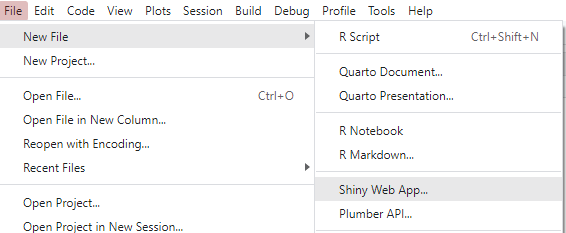
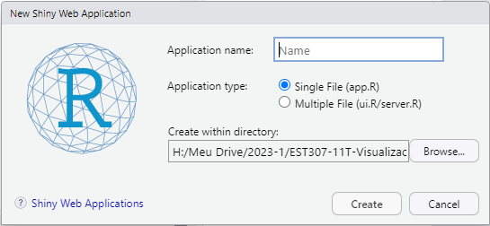
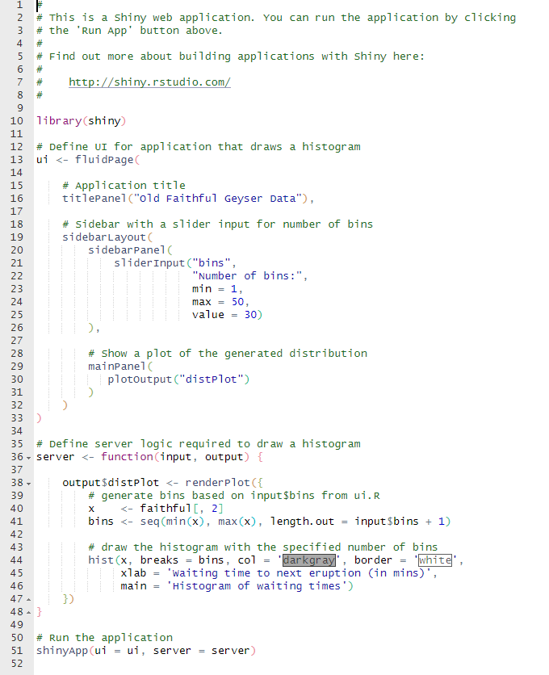
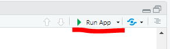
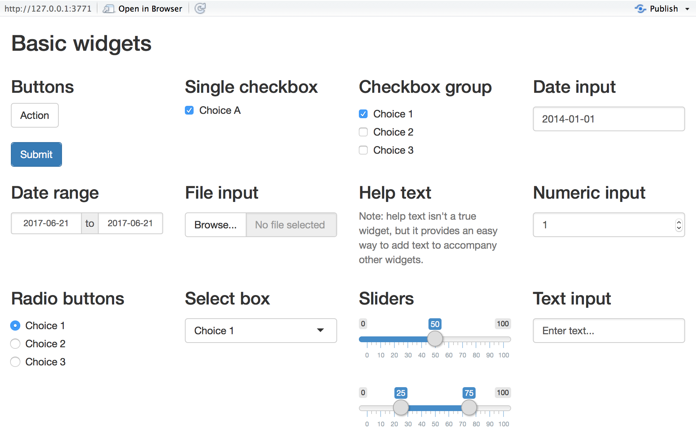
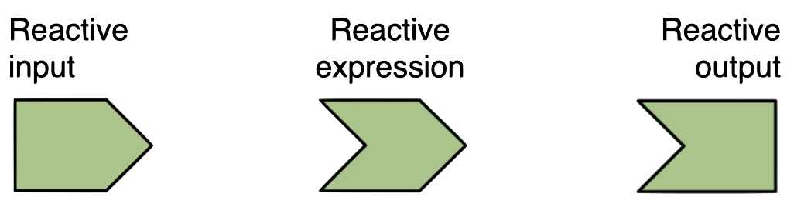
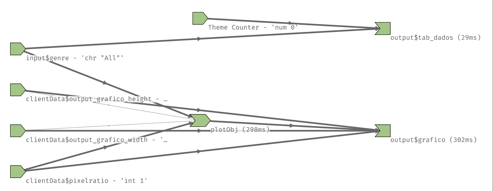
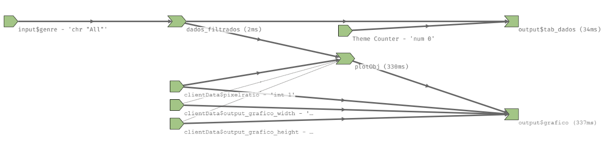

```{r, echo=FALSE, warning=FALSE}

library(pacman)
p_load(tidyverse, leaflet, janitor, shiny, shinydashboard, data.table, DT, formattable)

```

O trabalho de um estatístico geralmente está dividido em duas partes distintas. A primeira delas se refere à análise de dados em si. Nela utilizamos todas as ferramentas apresentadas até aqui, desde a importação de dados até a geração de indicadores e gráficos que permitam a compreensão dos fenômenos em estudo. É nesse momento que geramos os resultados.

A segunda parte, que é tão importante quanto a primeira, muitas vezes até mais importante, é comunicar nossos resultados. Do que serve uma análise estatística impecável se o público alvo for incapaz de extrair as informações dela? Neste sentido, existem diversas ferramentas de apresentação de resultados:

-   Relatórios

-   Artigos científicos

-   Vídeos

-   Apresentações

-   Dashboards

-   dentre outras

Cada ferramenta mencionada acima tem seu valor e é útil em determinadas situações. Entretanto, quando se trata de dinamicidade e de conceder liberdade ao público alvo de explorar os dados, os *dashboards* se destacam.

Um *dashboard* é um painel dinâmico de informações que permite tanto ao analista quanto ao contratante explorar variados aspectos de um conjunto de dados. Se ele for bem desenvolvido, pode ser útil inclusive na geração das demais modalidades de apresentação de resultados. A imagem abaixo trás uma ideia do conceito de um dashboard. Note que as informações são diversas, acessíveis e chamativas.


O termo *dashboard* deriva do nome do painel do carro. Note que ali, os instrumentos são simples e diretos, nos informam com simplicidade tudo que precisamos saber na condução do veículo e nos dá sinais de quando devemos explorar com mais detalhes alguns aspectos ou tomar alguma ação, como abastecer o carro ou mesmo se devo levar o veículo ao mecânico para uma análise mais detalhada.

Nesse sentido, o nome se torna ideal, pois nossos paineis devem servir a um propósito semelhante: Apresentar informações gerais, que permitam a visualização de tendências, riscos, pontos de melhoria, bem como darem indicativos que análises mais profundas devam ser realizadas em determinadas áreas.

Em relação ao design ideal de um dashboard, muito poderia ser dito, mas neste material nosso foco será basicamente operacional. Aprenderemos a criar um dashboard em R utilizando as ferramentas aprendidas no curso até aqui. Um material completo sobre como desenvolver um *dashboard* visualmente agradável pode ser visualizada em @few2006information. Além deste livro, a internet apresenta muito conteúdo sobre design de dashboards, do ponto de vista estético. Vamos listar aqui alguns pontos chave do design, sem nos estender muito no tema, uma vez que nosso foco é a operacionalização:

1.  Defina bem o objetivo do dashboard. Ele deve apresentar as informações conforme este objetivo e pode ter formato analítco ou operacional.

2.  Escolha a representação adequada para cada dado. Pode ser uma tabela, *card* ou gráficos adequados para cada situação, conforme visto na seção de gráficos.

3.  Torne a visualização limpa: Resuma nomes de variáveis, arredonde valores, utilize o mesmo formato para dados iguais, como datas, moedas, etc.

4.  Defina um layout adequado e limpo. Geralmente as pessoas leem as informações da esquerda para a direita, de cima para baixo. Lembre-se disso ao dispor suas informações.

5.  Disponha os elementos com espaçamento entre si para que as informações fiquem mais organizadas. Sempre que possível, utilize margens mais amplas.

6.  Apresente as informações completas como padrão. A filtragem deve ser opcional.

7.  Separe em abas apenas conteúdos que não sejam relacionados. Cada página deve contar a história completa.

8.  O *dashboard* deve ser a última etapa da análise de dados. O faça apenas após ter todas as análises em mãos. Isso evita retrabalho.

Essas são dicas básicas. No fim das contas, o desenvolvimento de um bom *dashboard* depende de muitos fatores, relacionados à área de *user experience* (UX). Porém, seguindo estes conceitos básicos é possível fazer um painel de ótima qualidade.

Vamos agora apresentar os conceitos básicos para a construção de um *dashboard* em R.

## Dashboards em R com o pacote `shiny`

O `shiny` é um pacote em R que permite a criação de *web apps* diretamente do R. De forma simplificada, o pacote permite a construção de uma página da web, que ao ser disponibilizado terá uma url e apresentará informações na forma de texto, imagens e aplicações. Ele utiliza HTML, CSS e JavaScript na construção dos aplicativos, mas de forma que não é necessário o domínio destas ferramentas para tal. Vamos apresentar os elementos básicos passo a passo, para que seja possível a construção destes aplicativos.

### Como criar um dashboard em shiny

Assim como todo pacote do R, o primeiro passo é instalá-lo. Após a instalação é possível visualizar alguns exemplos de *dashboards*.

```{r, warning=FALSE, eval=FALSE}
#Instalação do pacote
install.packages('shiny')

#Carregamento do pacote
library(shiny)
```

Após sua instalação, vamos visualizar um exemplo.

```{r, warning = F, eval=FALSE}
#Exemplo 1
runExample("08_html")
```

Note que o histograma é responsivo e varia conforme a escolha da distribuição e do tamanho da amostra. Esta é a principal caracterísica do `shiny`, a **reatividade**. Em breve nos aprofundaremos neste conceito. Vamos criar um dashboard com o `shiny`, seguindo o caminho abaixo no RStudio.

{style="border-style: groove;" fig-align="center"}

Após seguir esse caminho, a seguinte janela aparecerá:

{style="border-style: groove;" fig-align="center"}

Escolha um nome e um diretório no qual o app será salvo e clique em create. A seguinte janela será aberta:

{style="border-style: groove;" fig-align="center"}

Crie uma pasta na área de trabalho com o nome **EST307** e salve o app com o nome **appEST307**.

No código acima notamos duas funções principais: `ui` e `server`. Todo dashboard em shiny é composto por estes dois elementos. O `ui`, que deriva ***U**ser **I**nterface*, é a parte responsável pelo *frontend*, ou seja, a camada visual do dashboard. ja o `server` é a parte responsável pelo *backend*, em que será realizada toda a parte computacional, tais como geração de gráficos, tabelas, textos dinâmicos, etc.

A estrutura de construção de um app `shiny` é bastante semelhante a um código R padrão. Teremos funções que atribuirão elementos ao nosso app no `ui` e no `server`. De maneira resumida, um app shiny terá a seguinte estrutura:

```{r, eval=FALSE}

library("shiny")

#Define o frontend
ui <- fluidPage("Este é um app shiny")

#Define o backend
server <- function(input, output, session){
  
}

#Executa o app
shinyApp(ui, server)
```

Para executar o app basta selecionar e executar todo o código, ou clicar no botão **Run App**, disponível no canto superior direito da janela do código fonte:

{style="border-style: groove;" fig-align="center"}

Vamos agora copiar esse exemplo básico sobre o código automático gerado ao criar nosso app. Usaremos ele para explorar os elementos básicos da criação do app.

## Elementos básicos de um app `shiny`

Conforme dito, um app `shiny` é, basicamente, uma página da web. Para adicionarmos conteúdo nesta página é necessária a adição de elementos a ela. Todo o conteúdo visual será adicionado dentro da `ui`. Porém, antes de adicionar elementos, devemos compreender como os elementos são distribuídos dentro da interface do usuário.

O `shiny` trabalha com diversos layouts possíveis, que serão abordados nas seções seguintes. Note que nosso app já conta com uma `fluidPage()`. Esta é a camada mais geral da página, que receberá linhas, colunas e demais elementos dispostos dentro dela. Nela é possível definir o título da página por meio do argumento `title`. Será dentro desta função que incluiremos novos elementos, que também serão funções.

Como se trata de uma função, cada adição seja parâmetro ou função, deverá ser separada por vírgula. Esta é uma das principais fontes de erro ao se desenvolver um app `shiny`. Para evitar erros desta natureza, sugere-se que o código esteja indentado, para facilitar a identificação de cada elemento.

Assim como uma página da web, podemos acrescentar elementos ao nosso app, tais como título, texto, imagens, conteúdo em HTML, *widgets* como caixas de seleção, caixas de combinação, *sliders*, botões, etc., e elementos estatísticos, como gráficos e tabelas. Vamos apresentar estes elementos básicos e utilizaremos nosso app para visualizar sua implementação.

### Painel de título

O primeiro elemento que adicionaremos ao nosso aplicativo será um painel de título. Para realizar tal operação, basta incluir a função `titlePanel()` dentro denossa `fluidPage()`, da seguinte maneira:

```{r, eval=FALSE}


library("shiny")
library("pacman")
p_load(tidyverse)

#Define o frontend----
ui <- fluidPage(
  
  ##Título do APP----
  titlePanel("App Shiny")
  
)

#Define o backend----
server <- function(input, output, session){
  
}

#Executa o app
shinyApp(ui, server)
```

Uma dica é proceder os comentários que definem elementos importantes com quatro hífens `----`. Ao fazer isto, um sumário é criado no RStudio e pode ser visualizado no canto superior direito do código fonte. Para adicionar níveis, basta incluir mais símbolos de comentários.

### Elementos em HTML

Assim como em uma página, é possível incluir conteúdos em HTML, como imagens, textos, cabeçalhos, etc. Apesar de não utilizar as *tags* HTML diretamente, temos funções equivalentes para utilizar em nosso app. As principais são as seguintes:

| Função shiny | Equivalente em HTML5 | Elemento criado |
|------------------------|------------------------|------------------------|
| `p` | `<p>` | Parágrafo de texto |
| `h1` | `<h1>` | Cabeçalho nível 1 |
| `h2` | `<h2>` | Cabeçalho nível 2 |
| `h3` | `<h3>` | Cabeçalho nível 3 |
| `h4` | `<h4>` | Cabeçalho nível 4 |
| `h5` | `<h5>` | Cabeçalho nível 5 |
| `h6` | `<h6>` | Cabeçalho nível 6 |
| `a` | `<a>` | Hiperlink |
| `br` | `<br>` | Quebra de linha |
| `div` | `<div>` | Uma divisão de texto com formato uniforme |
| `span` | `<span>` | Uma divisão dentro de uma linha de texto com formato uniforme |
| `code` | `<code>` | Bloco de código |
| `img` | `` | Imagem |
| `strong` | `<strong>` | Texto em negrito |
| `em` | `<em>` | Texto em itálico |
| `HTML` |  | Código HTML para elementos mais complexos. |

Vamos incluir o seguinte texto no topo do nosso app:

-   Cabeçalho: Um exemplo de app

-   Parágrafo: Este *app* é um exemplo simplificado de como funciona um aplicativo em **shiny**.

    Elementos serão adicionados com o avanço das aulas.

```{r, eval=FALSE}
library("shiny")

#Define o frontend----
ui <- fluidPage(
  
  ##Título do APP----
  titlePanel("App Shiny"),
  
  ##Texto inicial----
  h1("Um exemplo de app"),
  p("Este ", 
    em("app"), 
    "é um exemplo simplificado de como funciona um aplicativo em", 
    strong("shiny"),
    ".",
    br(),
    "Elementos serão adicionados com o avanço das aulas.")
  
)

#Define o backend----
server <- function(input, output, session){
  
}

#Executa o app
shinyApp(ui, server)
```

Note que os elementos de formatação são inseridos em funções, dentro da função `p()`. Cada elemento deve ser separado por vírgula.

Podemos também adicionar imagens. Vamos incluir uma logo do shiny. Basta adicionar o código a seguir:

```{r, eval=FALSE}

##Logo do shiny----
img(src = "https://programando-em-shiny.curso-r.com/img/hex-shiny.png", height = 72, width = 72)
```

Este código inclui a imagem disponível na URL no tamanho 72x72. Imagens locais também podem ser fornecidas normalmente. Usuários mais experientes podem passar outras customizações por meio de tags HTML ou CSS diretamente para o app. Veremos esta possibilidade mais ao final do curso.

### Inputs e widgets

O pacote `shiny` permite a inclusão de uma série de *widgets* para a entrada de dados, controle do app, apresentar informações, dentre outras possibilidades. Aqueles que fornecerão valores para futuras aplicações são denominados de *inputs*. A imagem abaixo apresenta os principais widgets presentes no pacote:

{style="border-style: groove;" fig-align="center"}

Estes widgets enriquecem a interação entre usuário e *app*, além de permitir que repassemos novos parâmetros às funções do R. Mas primeiro vejamos como incluir estes *widgets*. Os apresentados acima podem ser gerados por meio das seguintes funções:

| função | widget |
|------------------------------------|------------------------------------|
| `actionButton` | Botão de ação |
| `checkboxGroupInput` | Grupo de caixas de seleção |
| `checkboxInput` | Caixa de seleção única |
| `dateInput` | Calendário para seleção de data |
| `dateRangeInput` | Par de calendários para selecionar um período de tempo |
| `fileInput` | Upload de arquivo |
| `helpText` | Texto de ajuda |
| `numericInput` | Campo para entrada de números |
| `radioButtons` | Conjunto de botões radiais |
| `selectInput` | Caixa de seleção |
| `sliderInput` | Barra deslizante para seleção de valores |
| `submitButton` | Botão de enviar |
| `textInput` | Campo para entrada de texto |

Cada um desses widgets possui parâmetros particulares, que podem ser acessados digitando `?função` no R. Por exemplo, um *slider* tem valores mínimos e máximos. Caixas de seleção possuem uma lista de escolhas. Vamos explorar alguns deles em um momento oportuno. Entretanto, dois valores são obrigatórios para todos eles, um identificador, ou `inputId`, que servirá como referência para o app e um rótulo, definido pelo argumento `label`.

Para compreender como funciona a inclusão destes elementos, vamos incluir uma caixa de entrada de texto, uma caixa de seleção e um slider com valores de 0 a 100. O código a seguir deve ser incluído logo abaixo do logo do shiny em nosso app

```{r, eval = F}

##Caixa de entrada de texto----
textInput(inputId = "nome_usuario", label = "Desenvolvedor do APP")

##Caixa de seleção----
selectInput(inputId = "opcoes", label = "Opções", 
            choices = list("Opção 1" = "opcao_1",
                           "Opção 2" = 2,
                           "Opção 3" = NA))

##Slider de 0 a 100----
sliderInput(inputId = "slider", label = "Selecione a taxa da distribuição", 
            min = 1, max = 10, value = 2)
```

Note que na caixa de seleção, as opções podem retornar uma string, um número, NA, ou mesmo uma lista. Estes valores serão importantes em um segundo momento. Podemos explorar o funcionamento de cada widget no link <https://shiny.posit.co/r/gallery/widgets/widget-gallery/>. Neste endereço é possível visualizar cada um deles, bem como seu código.

### Outputs

Já mencionamos que toda a parte computacional é realizada na função `server`, incluindo a geração de gráficos e tabelas. Entretanto, estes elementos também devem possuir um local no `ui` em que estarão localizados. Objetos em R devem ser incluídos na interface por meio de funções denominadas ***outputs***.

***Outputs*** são funções específicas, conhecidas como *placeholders*. A palavra vem do inglês *place* (lugar) + *hold* (segurar, reservar), e fazem exatamente o que o nome propõe, reservam um lugar na interface. Este local reservado irá receber os objetos calculados no *server*. O pacote `shiny` possui algumas funções definidas para cada tipo de *output*:

| Output               | Objeto criado |
|----------------------|---------------|
| `dataTableOutput`    | DataTable     |
| `htmlOutput`         | HTML          |
| `imageOutput`        | imagem        |
| `plotOutput`         | gráficos      |
| `tableOutput`        | tabelas       |
| `textOutput`         | texto         |
| `uiOutput`           | HTML          |
| `verbatimTextOutput` | texto         |

Para os *outputs*, é necessário fornecer apenas o `outputId`, entre aspas. Ele será utilizado como referência no servidor.

Além dos *placeholders* disponíveis no `shiny`, pacotes extras contém seus próprios *outputs*. Por exemplo, gráficos do pacote `plotly` devem ser inseridos em um *placeholder* do tipo `plotlyOutput`. Tabelas do pacote `DT`, que oferecem alto nível de customização e funcionalidade, deverão ser inseridas em um `DTOutput`, mapas `leaflet` em um `leafletOutput` e assim sucessivamente. Vamos reservar três locais em nosso *app*: um espaço para texto, outro para um gráfico e um último para uma tabela. Vamos incluí-los nos seguintes locais:

-   `textOutput`: Abaixo do campo **Nome do Desenvolvedor**

-   `dataTableOutput()`: **Abaixo do campo Opções**

-   `plotOutput()`: **Abaixo do slider Selecione a taxa da distribuição**

```{r, eval=FALSE}

##Caixa de entrada de texto----
  textInput(inputId = "nome_usuario", label = "Desenvolvedor do APP"),

##Local para saída de texto----
  textOutput("desenvolvedor"),
  
  ##Caixa de seleção----
  selectInput(inputId = "opcoes", label = "Opções", 
              choices = list("Opção 1" = "opcao_1",
                             "Opção 2" = 2,
                             "Opção 3" = NA)),

##Local para tabela----
  tableOutput("tab_dados"),
  
  ##Slider de 0 a 100----
  sliderInput(inputId = "slider", label = "Selecione a taxa da distribuição", 
              min = 1, max = 10, value = 2),

##Local para o gráfico----
  plotOutput("grafico")
```

Após incluir os *placeholders*, execute o *app*. Note que nada aconteceu. Mas não se preocupe. Os lugares para os elementos estão reservados, ou seja, avisamos ao app que um objeto será inserido naquele local.

Como o local já está reservado, precisamos agora gerar os objetos que serão inseridos ali. Para isso passamos ao servidor. É no servidor que geraremos todos os objetos em R, sejam eles estáticos ou reativos.

### A função `server`

Agora que já compreendemos como ocorre o funcionamento básico da interface do usuário, podemos avançar para a parte do *backend*, que é onde a estatística acontece. Primeiramente, vamos avaliar a estrutura básica da função `server`:

```{r, eval=FALSE}

#Define o backend----
server <- function(input, output, session){
  
}
```

Note que, diferente da `ui`, em que os elementos são dispostos dentro de uma função, por exemplo, a função `fluidPage()`, a `server` é uma função declarada, que recebe três parãmetros: `input`, `output` e `session`. O parâmetro `session` é utilizado em aplicações com nível de complexidade maior e não o abordaremos neste texto. Trabalharemos com os dois principais parâmetros: `input` e `output`. Intuitivamente, podemos concluir que o parâmetro `input` se refere à informações de entrada no servidor, enquanto o parâmetro `output` se refere à informações de saída do servidor.

A esta altura, um leitor atento já percebeu que temos na UI funções do tipo `input` e funções do tipo `output`. São justamente estes parâmetros que farão a ligação entre *frontend* e *backend*. O objeto `input` receberá uma lista com as informações fornecidas pelos objetos de mesmo tipo na `ui`. Já o objeto `output` criará uma lista de objetos que deverão ser atualizados no *frontend*, onde há objetos do tipo `output`.

Antes de iniciarmos a edição da função `server`, cabe uma obsevação: diferente da `ui`, a função `server` é um legítima função R, no sentido operacional. Logo, seus elementos não devem ser separados por vírgula.

### Inclusão de Outputs

Vamos agora incluir de fato os objetos que foram declarados na interface do usuário no nosso *dashboard*. Essa inclusão ocorre por meio das funções do tipo **render**. Cada *output* definido na `ui` é representado no servidor por uma função específica. A sintaxe geral é a seguinte:

```{r, eval=FALSE}

##Renderizar um objeto declarado na ui

output$outputId <- renderObject({
  
  código do objeto
  
})
```

Todo objeto calculado dentro do servidor, relacionado a um elemento declarado na interface de usuário, deve seguir a estrutura **`output$outputId`**, em que o `outputId` é o valor informado na função do tipo `objetoOutput`. Por exemplo, no caso de nosso gráfico, ele foi declarado no *frontend* como `plotOutput("grafico")`, e é do tipo `plot`. Logo, no servidor, ele será declarado como `output$grafico <- renderPlot({})`.

Note que os objetos tipo `render` são funções. Entretanto, apresentam chaves dentro dos parênteses. Dentro destas chaves deverá ser acrescentado o código R computado para o objeto declarado como *output*, Fora das chaves, devem ser inseridos os parâmetros da função, se aplicáveis.

Para elucidar o funcionamento deste mecanismo, vamos gerar um histograma de 100 observações de uma distribuição exponencial de taxa 5 e inserí-lo no lugar reservado para o `plotOutput(outputId = "grafico")`. Insira o código abaixo em substituição à função `server` em nosso app e execute.

```{r}

#Define o backend----
server <- function(input, output, session){
  
  ##Histograma das médias de Poisson
  output$grafico <- renderPlot({
    
    ##Gera 30 observações da Poisson(5) e gera o histograma
    x <- rpois(100, 5) %>% hist
    
    #Calcula o histograma
    hist(medias)
    
  })
  
}
```

O gráfico gerado foi inserido exatamente na posição definida pelo `plotOutput`. Perceba que ele é o terceiro objeto, mas o placeholder o inseriu no local combinado, e não na primeira entrada. É assim que adicionamos objetos ao nosso *dashboard*. Vamos agora incluir um texto abaixo da nossa caixa de texto desenvolverdor do app e uma planilha abaixo da nossa caixa de seleção opções. Estes objetos já estão localizados na `ui` com os id `desenvolvedor` e `opcoes`. Como se tratam de um texto e um data.table, usaremos as funções `renderText` e `renderDataTable`. Para facilitar a leitura do código, sugere-se que os objetos sejam colocados no `server` na mesma ordem que foram inseridos na `ui`, mas como foi visto no exemplo, o `shiny` não se importa com esta ordenação. Utilize o código abaixo para atualizar sua função `server` no app. Atualize seu nome no código.

```{r, eval=FALSE}

#Define o backend----
server <- function(input, output, session){
  
  ##desenvolvedor - Texto abaixo da caixa desenvolvedor----
  output$desenvolvedor <- renderText({
    
    "Desenvolvedor do app: Helgem"
    
  })
  
  ##dados - Tabela de dados abaixo da caixa de seleção----
  output$tab_dados <- renderTable({
    
    data.frame(Valor = rnorm(20),
               opcao = rbinom(20, 3, 0.5))
    
  })
  
  
  ##grafico - Histograma das médias de Poisson----
  output$grafico <- renderPlot({
    
    ##Gera 30 observações da Poisson(5) e gera o histograma
    x <- rpois(100, 5) %>% hist

    
  })
  
}
```

Agora os lugares reservados foram preenchidos pelos objetos gerados no `server`. Note que se tratam de objetos estáticos, ou seja, não podemos realizar nenhuma alteração neles.

Agora que já sabemos como declarar os objetos no *frontend* e computá-los no *backend*, podemos avançar um pouco mais nas funcionalidades do `shiny`.

### Reatividade Básica

O app que geramos até aqui não apresenta a principal característica do pacote `shiny`: a reatividade. Note que a tabela apresenta 20 linhas fixas, o nome do desenvolvedor é fixo e definido na função, bem como o gráfico apresenta valores para uma única situação.

A forma mais simples de trazer reatividade ao *dashboard* desenvolvido em `shiny` é por meio da utilização dos *inputs* como ferramentas de entrada de dados. E é neste sentido que o argumento `input` da funão server é utilizado. Ele serve como entrada para os parâmetros fornecidos pelos *widgets* inseridos na interface do usuário.

Em nossa aplicação, temos três *inputs*:

-   `textInput`: entrada de texto com id `"nome_usuario"`

-   `selectInput`: caixa de seleção com id `"opcoes"`

-   `slidertInput`: slider de valores com id `"slider"`

O R armazena as entradas de cada um dos *inputs* acima nos seguintes objetos:

-   `input$nome_usuario`

-   `input$opcoes`

-   `input$slider`

Estes objetos agora poderão ser usados como entradas em funções e cálculos realizados no servidor do *app*. Vamos realizar as seguintes alterações:

-   na `ui`, alterar as escolhas da caixa de seleção de `"opcao_1"`, `2` e `NA` para 1, 2 e 3

-   em nosso `renderText`, vamos incluir o nome do desenvolvedor para ser impresso de forma interativa

-   em nossa tabela, filtrar os valores em relação à variável `opcao`, de acordo com o valor selecionado em nossa caixa de seleção

-   Em nosso gráfico, variar a taxa da distribuição utilizando o valor do slider.

Nossa função server ficará da seguinte forma:

```{r, eval=FALSE}

#Define o backend----
server <- function(input, output, session){
  
  ##desenvolvedor - Texto abaixo da caixa desenvolvedor----
  output$desenvolvedor <- renderText({
    
    paste0("Desenvolvedor do app: ", input$nome_usuario)
    
  })
  
  ##dados - Tabela de dados abaixo da caixa de seleção----
  output$tab_dados <- renderTable({
    
    data.frame(valor = rnorm(20),
               opcao = rbinom(20, 3, 0.5)) %>% 
      filter(opcao == input$opcoes)
    
  })
  
  
  ##grafico - Histograma das médias de Poisson----
  output$grafico <- renderPlot({
    
    ##Gera 100 observações da Poisson(2) e gera o histograma
        rpois(100, lambda = input$slider) %>% 
      hist(xlim = c(0, 20), 
           main = paste("Histograma: Distribuição de Poisson: Taxa = ",
                        input$slider))
    
  })
  
}

```

Agora nosso dashboard apresenta reatividade. Os valores apresentados são dinâmicamente alterados, conforme interações do usuário. Os exemplos apresentados são bastante simples, mas apresenta ferramentas bastante poderosas, quando associadas com as ferramentas estatísticas corretas. Pode-se por exemplo, utilizá-las para realização de segmentação, alteração no tipo de visualização, definição de modelos, dentre outras possibilidades.

Vamos agora fazer um exercício para fixar os conceitos.

### Exercício prático

Crie um app no R com o título **"Distribuições de probabilidade"**. Este app deverá apresentar:

-   O seguinte texto em cabeçalho 3:

    "Distribuição empírica de probabilidades: **X**". O valor de X deverá ser atualizado pelo item selecionado na caixa de seleção descrita a seguir.

-   Uma caixa de seleção com o título de "**Distribuição de Probabilidade**" contendo as seguintes distribuições:

```         
-   Binomial

-   Poisson

-   Exponencial

-   Normal
```

-   Um slider com o título de **"Tamanho da amostra"**, com valor mínimo de 10, valor máximo de 100 e valor padrão 30.

-   Duas caixas de texto contendo os seguintes títulos: "**Parâmetro 1**" e "**Parâmetro 2**"

-   Um gráfico exibindo o histograma de uma amostra de tamanho definido pelo slider **Tamanho da amostra**

-   . Os parâmetros serão definidos pelos valores das caixas de texto **Parâmetro 1** e **Parâmetro 2**. Caso a distribuição apresente apenas um parâmetro, usar apenas o **Parâmetro 1**.

```{r, eval=FALSE}
#| code-fold: true
#| code-summary: Resposta

#Solução do Exercício prático 1

library(shiny)

# UI----
ui <- fluidPage(

    ## Título do APP----
    titlePanel("Distribuições de Probabilidade"),

    ##Placeholder para a descrição----
    htmlOutput("desc"),
    
    ##Caixa de seleção para a distribuição----
    selectInput("dist", "Distribuição de Probabilidade",
                choices = list("Binomial" = "Binomial",
                               "Poisson" = "Poisson",
                               "Exponencial" = "Exponencial",
                               "Normal" = "Normal"),
                selected = "Normal"),
    
    ##Slider para o tamanho da amostra----
    sliderInput("n_amostral", "Tamanho da amostra", min = 10, max = 100, value = 30),
    
    ##Seletores de parâmetros----
    numericInput("p1", "Parâmetro 1", value = 1, min = -1000, max = 1000),
    numericInput("p2", "Parâmetro 2", value = 1, min =0, max = 1000),
    
    ##Placeholder para o histograma----
    plotOutput("histograma")
    
)

# Server----
server <- function(input, output) {

    ##Descrição dinâmica com base na distribuição
    output$desc <- renderUI({
      
      h3(paste("Distribuição empírica de probabilidades: ", input$dist, input$p1))
    })
    
    ##Histograma baseado nas informações fornecidas----
    output$histograma <- renderPlot({
      
      if(input$dist == "Binomial"){
        
        data <- rbinom(n = input$n_amostral, size = input$p1, prob = input$p2)
        
      }else if(input$dist == "Poisson"){
        
        data <- rpois(n = input$n_amostral, lambda = input$p1)
        
      }else if(input$dist == "Exponencial"){
        
        data <- rexp(n = input$n_amostral, rate = input$p1)
        
      }else{
        
        data <- rnorm(n = input$n_amostral, mean = input$p1, sd = input$p2)
        
      }
      
      hist(data, main = "")
      
    })
    
}

# Run the application 
shinyApp(ui = ui, server = server)

```

## Arquivos Externos

Conforme visto na seção de importação de dados, na grande maioria dos casos, trabalhamos com grandes bases de dados externas. Em dado momento, devemos realizar esta importação para o R e então trabalhamos com estas informações.

Ao se desenvolver *apps* no `shiny`, enquanto biblioteca do R, também temos a necessidade de utilização de dados externos. Mais do que isso, como se trata de uma aplicação visual, além de dados, podemos também necessitar de outros tipos de arquivos, tais como imagens, textos, dentre outros.

Uma terceira necessidade ocorre quando pensamos em termos de código. Conforme visto, *apps* `shiny` apresentam uma estrutura de programação peculiar. Deste modo, realizar determinados procedimentos de programação dentro do `server`, pode tornar o aplicativo menos eficiente, pois a menos que estejamos tratando de um procedimento reativo (veremos em breve), a cada interação do usuário o R executa novamente todo o código. Isto implica que, caso uma função seja atribuída dentro de um *output*, esta função seria sempre recalculada.

Para resolver as situações mencionadas acima, podemos carregar arquivos dentro de nosso *app*. Podemos incluir dados, imagens, arquivos, *scripts* em R, e quaisquer outros arquivos que façam sentido dentro da aplicação. Podemos também carregar pacotes normalmente.

Uma aplicação em `shiny` trata o diretório em que o arquivo `app.R` está localizado como diretório de trabalho. A partir daí, todos os caminhos de inclusão de arquivos são relativos. Uma boa prática é a criação de pastas para cada tipo de arquivo que será incluído no código. Vamos criar na pasta de nosso *app* três novas pastas: `www`, `script` e `data`. Nas pastas criadas, salvaremos os arquivos disponíveis no Moodle na seção Arquivos, referentes à aula, cada tipo em sua respectiva pasta. Arquivos de imagem sempre devem ser salvos na pasta `www`, um diretório especial para interação entre o app e o navegador.

A inclusão de arquivos e pacotes deve ser feita em um lugar que facilite seu acesso e que não se confundam com os códigos de `ui` e `server`. Um lugar ideal são as linhas anteriores à `ui`, como uma espécie de cabeçalho do código. Vamos incluir as seguintes linhas em nosso código:

```{r, eval = F}

#Pacotes 
library("pacman")
p_load(shiny, tidyverse, janitor, data.table, DT)

#Scripts R
source("scripts/script.R")

#Arquivos
dados <- fread("data/videogame_sales.csv") %>% clean_names()
  
```

Note que, para incluir os arquivos, não há necessidade de incluir o diretório de trabalho. Os diretórios são relativos ao local em que o app está localizado. Para incluir arquivos em pastas, basta utilizar o nome da pasta, procedido de / e do nome do arquivo. Se o arquivo estiver na pasta raiz do *app*, basta utilizar o nome do arquivo. Note que arquivos e dados lidos fora do `server` serão lidos apenas na inicialização do aplicativo.

Vamos agora fazer algumas alterações em nosso aplicativo.

1.  Substituir a imagem, antes informada via url, pelo arquivo local `"hex-shiny.png"`. Arquivos na pasta www não devem ter seus diretórios relativos declarados, apenas o nome do arquivo.

2.  Substituir nossa tabela de dados gerados pelo objeto `dados`, o *placeholder* `tableOutput` por `DTOutput` e o *output* `renderTable` por `renderDT.`

3.  Substituir o histograma gerado por um gráfico de barras com o total de vendas por ano.

4.  Utilizar nosso slider para apresentar as n plataformas com mais jogos.

5.  Utilizar as opções para filtrar a tabela dados por gênero de jogo.

O código com as alterações segue abaixo:

```{r, eval = F}

#Pacotes 
library("pacman")
p_load(shiny, tidyverse, janitor, data.table, DT)

#Scripts R
source("script/script.R")

#Arquivos
dados <- fread("data/videogame_sales.csv") %>% clean_names()


#Define o frontend----
ui <- fluidPage(
  
  ##Título do APP----
  titlePanel("App Shiny"),
  
  ##Texto inicial----
  h1("Um exemplo de app"),
  p("Este ", 
    em("app"), 
    "é um exemplo simplificado de como funciona um aplicativo em", 
    strong("shiny"),
    ".",
    br(),
    "Elementos serão adicionados com o avanço das aulas."),
  
  ##Logo do shiny----
  img(src = "hex-shiny.png", height = 72, width = 72),
  
  ##Caixa de entrada de texto----
  textInput(inputId = "nome_usuario", label = "Desenvolvedor do APP"),
  
  ##Local para saída de texto----
  textOutput("desenvolvedor"),
  
  ##Caixa de seleção----
  selectInput(inputId = "opcoes", label = "Opções", 
              choices = list("Sports" = "Sports", 
                             "Platform" = "Platform", 
                             "Racing" = "Racing", 
                             "Role-Playing" = "Role-Playing", 
                             "Puzzle" = "Puzzle", 
                             "Misc" = "Misc", 
                             "Shooter" = "Shooter", 
                             "Simulation" = "Simulation", 
                             "Action" = "Action", 
                             "Fighting" = "Fighting", 
                             "Adventure" = "Adventure", 
                             "Strategy" = "Strategy"
                             )),
  
  ##Local para tabela----
  DTOutput("tab_dados"),
  
  ##Slider de 0 a 100----
  sliderInput(inputId = "slider", label = "Número de plataformas com mais vendas para exibição", 
              min = 1, max = 10, value = 2),
  
  ##Local para o gráfico----
  plotOutput("grafico")
  
)

#Define o backend----
server <- function(input, output, session){
  
  ##Desenvolvedor - Texto abaixo da caixa desenvolvedor----
  output$desenvolvedor <- renderText({
    
    paste0("Desenvolvedor do app: ", input$nome_usuario)
    
  })
  
  ##Dados - Tabela de dados abaixo da caixa de seleção----
  output$tab_dados <- renderDT({
    
    dados %>% filter(genre == input$opcoes)
    
  })
  
  
  ##Grafico - Vendas de jogos por plataforma----
  output$grafico <- renderPlot({
    
    dados %>% 
      group_by(platform) %>% 
      summarise(sales = sum(global_sales)) %>% 
      arrange(-sales) %>% 
      head(input$slider) %>% 
      ggplot(aes(x = reorder(platform, -sales), y = sales)) + geom_bar(stat = 'identity', fill = 'blue') +
      labs(title = paste("Top", input$slider, "plataformas em vendas de jogos")) + 
      xlab("Plataformas") +
      ylab("Vendas (em milhões)")
      
    
  })
  
}

#Executa o app
shinyApp(ui, server)
```

Com a possibilidade de inclusão de dados e arquivos externos, as possibilidades de desenvolvimento de dashboard se expandem consideravelmente.

O conteúdo visto até aqui contempla as principais funcionalidades do pacote `shiny`, em termos de operacionalização. Agora veremos um dos atributos que permitem a geração de aplicativos mais eficientes e com funcionalidades mais avançadas, a **reatividade**.

## Reatividade

Agora que sabemos incluir dados externos em nosso aplicativo, existe a possibilidade de implementações um pouco mais complexas. Vamos seguir utilizando a base de dados de vendas de jogos.

O código abaixo cria um novo app, vazio, mas que mantém os dados de vendas de jogos e o filtro de seleção para os gêneros de jogos.

Vamos copiá-lo sobre nosso app antigo.

```{r, eval=F}

#Pacotes 
library("pacman")
p_load(shiny, tidyverse, janitor, data.table, DT)


#Arquivos
dados <- fread("data/videogame_sales.csv") %>% clean_names()


#Define o frontend----
ui <- fluidPage(
  
  ##Título do APP----
  titlePanel("Venda de Jogos de Vídeo Game"),
  
  ##Caixa de seleção para gêneros----
  selectInput(inputId = "genre", label = "Gênero", 
              choices = list("All" = "All",
                             "Action" = "Action", 
                             "Adventure" = "Adventure", 
                             "Fighting" = "Fighting", 
                             "Misc" = "Misc", 
                             "Platform" = "Platform", 
                             "Puzzle" = "Puzzle", 
                             "Racing" = "Racing", 
                             "Role-Playing" = "Role-Playing", 
                             "Shooter" = "Shooter", 
                             "Simulation" = "Simulation", 
                             "Sports" = "Sports", 
                             "Strategy" = "Strategy"
                             ),
              selected = "All"),
  
)

#Define o backend----
server <- function(input, output, session){
  

}

#Executa o app
shinyApp(ui, server)
```

Suponha que seja de nosso interesse exibir a tabela de dados e o gráfico de vendas por plataforma, gerado anteriormente, ambos baseados na seleção do gênero. Como faríamos este processo? Simples, basta incluir os *placeholders* na `ui` e realizar as alterações em cada função. Inclua os códigos abaixo dentro das funções `ui` e `server`, nos locais adequados. Queremos que os dados e o gráfico apareçam abaixo do seletor de gêneros.

```{r, eval = F}

#Incluir na UI

  ##Local para tabela----
  DTOutput("tab_dados"),
  
  ##Local para o gráfico----
  plotOutput("grafico")

#Incluir no server

 ##Dados - Tabela de dados abaixo da caixa de seleção----
  output$tab_dados <- renderDT({
    
    if(input$genre == "All"){
      
      dados
      
    }else{
      
      dados %>% filter(genre == input$opcoes)
      
    }
    
    
  })
  
  
  ##Grafico - Vendas de jogos por plataforma----
  output$grafico <- renderPlot({
    
    if(input$genre == "All"){
      
      dados %>% 
        group_by(platform) %>% 
        summarise(sales = sum(global_sales)) %>% 
        arrange(-sales) %>% 
        ggplot(aes(x = reorder(platform, -sales), y = sales)) + 
          geom_bar(stat = 'identity', fill = 'blue') +
          labs(title = paste("Venda de jogos por plataformas")) + 
          xlab("Plataformas") +
          ylab("Vendas (em milhões)")
      
    }else{
      
      dados %>% 
        filter(genre == input$opcoes) %>% 
        group_by(platform) %>% 
        summarise(sales = sum(global_sales)) %>% 
        arrange(-sales) %>% 
        ggplot(aes(x = reorder(platform, -sales), y = sales)) + 
          geom_bar(stat = 'identity', fill = 'blue') +
          labs(title = paste("Venda de jogos por plataformas")) + 
          xlab("Plataformas") +
          ylab("Vendas (em milhões)")
      
    }

  })

```

Agora, tanto a tabela de dados quanto o gráfico são reativos ao mesmo *input*. A análise do gráfico geral indica que uma série de plataformas tem vendas desprezíveis, como os sistemas SCD, NG, TG16, 3DO, GG e PCFX. Como faríamos para excluir estes dados do nosso *dashboard*? Algumas possibilidades:

-   Filtrar em todas as análises realizadas com estes dados;

-   Realizar a exclusão destes na base de dados.

A primeira opção é viável. Mas suponha que tenhamos 10 elementos que utilizem estes dados. O código teria grande complexidade. A segunda opção é inviável, pois se quisermos, por exemplo, o total de vendas, esta operação apagaria dados valiosos.

Note que os procedimentos de filtragem de dados são os mesmos, tanto na tabela quanto nos dados. Ou seja, a cada nova atualização, executamos a mesma tarefa duas vezes, em dois lugares distintos. Agora, novamente, imagine se dez elementos dependessem deste filtro. Seria uma redundância operacional que poderia levar à queda de rendimento do aplicativo.

Para resolver este problema, podemos usar uma função reativa para aplicar o filtro, e utilizar seu resultado em todas as entradas necessárias. Para tal operação, existem as expressões do tipo `reactive`.

### Função `reactive()`

Uma expressão reativa é um componente que se localiza entre um *input* e um *output* e realiza operações intermediárias. Este tipo de expressão evita que calculos adicionais sejam realizados sem necessidade. Também evita cópias desnecessárias de trechos de código que realizam a mesma operação, como o que escrevemos acima. Neste sentido, elas são ditas "preguiçosas" (*lazy*), pois serão executadas apenas quando os *inputs* forem alterados.

Para compreender melhor como funcionam os elementos reativos, vamos apresentar de forma superficial os elementos que compõe a reatividade do pacote `shiny`.

{style="border-style: groove;" fig-align="center"}

Todo aplicativo desenvolvido em `shiny` apresenta relações entre seus elementos reativos. Estas relações são representadas por meio de um diagrama e dos objetos listados acima. Por exemplo, no nosso app, o *input* `genre` está ligado ao *output* `tab_dados`. Vejamos o log de reatividade de nosso app:

{style="border-style: groove;" fig-align="center"}

Note que o *input* `genre` está ligado diretamente ao output `tab_dados` e indiretamente ligado ao *output* `gráfico`, por meio de uma função reativa `plotObj`.

Agora, para tornar nosso app sem operações redundantes, vamos transformar a filtragem dos dados em uma operação reativa. Para isso, usaremos a função `reactive()`. Além de gerar uma base de dados filtrada para ambas as saídas, ela garantirá que os dados serão recalculados apenas se necessário. Note que nosso código ficou bem mais simples e eficiente:

```{r, eval=FALSE}

#Define o backend----
server <- function(input, output, session){
  
  ##Filtro de dados reativo
  dados_filtrados <- reactive({
    
    if(input$genre == "All"){
      
      dados
      
    }else{
      
      dados %>% filter(genre == input$genre)
      
    }
    
  })
  
  ##Dados - Tabela de dados abaixo da caixa de seleção----
  output$tab_dados <- renderDT({
    
    dados_filtrados()
    
  })
  
  
  ##Grafico - Vendas de jogos por plataforma----
  output$grafico <- renderPlot({
    
    dados_filtrados() %>% 
        group_by(platform) %>% 
        summarise(sales = sum(global_sales)) %>% 
        arrange(-sales) %>% 
        ggplot(aes(x = reorder(platform, -sales), y = sales)) + 
        geom_bar(stat = 'identity', fill = 'blue') +
        labs(title = paste("Venda de jogos por plataformas")) + 
        xlab("Plataformas") +
        ylab("Vendas (em milhões)")
    
  })
  
}
```

Vamos visualizar o novo log de reatividade:

{style="border-style: groove;" fig-align="center"}

Note que agora o filtro é executado apenas uma vez e, esse objeto reativo está conectado tanto ao gráfico quanto à tabela de dados. Para acessar o log de reatividade, basta executar o código `options(shiny.reactlog = TRUE)` antes de executar o aplicativo, e durante o uso do *app* pressionar as teclas `ctrl+F3`. É uma ferramenta útil para identificar gargalos de reatividade nos *dashboards*.

É importante observar que um objeto reativo é uma função, logo ele retorna uma função. Neste sentido, dados gerados por uma função reativa devem ser procedidos de parênteses `()`. Os objetos do tipo `reactive` devem ser utilizados apenas em casos em que se realizarão cálculos, como filtragens, aplicações de funções, etc.

### Função `observe()`

Suponha agora que após filtrar por um gênero, queiramos também filtrar por plataforma. Entretanto, algumas plataformas não possuem jogos de determinado gênero. Por exemplo, o console 3DO não possui nenhum jogo de ação com mais de 100 mil cópias vendidas. Seria interessante que a plataforma fosse apresentada na caixa de seleção? Se a incluirmos, ao selecionar o gênero *Action* e na sequência a plataforma 3DO, receberíamos um erro na tela do nosso *app*. Para situações desta natureza, podemos utilizar a função `observe`.

A função `observe` é bastante útil em situações em que há uma ação do usuário que pode gerar uma reparametrização de *inputs*, por exemplo atualização de valores. Vamos implementar o exemplo abaixo, e aproveitaremos para explorar uma nova opção das listas de seleção, a atualização de valores com o uso da função `updateSelectInput()`. Inclua os códigos a seguir nos devidos lugares

```{r, eval=FALSE}

#Lista de plataformas (Incluir após a leitura de dados)----
choices_plataforma <- dados$platform %>% 
  unique %>% 
  sort() %>% 
  c("All", .)

  ##Seleção de plataforma (Abaixo da seleção de gênero)----
  selectInput("plataforma", "Plataforma", choices = choices_plataforma)

  ##Filtro de dados reativo
  dados_filtrados <- reactive({
    
    if(input$genre == "All"){
      
      data <- dados
      
    }else{
      
      data <- dados %>% filter(genre == input$genre)
      
    }
    
    if(input$plataforma == "All"){
      
      data
      
    }else{
      
      data %>% filter(platform == input$plataforma)
      
    }
    
  })
```

Execute o aplicativo com o novo código e tente selecionar o gênero `Action` e a plataforma `3DO`. Notou que não há dados? Vamos resolver com o uso da função `observe`. Adicione as linhas a seguir no `server`:

```{r, eval = F}

  ##Atualização das plataformas que contém o gênero selecionado----
  observe({
    
    choices_plataforma_update <- dados %>% 
      filter(genre == input$genre) %>% 
      select(platform) %>% 
      unique %>% 
      arrange(platform) %>% 
      rows_append(data.frame(platform = "All"), .) %>% 
      rename(" " = "platform")
    
    updateSelectInput(session = session,
                      inputId = "plataforma",
                      choices = choices_plataforma_update,
                      selected = head(choices_plataforma_update, 1))
    
  })
```

Percebeu a diferença? Agora apenas os consoles que tem jogos de ação aparecem na linha. A função `observe()` executou uma ação observando um comportamento do aplicativo, indiretamente gerado pelo usuário. Este é seu principal objetivo.

De modo geral, podemos resumir `reactives` e `observers` da seguinte forma:

-   `reactives`: Utilizados para realização de cálculos. Sempre retorna um valor ou um objeto.

-   `observers`: Utilizados para a realização de ações. Não retorna objetos.

Por outro lado, existem situações em que uma ação do usuário é o gatilho direto para a ocorrência de um evento no *dashboard*. Nestes casos, usamos funções cujos gatilhos são **eventos**.

### Função `observeEvent()`

Em alguns momentos, ao desenvolver a interatividade entre o usuário e o app, queremos esperar que alguma ação ocorra para que um evento seja acionado, ou seja, desejamos um gatilho para determinado evento.

Por exemplo, no nosso aplicativo anterior, seria interessante um botão que limpasse as escolhas de gênero e plataforma, caso o usuário decida iniciar um novo filtro. Em situações dessa natureza, em que uma ação explícita deve ser tomada pelo usuário, mas que não acarretará em novos cálculos, uma vez que a filtragem já está definida como uma variável reativa, utilizamos a função `observeEvent()`. A sintaxe é bastante simples: `observeEvent(input, {expression})`. A função recebe um *input* gerado por um evento, geralmente um botão, e uma expressão é repassada à função. Esta expressão é executada sempre que o evento for observado.

Vamos incluir um botão com o título de "Limpar filtros na `UI`, logo abaixo do segundo filtro e incluir um observador de evento no nosso servidor. Basta incluir os códigos abaixo nos devidos lugares.

```{r, eval=FALSE}

##Botão para limpar filtros----
  actionButton("limpar_filtros", "Limpar filtros"),
  
  ##Observa o evento limpar filtros e atribui o valor padrão para o primeiro selectInput----
  observeEvent(input$limpar_filtros,{
    
    updateSelectInput(session = session,
                      inputId = "genre",
                      selected = "All")
    
  })

```

Como a segunda caixa de seleção está vinculada à primeira, basta atribuir o valor padrão para a primeira afim de que a segunda seja reiniciada.

### Função `eventReactive()`

Para concluir, vamos apresentar a função `reactiveEvent()`. Suponha que tenhamos como objetivo que o usuário gere um resumo das vendas, seja antes ou depois da aplicação de filtros. Para isso, é necessário o cálculo de elementos relacionados aos dados.

Vamos pensar na seguinte tabela de resumo:

| Informação                    | Valor                  |
|-------------------------------|------------------------|
| Vendas totais                 | valor de vendas totais |
| Vendas médias                 | valor de vendas médias |
| Jogo mais vendido             | nome do jogo           |
| Desenvolvedor com mais vendas | nome do desenvolvedor  |
| Plataforma com mais vendas    | nome da plataforma     |

Neste caso, como teremos que utilizar um código em R para gerar uma tabela, que será retornada como objeto, a função `observeEvent` não será suficiente na realização da tarefa. Em casos desta natureza, utilizamos a função `eventReactive()`. Sua sintaxé é identica à da função `observeEvent`: `eventReactive``(input, {expression}`).

Vamos criar essa funcionalidade na prática:

-   Inclua na `ui` o botão "Gerar resumo". Esse botão deve estar posicionado abaixo do gráfico.

-   Inclua na `ui` um placeholder para uma tabela. Ela deve estar localizada abaixo do botão "Gerar resumo".

-   Inclua no server um evento reativo que após o clique no botão, gere a tabela de interesse.

-   Renderize a tabela criada no servidor.

```{r, eval=FALSE}

  ##Cabeçalho para a tabela de resumo----
  h4("Resumo de Vendas"),
  
  ##Local para tabela de resumo----
  tableOutput("resumo")

  #Gera o conjunto de dados de resumo----
  dados_resumo <- eventReactive(input$gerar_resumo, {
    
    total <- sum(dados_filtrados()$global_sales)
    
    media <- mean(dados_filtrados()$global_sales)
    
    mais_vendido <- dados_filtrados()$name[1]
    
    publisher <- dados_filtrados() %>% 
      group_by(publisher) %>% 
      summarise(total = sum(global_sales)) %>% 
      arrange(-total) %>% 
      .[1,1] %>% 
      as.character
    plataforma <- dados_filtrados() %>% 
      group_by(platform) %>% 
      summarise(total = sum(global_sales)) %>% 
      arrange(-total) %>% 
      .[1,1] %>% 
      as.character
    
    data.frame(vendas = total,
               media_vendas  = media,
               jogo = mais_vendido,
               desenvolvedor = publisher,
               plataforma = plataforma) %>% 
      rename("Vendas Totais" = "vendas",
            "Vendas médias" = "media_vendas",
            "Jogo mais vendido" = "jogo",
            "Desenvolvedor com mais vendas" = "desenvolvedor",
            "Plataforma com mais vendas" = "plataforma")
    
  })
  

  ##Tabela com os resumos----
  output$resumo <- renderTable(dados_resumo())
  
```

Note que antes de clicar no botão "Gerar resumo", apenas o cabeçalho é impresso. Após clicar, o aplicativo gera o resumo considerando os filtros aplicados nos dados.

Experimente alterar os filtros e observe a tabela resumo. Note que apenas alterá-los não modifica o conteúdo da tabela. Isto porque ela é reativa apenas ao botão. Após clicar no botão, os dados são atualizados.

Esta funcionalidade deve ser aplicada sempre que desejarmos efetuar algum cálculo condicionado a um evento observado pelo app.

Agora conhecemos as funcionalidades mais utilizadas para o desenvolvimento de um *dashboard* em `shiny`. Note que, até aqui, não nos preocupamos com a aparência de nossos apps, apenas com a funcionalidade. A seguir, trataremos do *layout* de nosso painel, para torná-lo visualmente mais agradável.

### Exercício prático

Utilizando o mesmo conjunto de dados de vendas de jogos, gerar um dashboard que contenha um gráfico de barras que exiba o número de jogos lançados por plataforma ou por gênero. Deverá ser inserida uma caixa de seleção em que o usuário escolherá qual a informação que será exibida. Após escolher a opção, o usuário deverá clicar em um botão para gerar o referido gráfico. Por padrão, deverá ser gerado o gráfico de jogos por plataforma.
