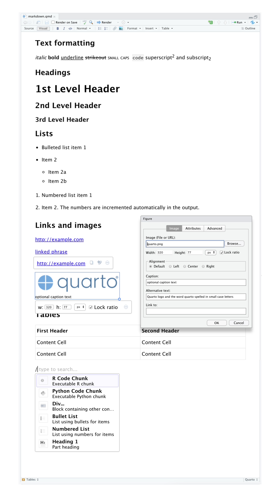
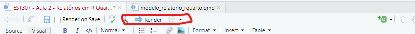
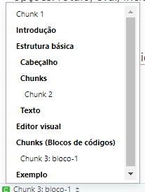
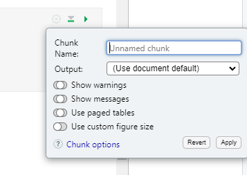
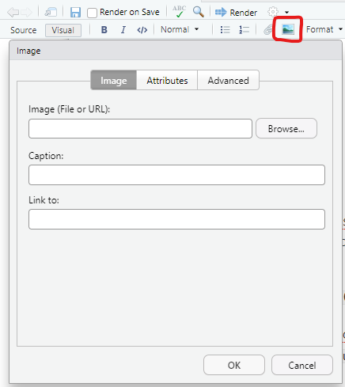
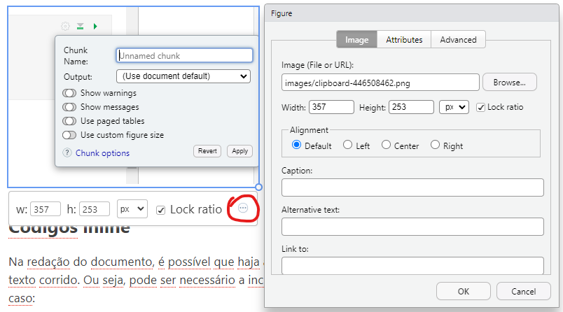
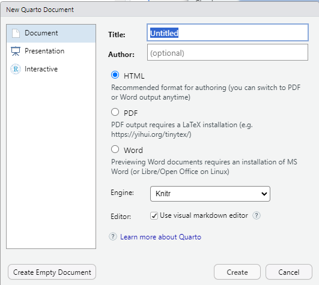
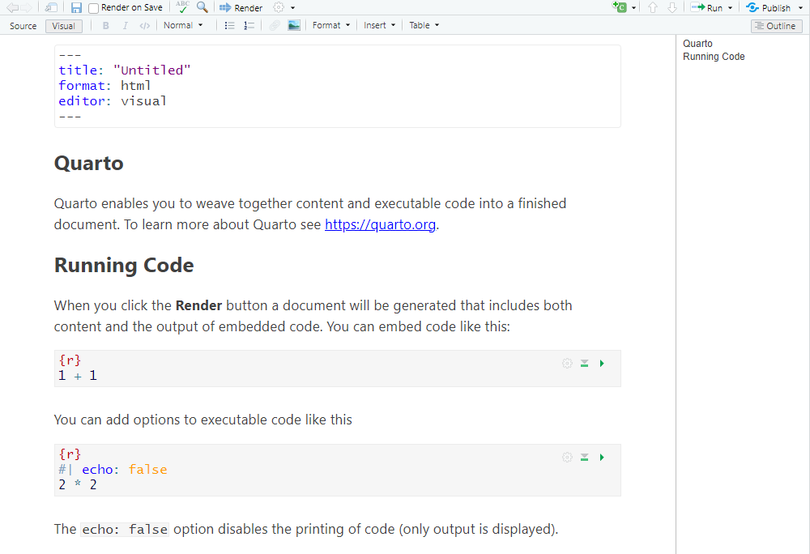
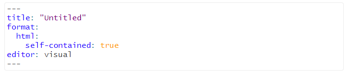
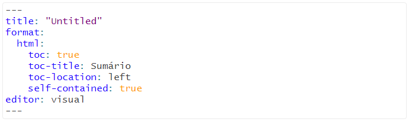

```{r}
#| warning: false
#| echo: false

pacman::p_load(magrittr, dplyr, pander)
```

# Introdução

O Quarto é um framework para ferramentas de desenvolvimento de projetos de análise e comunicação em Estatística e Ciência de Dados. Ele é capaz de congregar códigos, texto, conteúdos como imagens, tabelas, elementos dinâmicos, dentre outras possibilidades.

Ele permite a exportação para diversos formatos, tais como HTML, PDF, docx, LaTex e mais.

Ele foi desenvolvido para ser utilizado em três cenários:

1.  Comunicação de resultados, com muito foco na solução e pouco foco no código .

2.  Compartilhamento de metodologias com outros cientistas/analistas de dados, com foco em código.

3.  Como ambiente para análise/ciência de dados, em que é possível utilizá-lo como ferramenta para desenvolvimento de análises, o processo envolvido e suas conclusões, de forma escrita.

Além disso, o Quarto oferece uma série de formatos possíveis para apresentação dos resultados: livros, relatórios, sites, *dashboards* e outras possíveis aplicações.

# Estrutura básica

Um documento em formato Quarto (.qmd), é composto basicamente por três componentes: cabeçalho, *chunks* e texto.

## Cabeçalho

O cabeçalho é uma parte do documento, escrita em formato YAML. O YAML é uma sigla para **YAML não é uma linguagem de marcação**. Ela oferece uma forma intuitiva de criação de documentos dentro de uma outra linguagem de programação.

## Chunks

Os *chunks* são blocos de códigos, inseridos no decorrer do documento, com o objetivo de incluir processos/resultados de forma explícita ou implícita no texto, durante o fluxo de trabalho de análise de dados. a seguir um exemplo de bloco de código:

```{r}
# Esse é um bloco de código (chunk)
rnorm(100) %>% hist
```

Adiante detalharemos os recursos dos *chunks*.

## Texto

Blocos de texto são espaços de texto convencional, para discussão e detalhamento dos resultados. Permite a inclusão de textos, imagens, tabelas e outros elementos. O texto pode ser incuído diretamente no fluxo do documento no editor visual.

A seguir vamos explicar de forma resumida cada um dos elementos do RMarkdown.

# Editor visual

O editor visual é uma interface para o desenvolvimento de documentos. Ele fornece uma interface do tipo WYSIWYM (what you see is what you mean), ou seja, o que está em tela é o resultado final do documento. Por trás do documento visual, existe um arquivo em linguagem Markdown, em formato `.qmd`. O código pode ser visualizado ao se clicar na opção *Source*.

Ele conta com uma tela principal, na qual os elementos serão adicionados e uma barra de ferramentas para formatação/autoração dos conteúdos. Na barra de ferramentas, existem opções para as seguintes ações:

-   Formatação de texto: Negrito, itálico, código, tamanho de fonte, nível de cabeçalho, listas, hiperlink e inclusão de imagens

-   Inserção de elementos: chunks, citações, referências, fórmulas, comentários, dentre outros

-   Inclusão e formatação de tabelas.

Para incluir elementos, também é possível utilizar o atalho `Ctrl+/` (ou `Options+/` no MacOs).

A imagem a seguir dá uma noção das possibilidades do editor visual e suas possibilidades.



Após a edição do documento, renderiza-se o mesmo com o botão Render, localizado na parte superior do editor visual.



Ao renderizar o documento, todo o progresso será salvo. Também é possível definir a renderização do documento sempre que ele for salvo, assinalando a opção ***Render on Save***.

# Chunks (Blocos de códigos)

Os *Chunks* são o principal diferencial entre um editor de texto comum e o Quarto. Com eles é possível incluir trechos de código para execução (ou não) dentro do documento, com a visualização (ou não) dos resultados. São eles que permitem a inclusão de resultados analíticos no corpo do documento, sem a necessidade de inclusões via imagem/texto.

Em suma, cada *chunk* atua como um mini console. Os resultados são executados e exibidos (ou não) diretamente no documento. Além disso, uma série de opções permite a organização e o controle da exibição do conteúdo gerado por ele.

A inclusão de opções se dá por meio de parâmetros, definidos dentro de cada *chunk* pelo operador `#|`.

Vamos explorar as principais opções.

-   `label`: A inclusão de um rótulo permite a identificação do bloco de código, além de adicionar o *chunk* ao menu de navegação de seções:

```{r}
#| label: bloco-1

2^2
```



Além da navegação, imagens geradas nesse bloco serão identificadas com esse rótulo. Outra possibilidade é armazenar em cache resultados de *chunks* que exigem computação intensiva, o que agiliza novas renderizações. Os demais parâmetros são relacionados à execução do código em si.

-   `eval`: Define se o código gerará resultados ou se será somente leitura (previne a execução)

-   `include`: Define se o resultado do código será apresentado ou se os cálculos ocorrerão em segundo plano.

-   `echo(true` ou `false)`: - Define se o código será omitido ou exibido. Útil para documentos em que apenas o resultado final deve ser exibido.

-   `results`: Define se os resultados serão exibidos

-   `error`: Define se o código seguirá a execução ao encontrar um erro. Útil para debugar seu documento/aplicação. Falso por padrão, ou seja, ao encontrar um erro o documento não renderiza

-   `fig-show`: Define se os gráficos gerados serão exibidos

-   `warning` e `message`: Define se alertas e mensagens serão exibidas

A tabela a seguir resume o comportamento dos chunks com cada um dos parâmetros acima:

| Option | Executa o código | Apresenta o código | Saídas | Gráficos | Mensagens | Alertas |
|-----------|:---------:|:---------:|:---------:|:---------:|:---------:|:---------:|
| `eval: false` | X |  | X | X | X | X |
| `include: false` |  | X | X | X | X | X |
| `echo: false` |  | X |  |  |  |  |
| `results: hide` |  |  | X |  |  |  |
| `fig-show: hide` |  |  |  | X |  |  |
| `message: false` |  |  |  |  | X |  |
| `warning: false` |  |  |  |  |  | X |

Também é possível definir tais parâmetros manualmente. Em cada bloco, é exibida uma engrenagem. Nela, são exibidas as opções do *chunk.*



## Códigos inline

Na redação do documento, é possível que haja a necessidade de inclusão de um cálculo variável no texto corrido. Ou seja, pode ser necessário a inclusão de código *inline*. O exemplo a seguir ilustra o caso:

-   Sorteie um número entre 0 e 250: `r sample(1:250, 1)`.

Para incluir um código *inline*, podemos usar a formatação em código com `Ctrl + D` e iniciar o comando com a letra r. Ou seja: `{{r código a executar}}`. A linha acima seria obtida da seguinte forma:

-   Sorteie um número entre 0 e 250: `{{r sample(1:250, 1)}}`.

## Figuras

A inclusão de figuras externas, ou seja, não geradas por código, pode ser realizada de duas formas. A primeira é por meio do ícone de imagem, na barra de ferramentas. Serão exibidas opções para inclusão e formatação da imagem:



Nesse caso, relembrando nossa aula anterior, é importante incluir uma pasta dentro do projeto para inclusão das figuras antes da importação.

Adicionalmente, é possível copiar e colar imagens diretamente no editor visual. Nesse caso, todas as imagens serão automaticamente incluídas na pasta *images* do projeto, com o prefixo `clipboard-`. Para editar os atributos de uma imagem, seja ela inserida manualmente ou colada, basta clicar na imagem. Será exibida uma barra com as dimensões da imagem e um ícone de três pontos (`...`), que dará acesso a todas as opções.

figuras

# Criação de um documento Quarto

Para criar um documento Quarto, basta seguir os passos para a criação de um projeto e na sequência seguir as opções `File -> New File... -> Quarto Document`. Na sequência, basta preencher os dados de título e autor e seu documento será criado, já com um cabeçalho padrão.



O resultado de um documento padrão pode ser visto a seguir.



## Opções de cabeçalho

No cabeçalho, podemos definir uma série de opções, tais como variáveis globais, parâmetros, base de referências bibliográficas, dentre diversas possibilidades. Uma delas é relacionada ao formato do documento.

Um documento Quarto é gerado para publicação em serviços próprios, como o RPubs (<https://rpubs.com/>). Para isso, ele é exportado com uma estrutura de pastas específica para publicação.

Entretanto, muitas vezes (como em nossa disciplina) é necessário que seja gerado um documento único, com todos os recursos inclusos, para facilitar seu compartilhamento. Para isso, utilizamos um documento auto-contido (*self-contained*).

Essa instrução é passada no cabeçãlho do arquivo, dentro da opção `format:`.



Desse modo, um único arquivo `.HTML` será gerado, com o documento pronto para compartilhamento.

Também é possível incluir um sumário e suas definições, por meio das opções iniciadas com `toc`. O cabeçalho a seguir adiciona um sumário, com o título sumário localizado à esquerda.



Com isso temos toda a estrutura necessária para a criação de um documento em formato Quarto.

## Tópico adicional - pacote pander

O pacote `pander` é voltado para formatação de resultados de código a ser exibidos no documento Quarto. Para ilustrar, vejamos a diferença entre uma saída comum de uma regressão linear com e sem o pacote `pander`. Para formatar a saída, utiliza-se a função homônima ao pacote.

```{r}
#Resultado com e sem a função pander

x <- rnorm(100)
y <- 2*x

#Sem pander
lm(y ~ x)  %>% summary()

#Com pander
lm(y ~ x)  %>% summary() %>% pander
```

Note que a saída com `pander` é bem mais organizada. Esse pacote é uma ótima opção para facilitar a formatação de resultados de modelos, análises experimentais, dentre outras possibilidades.

Vamos fazer um exemplo para consolidar o que vimos nessa aula.

# Exemplo

1.  Crie um novo projeto e defina seu título como **Teste R Quarto**.

2.  Utilize um chunk sem exibição de código para carregar os pacotes `pander`, `car` e `tidyverse`.

3.  Em um novo *chunk*, plote um diagrama de dispersão entre as variáveis `speed` e `dist`, do banco de dados `car`. Interprete o resultado abaixo

4.  Ajuste um modelo de regressão linear que explique a relação entre as variáveis `speed` e `dist`. Exiba o resultado usando o pacote `pander` e interprete o resultado abaixo.
