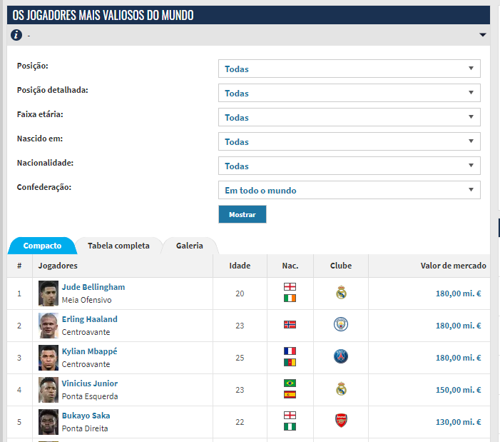
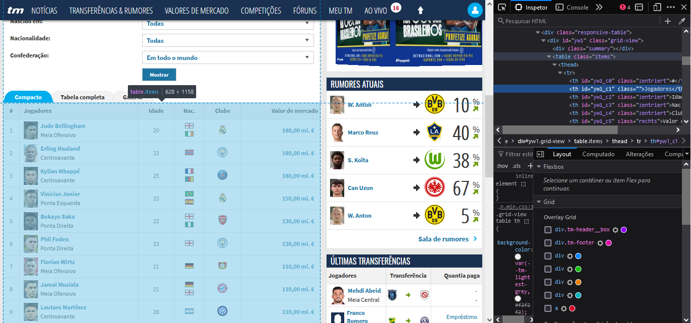
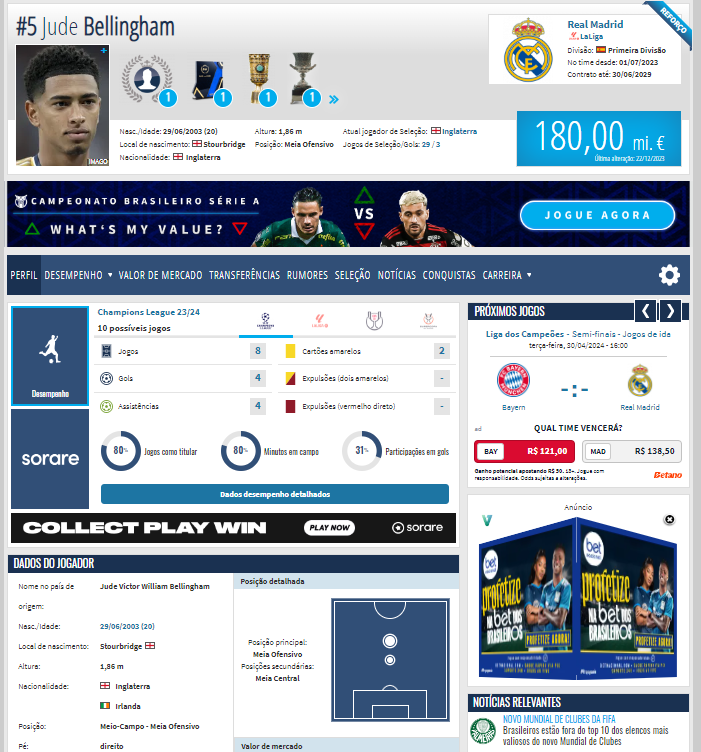

```{r}
#| echo=FALSE

#Pacotes e funções necessários
pacman::p_load('tidyverse', 'rvest', "RSelenium", "jsonlite", "httr")

closeconnection <- function(){
  
  driver$server$stop()
  rm(driver)
  
}
```

# Importação de Dados da Web

O R em seu pacote *base* ou com a utilização de pacotes específicos, é capaz de efetuar a importação de dados da *web* de diversas formas. Suas capacidades vão desde efetuar a leitura de um arquivo *.csv* diretamente de sua URL até a realização de tarefas mais complexas, como a raspagem de dados de sites e navegação automatizada em páginas da web. A partir de agora, exploraremos algumas dessas possibilidades.

## Importação de dados hospedados na Web

A primeira funcionalidade do R que iremos explorar é a possibilidade de download e importação direta de dados hospedados na internet. Conforme vimos na seção de leitura de arquivos de texto, podemos efetuar a leitura de arquivos fornecendo sua url. Vamos importar a base de dados contendo alguns indicadores do Plano Plurianual da Prefeitura de Porto Alegre, disponível no link <https://dadosabertos.poa.br/dataset/indicadores-do-plano-plurianual-ppa>:

```{r}

#Como os dados são separados por ponto e vírgula, utilizaremos a função read.csv2 
dados_poa <- read.csv2("https://dadosabertos.poa.br/dataset/1003d991-9b16-4eb3-845e-3f227e46804e/resource/6d18d609-9e38-47c8-b70d-dc255ede8332/download/indicadores_ppa.csv")  

#Visualização da estrutura dos dados 
glimpse(dados_poa)
```

Podemos também utilizar o R para realizar download de arquivos da internet e então trabalharmos com eles localmente. O R conta com uma série de funções capazes de realizar a manipulação de arquivos no sistema operacional, incluindo mover, descompactar, compactar, dentre outras.

Vamos efetuar a leitura da base de dados de coordenadas de domicílios da cidade de Ouro Preto do site do IBGE. Primeiramente fazemos o download do arquivo:

```{r}

#Download do arquivo utilizando a URL 
download.file("https://ftp.ibge.gov.br/Cadastro_Nacional_de_Enderecos_para_Fins_Estatisticos/Censo_Demografico_2022/Coordenadas_enderecos/Municipio/31_MG/3146107.zip", "ouropreto.zip")
```

Vamos agora descompactar os arquivos em um diretório temporário:

```{r}

#Definição de um diretório temporário 
local <- tempdir()  

#Descompactação dos arquivos 
unzip("ouropreto.zip", exdir = local)
```

Vamos verificar quais arquivos estão presentes no diretório criado e efetuar a importação do arquivo **tb_uf.csv**

```{r}
#Vamos verificar os arquivos presentes no diretório com extensão .csv 
list.files(tempdir(), pattern = "csv")  

#Vamos ler o arquivo tb_uf.csv. Precisamos concatenar o nome do arquivo com o diretório 
arquivo <- paste0(local, "/", "3146107.csv") 
arquivo
op <- read.csv2(arquivo) 

#Vejamos o a estrutura do arquivo 
glimpse(op)
```

Utilizando este recurso, é possível, por exemplo, efetuar a importação de arquivos em lotes da web ou efetuar a leitura de uma série de arquivos, o que facilita o processamento de grandes volumes de dados.

## Arquivos JSON

O formato JSON, acrônimo para JavaScript Object Notation (Notação de objetos JavaScript), é uma formatação leve de troca de dados. Deste modo, sua principal vantagem é uma completa independência de linguagens de programação, ou seja, ela funciona de forma igual, independentemente do software/linguagem de programação utilizada. Esta característica, somada à simplicidade do arquivo, torna o formato ideal para a troca de dados entre usuários, serviços, dentre outros. Outro exemplos de aplicações úteis do formato JSON é a interação com APIs da web, bem como a construção de *pipelines* de ciências de dados em que os procedimentos ocorrem parcialmente em ambientes diferentes, sem a necessidade de conversão para os formatos proprietários. Mais detalhes sobre o formato JSON podem ser obtidos clicando no link a seguir: <https://www.json.org/json-pt.html>.

O JSON é constituído de duas estruturas:

-   Uma coleção de pares do tipo nome/valor

-   Uma lista ordenada de valores, semelhante à estruturas um vetores, *arrays*, listas ou sequências.

Um exemplo simplificado de arquivo json, pode ser visualizado a seguir:

```{r}
'[   
{"Name" : "Mario", "Age" : 32, "Occupation" : "Plumber"},    {"Name" : "Peach", "Age" : 21, "Occupation" : "Princess"},   {},   {"Name" : "Bowser", "Occupation" : "Koopa"} ]'
```

Essa estrutura acima seria equivalente ao seguinte *dataframe*:

```{r}

data.frame(Name = c("Mario", "Peach", NA, "Bowser"),            
           Age = c(32, 21, NA, NA),            
           Occupation = c("Plumber", "Princess", NA, "King of Koopa"))
```

A importação e exportação de arquivos JSON no R é realizada com a utilização do pacote **jsonlite**. A função utilizada para a importação dos dados para o R é a *`fromJSON`*, que apresenta os seguintes parâmetros:

-   **txt**: Uma string, URL ou arquivo no formato JSON;

-   **simplifyVector:** Converte arrays JSON que contém apenas primitivas em um vetor;

-   **simplifyDataFrame:** Converte arrays JSON que contém apenas registros em um dataframe;

-   **simplifyMatrix:** Converte arrays JSON que contém vetores de mesma dimensão em uma matriz ou *array.*

Vejamos como a função simplifica estas estruturas no esquema a seguir:

| Estrutura JSON | Exemplo de dados JSON | Classe R simplificada | Argumento |
|------------------|------------------|------------------|------------------|
| Array de primitivas | \["Amsterdam", "Rotterdam", "Utrecht", "Den Haag"\] | Vetor | simplifyVector |
| Array de objetos | \[{"name":"Erik", "age":43}, {"name":"Anna", "age":32}\] | Dataframe | simplifyDataFrame |
| Array de arrays | \[ \[1, 2, 3\], \[4, 5, 6\] \] | Matriz | simplifyMatrix |

A seguir, um exemplo de de importação de arquivo JSON para o R utilizando o pacote *jsonlite*. Vamos utilizar o conjunto de dados World Population by Country, disponível no *Kaggle*, no link <https://www.kaggle.com/datasets/rajkumarpandey02/2023-world-population-by-country>

```{r}

#Leitura do arquivo
country_pop <- fromJSON("datasets/a4_dados_web/countries-table.json")  

#Visualização da estrutura dos dados 
glimpse(country_pop)
```

Note que o arquivo foi importado diretamente no formato `data.frame`, porém, em alguns casos, é necessária a manipulação dos dados para que estejam em um formato adequado de trabalho.

## Importação de dados via API

Com a possibilidade de importação de dados no formato JSON, abre-se a possibilidade da obtenção de dados utilizando APIs de sites. API é sigla para *Application Programming Interface,* ou em português Interface de Programação de Aplicativos e constituem um conjunto de ferramentas, definições protocolos.

A utilização de APIs permitem ao analista/cientista de dados uma maneira consistente de obter dados organizados e confiáveis de um site ou serviço. Quando um site oferece uma API, ele está, em termos gerais, disponibilizando uma máquina que receberá requisiões de dados. Uma vez que esta máquina recebe a requisição, ela processará a requisição e responderá com os conjuntos de dados solicitados.

Considerando o modelo descrito acima, o usuário de R deverá escrever um código para se comunicar com a API de interesse ao enviar a requisição e então estar preparado para processar o conjunto de dados solicitado.

A grande vantagem da utilização das API em detrimento ao webscrapping é que, enquanto no webscraping geralment se obtem um conjunto de informações em HTML, que conforme visto anteriormente, deverá ser processada até que se torne palatável para análise, a API retorna os dados pré-processados. A desvantagem reside no fato de que a grande maioria dos sites não fornece API para acesso aos seus dados.

No R podemos utilizar as API utilizando o pacote **`jsonlite`**, o mesmo utilizado na leitura de arquivos JSON, em conjunto com o pacote **`httr`**. A seguir, um passo a passo para a utilização de APIs no R [@Pereira2022]:

1.  Obter uma chave autenticada para acessar a API (quando necessário).

2.  Encontrar a URL da API, bem como sua documentação.

3.  Fazer a requisição de dados para a API por meio do pacote **httr** e seus principais comandos:

    -   **GET**: Busca os dados.

    -   **POST**: Envia os dados.

    -   **PUT/PATCH**: Atualiza os dados.

    -   **DELETE**: Exclui os dados..

4.  Extrair os resultados retornados pela API com o uso da função *fromJSON* do pacote **jsonlite**.

Geralmente, uma API utiliza os códigos de status HTTP para indicar sucesso ou falha de uma requisição. Os códigos de respostas mais utilizados são:

-   `200`: requisição foi bem sucedida.
-   `201`: requisição foi bem sucedida e um novo recurso foi criado como resultado.
-   `204`: não há conteúdo para enviar para esta solicitação.
-   `400`: essa resposta significa que o servidor não entendeu a requisição.
-   `404`: o servidor não pode encontrar o recurso solicitado.
-   `500`: o servidor encontrou uma situação com a qual não sabe lidar.

Para saber sobre os códigos de resposta de uma API, sempre devemos consultar a sua documentação. Hoje em dia, todas as redes sociais possuem APIs para consumir os dados dos usuários e postagens. Normalmente essas APIs pedem um cadastro anterior. O R possui diversos pacotes para consumir APIs interessantes:

-   `Quandl`: pacote que fornece diversos dados econômicos de diversos países;
-   `Rfacebook`: pacote que facilita o uso da API do facebook (requer cadastro prévio);
-   `twitterR`: pacote que facilita o uso da API do twitter (requer cadastro prévio);
-   `ggmap`: pacote que facilita o uso da API do google maps;
-   dentre outros.

Veremos agora, como acessar uma API no R, caso essa API não tenha um pacote criado. Vamos acessar a API do IBGE para acessar os dados de municípios. Informações sobre a API, bem como seus parâmetros podem ser obtidos cicando [aqui](https://servicodados.ibge.gov.br/api/docs/agregados?versao=3). Vamos obter a estimativa da população de Ouro Preto e os municípios mais próximos.

A própria página da API oferece os parâmetros para construção das URL de acesso conforme as informações desejadas.

Primeiramente fazemos uma requisição usando o comando **GET** do pacote `httr`:

```{r}
#Instalar e carregar o pacote httr 
#install.packages('httr') 
library('httr')  

#url de acesso 
pop <- "https://servicodados.ibge.gov.br/api/v3/agregados/6579/periodos/2021/variaveis/9324?localidades=N6[3118007,3118304,3131901,3140001,3145901,3146107]"  

#Fazendo uma requisição usando GET 
api_pop <- GET(url = pop)  

#Visualização dos status da requisição 
api_pop
```

Note que nossa requisição apresenta status 200, ou seja, a requisição foi bem sucedida. Vamos agora converter os dados obtidos em para um formato de texto, de modo que o R consiga efetuar sua leitura como JSON. Na sequência, vamos verificar a estrutura do objeto e manipular os dados de modo a obter um dataframe.

```{r}

#Convertendo o resultado em uma lista 
populacao <- content(api_pop, "text") %>% fromJSON()   

#Verificando a estrutura do objeto 
glimpse(populacao)  

#Note que os dados desejados estão no formato lista. Vamos convertê-los para o formato dataframe 
resultados <- populacao$resultados  

resultados

#Os resultados estão desorganizados. Vamos organizá-los em um dataframe. Entraremos em mais detalhes sobre manipulação de dados na próxima unidade 
resultados %>% unlist %>% matrix(nrow = 6, byrow = F) %>% as.data.frame.matrix() %>% select(V1, V4, V5) %>% rename("cod_municipio" = V1, municipio = V4, populacao = V5)

```

É importante notar que, mesmo oferecendo facilidade no acesso aos dados, a importação de dados via API não garante que teremos objetos formatados conforme esperado. Na maioria das vezes será necessário efetuar a manipulação dos dados para obter dados propícios à análise.

Vale ressaltar que as APIs podem apresentar comportamento instável. Mesmo sem atingir o número máximo de consultas, pode ocorrer falhas na importação. Neste sentido, é importante evitar fazer consultas excessivas e é uma boa prática dividir o processo em consultas menores.

A seguir, apresentaremos um processo de obtenção de dados da Web para sites que não dispõem de APIs.

## Webscrapping

A internet é fonte inesgotável dados. Conseguimos obter dados de diversos tipos por meio do acesso a sites da *web*. Conforme vimos na seção anterior, muitas páginas oferecem serviços de aquisição de dados por meio de API, o que facilita bastante o acesso a dados.

Entretanto, na maioria das vezes, os dados apresentados não encontram-se em um formato adequado para a importação pelo R e os sites não dispõe de API. Para estes casos, o R oferece a possibilidade da utilização de técnicas de **Webscraping**, ou no português, raspagem de dados.

O Webscraping consiste na leitura de informações dos sites diretamente de seu código HTML (Hypertext Markup Language). Como o HTML é uma linguagem de marcação de texto, voltada para o desenvolvimento e formatação de sites, o formato não é o ideal para aquisição de dados estruturados.

No R, existem dois pacotes principais utilizados no Webscrapping, os pacotes **rvest** [@rvest]e **RSelenium** [@RSelenium]. O primeiro é voltado para o download e manipulação de arquivos HTML e XML, enquanto o segundo atua como um webdriver remoto para automatização de navegação.

Como os dados obtidos estão em uma espécie de formato de texto, outro pacote essencial para a realização do webscrapping, já na fase de manipulação, é o pacote de manipulação de strings **stringr**[@stringr].

### Pacote `rvest`

O pacote **rvest** efetua a leitura das informações do site diretamente de seu código HTML. As informações no código HTML estão organizadas em *tags*. O HTML usa "Marcação" para anotar texto, imagem e outros conteúdos para exibição em um navegador da Web. A marcação HTML inclui "elementos" especiais, como \<head\>, \<title\>, \<body\>, \<header\>, \<footer\>, \<article\>, \<section\>, \<p\>, \<div\>, \<span\>, \, \<aside\>, \<audio\>, \<canvas\>, \<datalist\>, \<details\>, \<embed\>, \<nav\>, \<output\>, \<progress\>, \<video\>, \<ul\>, \<ol\>, \<li\> e muitos outros.

Um elemento HTML é separado de outro texto em um documento por "tags", que consistem no nome do elemento entre "\<" e "\>". O nome de um elemento dentro de uma tag é insensível a maiúsculas e minúsculas. Isto é, pode ser escrito em maiúsculas, minúsculas ou um mistura. Por exemplo, a tag \<title\> pode ser escrita como \<Title\>, \<TITLE\> ou de qualquer outra forma.

Dentro das tags, geralmente existem classes específicas, que poderão ser úteis no processo de identificação do conteúdo a ser extraído.

Outro elemento que será útil no processo de webscraping são os elementps HTML, ou HTML elements. Esses elementos são seções de código HTML que carregam informações agregadas, usualmente relacionadas. Por exemplo, uma tabela presente em um site tende a ter suas informações agrupadas em um único elemento. Utilizaremos uma referência relativa destes elementos para informar ao R sua localização, o código **CSS** ou o código **xpath**. Utilizaremos os códigos CSS e xpath de forma instrumental. Mais detalhes podem ser obtidos nos links a seguir:

-   [CSS - Cascading Style Sheets](https://developer.mozilla.org/pt-BR/docs/Web/CSS)

-   [Xpath - XML Path](https://www.ibm.com/docs/pt-br/baw/19.x?topic=expressions-xpath-overview)

A seguir, vamos apresentar alguns exemplos de Webscrapping usando o pacote **rvest**. Para exemplificar o processo, será utilizado o site agregador de informações de futebol Transfermarkt (<https://www.transfermarkt.com.br/>). Vamos obter as informações dos 25 jogadores de futebol mais valiosos, segundo avaliações do site.

O primeiro passo é abrir a página e verificar as informações que se deseja extrair. Vamos acessar o link <https://www.transfermarkt.com.br/spieler-statistik/wertvollstespieler/marktwertetop>.

Note que os dados são compostos da posição do jogador, posição em que atua, idade, nacionalidade, clube e valor de mercado. Porém, os dados em texto não incluem nacionalidade ou clube, logo não podem ser obtidos pelo processo básico de raspagem. Incialmente, precisamos efetuar a leitura da página para o R. Será utilizada a função read_html:

```{r}

# Carregamento do pacote
library(rvest)

#Importação do código HTML do site
url <- "https://www.transfermarkt.com.br/spieler-statistik/wertvollstespieler/marktwertetop"


top_jogadores <- read_html(url)

#Estrutura dos dados
top_jogadores
```

Note que o código é composto de duas tags, a tag *head* compõe o cabeçalho da página e a tag *body* compõe o corpo da página. Logo, a informação da tabela deverá ser buscada dentro dos elementos da tag *body.* Entretanto, o código da página é intrincado o suficiente para dificultar e, na maioria dos casos, impossibilitar este busca diretamente no código. Neste caso, iremos utilizar a ferramenta de inspeção do Firefox para identificar o elemento. Para tal, clicaremos com o botão direito na página, clicaremos em **Inspecionar** e utilizaremos a ferramenta **Selecionar um elemento da página**.

Ao clicar na tabela de interesse, o código HTML do elemento é destacado no inspetor:

Ao encontrar a linha que corresponde ao código, clique com o botão direito sobre a linha de código, clique em **Copiar** e na sequência selecione **CSS Selector**. Esse código é uma espécie de rótulo para o elemento. Para esta tabela, ela retornará o código `.items`. Utilizaremos este rótulo para a leitura da seguinte forma:

```{r, warning=FALSE, message=FALSE}
#| warning: false
#| message: false
#Definição do nó que contém a tabela
html_tabela <- html_element(top_jogadores, ".items")

#Estrutura do objeto
html_tabela

```

Como já coletamos os dados da tabela, agora precisamos convertê-la em um formato adequado. Para isso, utilizaremos a função `html_table.`

```{r}

#Conversão dos dados em HTML
dados_jogadores <- html_tabela %>% html_table

#Estrutura dos dados
dados_jogadores
```

Note que a leitura da tabela nos retorna uma tabela com algumas informações faltantes, como as bandeiras de nacionalidade e emblemas dos times. Isso ocorre porque esta função extrai apenas texto.

Ao verificar a tabela, verificamos que existem algumas linhas incompletas, dados repetidos e fora de posição. Vamos corrigir essas inconsistências. Note também que os nomes estão errados devido ao deslocamento do conteúdo e o valor de mercado está em formato `chr`. também vamos trabalhar estes elementos para obter uma base de dados organizada.

```{r}

#As colunas 2, 3, 7 e 8 apresentam informações repetidas ou faltantes. Vamos removê-las
dados_jogadores <- dados_jogadores[, -c(2, 3, 7, 8)]

#Vamos eliminar as linhas repetidas usando a função complete_cases
linhas_completas <- complete.cases(dados_jogadores)
dados_jogadores <- dados_jogadores[linhas_completas, ]

#Correção dos nomes
names(dados_jogadores) <- c("classificacao", "nome", "posicao", "idade", "valor")

#Conversão do valor de mercado de texto para numérico
dados_jogadores$valor <- str_remove(dados_jogadores$valor, ",00 mi. €")
dados_jogadores$valor <- as.numeric(dados_jogadores$valor)

#Resultado final
dados_jogadores
```

Agora temos uma base de dados organizada e poderíamos trabalhar com elas. Entretanto, suponha que exista o interesse de obter informações mais detalhadas sobre cada jogador. Na página inicial, note que, o nome de cada jogador leva a uma página personalizada, com uma série de informações, conforme exemplo abaixo.



Nessa página, temos informações detalhadas, como nome completo, nacionalidade, clube atual, data de chegada no time, dentre outras. Para agregar essas informações aos dados, seria necessário navegar em cada uma das páginas destes jogadores, copiar as informações e cruzá-las com as já obtidas, o que seria uma tarefa cansativa, sobretudo se existir a atualização das informações.

Felizmente, é possível programar uma rotina que acesse cada uma das páginas e extraia as informações. Basta identificarmos o link de cada página, efetuar a raspagem e posteriormente a agregação dos dados.

Como já baixamos o html da página inicial, podemos trabalhar novamente com o mesmo objeto.

Estamos interessados nos links que levam à página de cada jogador. Utilizaremos a função `html_elements` para extrair todos os elementos que contém links. Para tal, usaremos o fato de que todas as tags de URL são do tipo **`a`** e aplicaremos a função `html_attr` para extrair as URL dos nós, informando o atributo **`href`**. Como a página contém outros links que não nos interessam, focaremos novamente apenas nos dados da tabela de títulos.

```{r}

#Buscando por nós que contém links dentro da tabela de títulos
links <- top_jogadores %>% html_element(".items") %>% html_elements("a") %>% html_attr("href")

#Verificando a estrutura dos dados
head(links)
```

Note que os links retornaram apenas o sufixo. Para acessá-los, deveremos incluir a URL da página. Perceba também que para cada jogador, três links são listados: um para sua página, outro para a página de seu time e um terceiro para os detalhes da transferência. Os links de jogadores são aqueles que contém a palavra "`profil`". Vamos manter apenas estes e agregar a url do site

```{r}

#Seleção de links que contém a palavra profil
links_jogadores <- links[str_detect(links, "profil")]

#Agregação da url do site
links_jogadores <- paste0("https://www.transfermarkt.com.br", links_jogadores)
```

Agora, com os links completos, podemos iniciar o processo de extração dos dados. Para automatizar o processo, primeiramente vamos verificar como realizar a extração de uma página. Note que, diferente da página anterior, os dados de interesse não estão organizados em uma tabela. Deste modo, teremos que trabalhar com o texto. Estamos interessados nos dados do time no qual os jogadores atuam, logo, vamos nos focar apenas no quadro destacado.

O webscraping sequencial conta com a vantagem de que as páginas desta natureza geralmente são geradas de forma procedural e tendem a seguir um padrão, o que facilita a automatização da extração de dados. Assim, os procedimentos que funcionam para uma página podem ser aplicados às demais. Vamos iniciar com a posição 1.

```{r}

#Download do código HTML
html_pag <- read_html(links_jogadores[1])

#Queremos as informações disponíveis no elemento destacado. 
info_jogador <- html_pag %>% html_element(".data-header__club-info") 

#Visualização dos dados
info_jogador
```

Como queremos apenas os dados do jogador, utilizaremos a função `html_text` para extraí-las e a função `str_view` para verificar a cadeia de caracteres.

```{r}

#Extraindo o texto do código HTML do nó
info <- html_text2(info_jogador)

#Note que as informações estão separadas pelo caractere \n, que india uma nova linha
info

```

Note que nossas informações estão separadas por algumas cadeias de caracteres:

-   Time - antes do delimitador **\\n**

-   Liga - Entre o delimitador **\\n** e a expressão **Divisão:**

-   Divisão: Entre as expressões **Divisão:** e **No time desde:**

-   Início de contrato: entre as expressões **No time desde:** e **Contrato até:**

-   Término de contrato: Após a expressão **Contrato até:**

Vamos utilizar essas expressões como delimitadores para obter nossos dados. Para isso utilizaremos a função `str_split`, que divide uma string dados os delimitadores. Como a função apresenta os dados em lista, vamos utilizar a função `unlist` para converter a lista em vetor. Na sequência, vamos utilizar a função `str_view` para imprimir em tela as *strings* organizadas.

```{r}

#Extração dos dados do jogador
dados <- info %>% str_split("\n|Divisão: |No time desde: |Contrato até: ") %>% unlist 

dados %>% str_view
```

Note que temos as informações organizadas em um vetor, na ordem `time`, `liga`, `divisão`, `inicio_contrato` e `fim_contrato`. Vamos usar esse vetor para criar um data frame com os dados de todos os jogadores. Agora que criamos o processo de extração para um jogador, basta aplicar aos demais e, após o process de extração, agregar à base de dados dos top 10 jogadores

```{r}

#Objeto que receberá as informações:
ficha_jogador <- data.frame()

#Laço para acesso aos 10 jogadores usando o procedimento anterior
for(i in 1:10){
  
  #Download do código HTML
  html_pag <- read_html(links_jogadores[i])

  #Queremos as informações disponíveis no elemento Dados do Jogador. 
  info_jogador <- html_pag %>% html_node("#main > main > header > div.data-header__box--big > div") 
  
  #Extraindo o texto do código HTML do nó
  info <- html_text2(info_jogador)
  
  #Extração dos dados do jogador
  dados <- info %>% str_split("\n|Divisão: |No time desde: |Contrato até: ") %>% unlist
  
  
  ficha_jogador <- rbind(ficha_jogador, dados)
  
}

#Corrigindo os nomes das variáveis
names(ficha_jogador) <- c("time", "liga", "divisao", "inicio_contrato", "fim_contrato")


#Agregação com a base de dados inicial
top_10 <- cbind(dados_jogadores[1:10, ], ficha_jogador)

#Resultado final
top_10
```

Neste exemplo simplificado, foi possível verificar as possibilidades de navegação fornecidas pelo pacote **rvest**. Entretanto, em alguns casos, o formato da página não permite a navegação por meio de URLs. Alguns sites mais complexos necessitam de interação direta do usuário para a geração de protocolos de navegação. Muitas vezes para acessar uma informação específica é preciso realizar o preenchimento de dados, seleção de informações em objetos como caixas de combinação, listas suspensas e outros elementos. Em outros casos, as URL para acesso são geradas por meio de um código Javascript de forma dinâmica, o que impede o acesso ao link direto.

### Pacote `RSelenium`

Nestes casos, o *pacote **rvest*** não possui ferramental suficiente para gerenciar o acesso. Em casos como estes, utilizamos o pacote **RSelenium**. Conforme mencionado anteriormente, o pacote **RSelenium** é um pacote que reune ferramentas utilizadas na navegação automatizada e realização de testes. Ele é baseado em Selenium, que é descrito como um automatizador de navegadores. Mais detalhes sobre o Selenium podem ser obtidos no link <https://www.selenium.dev/>.

Utilizaremos o RSelenium para enviar comandos para as páginas e eventualmente o combinaremos com o rvest para obter dados de páginas da web. Como essa seção utiliza interatividade com um navegador externo, os resultados não serão apresentados no documento HTML.

Como exemplo, vamos efetuar a leitura dos horários de aula da UFOP por departamento, cujo acesso está disponível no link a seguir: [https://zeppelin10.ufop.br/HorarioAulas/#](#0). Para acessar os horários de um departamento, é necessário clicar em um link. Porém, ao inspecionar o elemento, percebemos que os links para cada departamento são criados de forma dinâmica, por meio de uma função Javascript. Assim, diferentemente do exemplo anterior, não é possível efetuar a busca pela URL. Neste caso, teremos que navegar de fato pelas páginas antes de obter seu código HTML.

O RSelenium criará um webdriver que permitirá o acesso a um navegador automatizado, de acordo com comandos fornecidos diretamente pelo R. Esse *webdriver* é o objeto que faz a ligação entre o R e o navegador. É como se fosse um controle remoto. É a partir dele que todas as instruções são passadas ao navegador, como clicar, escrever um texto, pressinar uma tecla, etc. Vamos criar o webdriver e chamá-lo de driver.

O driver criado é composto de duas entidades, uma chamada `server`, que trata das configurações do servidor remoto, e outra chamada `client`, que trata das interações do usuário com o navegador. Vamos utilizar a entidade `client`, que nomearemos de `rmdr`, pois se trata de um *remote driver.*

Uma lista com todos os métodos disponíveis para a classe `remoteDriver`, pode ser obtido no link <https://docs.ropensci.org/RSelenium/reference/remoteDriver-class.html>. Para acessar um método, basta digitar o objeto seguido de um cifrão e o método selecionado.

```{r}
#| eval: false

#Cria o driver e direciona a localização do firefox
driver <- rsDriver(browser = c("firefox"), chromever = NULL, phantomver = NULL)

rmdr <- driver[['client']]
```

Agora, vamos direcionar o navegador para a URL inicial. Para isso, utilizaremos o metodo `navigate`, que indica que o driver deve navegar até a URL indicada.

```{r}
#| eval: false
#navegação para a página inicial
rmdr$navigate("https://zeppelin10.ufop.br/HorarioAulas/#")
```

Precisamos agora identificar os elementos que compõe os links de acesso de cada departamento. No RSelenium, existem várias formas de endereçar um elemento, as principais são:

-   name;

-   id;

-   classe;

-   código css;

-   xpath;

Utilizamos as duas últimas principalmente quando o *name* e o *id* não estão disponíveis. Ao verificar o código fonte (ao clicar **F12** no navegador), percebemos que os elementos relacionados ao link possuem o *id*, que segue o seguinte padrão: `formPrincipal:tabela:i:codigoDepartamento` em que **i** é a posição do link na tabela, iniciando de 0. Ou seja, precisaremos visitar as páginas de 0 a 46. Assim como no webscrap do IMDb, vamos realizar a raspagem da primeira página, que servirá de modelo para as demais.

O primeiro passo será indicar para o RSelenium qual será o elemento visitado, por meio do método **findElement.** Ao fazer isso e atribuir a um objeto, no caso o objeto `dep`, criamos um objeto da classe `webElement`. Esse novo objeto se refere a um elemento HTML da página. No nosso caso, o primeiro link que leva a um departamento. Assim como a classe `remoteDriver`, objetos da classe `webElement` possuem seus próprios métodos, que podem ser acessados no link <https://docs.ropensci.org/RSelenium/reference/webElement-class.html>. Utilizaremos principalmente os métodos `clickElement()` e `sendKeysToElement()`, que clicam e enviam "teclas" para o elemento, respectivamente.

Após indicar o elemento, usamos o método `clickElement()` para clicar no elemento. É importante perceber que primeiro criamos o elemento `dep` para depois utilizarmos o método `clickElement()`.

```{r}
#| eval: false
#Indicando o link para navegação
dep <- rmdr$findElement(using = "id", "formPrincipal:tabela:0:codigoDepartamento")

#Comando clicar
dep$clickElement()

```

Agora que acessamos a página, vamos copiar o HTML, utilizando o método **getPageSource**. Perceba que esse método se refere à página como um todo, por isso é acessado no objeto da classe `remoteDriver`.

```{r}
#| eval: false

#Coleta do código HTML da página
html_horario <- rmdr$getPageSource() 

#Estrutura dos dados
glimpse(html_horario)
```

Note que o HTML está armazenado em lista. Para utilizar o pacote `rvest` na leitura, teremos que converter o objeto para vetor. A partir daí basta utilizar a metodologia apresentada para o pacote `rvest`. Note que a tabela não possui o nome do departamento. Neste caso, iremos utilizar extrair o nome do departamento e agregá-lo à tabela usando o método **getElementText**. Para identificá-lo, usaremos sua classe, **caminho**. Após armazenar a tabela, voltaremos à página inicial.

```{r}
#| eval: false
#Convertendo o código para vetor e efetuando a leitura como HTML
html_horario <- unlist(html_horario) %>% read_html

#Estrutura dos dados
html_horario

#Coletando o nome do departamento
depto <- rmdr$findElement(using = "class", "caminho")
nome_depto <- depto$getElementText() %>% unlist

#Leitura dos dados da tabela
tabela_horarios <- html_horario %>% html_table %>% .[[1]]
tabela_horarios$depto <- rep(nome_depto, nrow(tabela_horarios))

#Estrutura da tabela
glimpse(tabela_horarios)

#Após obter a tabela completa, retornamos para a página inicial
rmdr$navigate("https://zeppelin10.ufop.br/HorarioAulas/#")
```

Com o processo completo, basta iterar em todas as linhas da tabela inicial para obter os horários. Para ilustrar, vamos efetuar a leitura dos cinco primeiros horários. Colocaremos alguns pontos de pausa para permitir o processamento das páginas.

```{r}
#| eval: false
#Objeto que receberá todas as tabelas
tabela_completa <- NULL

#Navegação para a página inicial
rmdr$navigate("https://zeppelin10.ufop.br/HorarioAulas/#")

for(i in 0:4){
  
  #Indicando o link para navegação
  dep <- rmdr$findElement(using = "id", paste0("formPrincipal:tabela:", i, ":codigoDepartamento"))
  
  #Comando clicar
  dep$clickElement()
  
  #Pausa para processamento
  Sys.sleep(2)
  
  #Coleta do código HTML da página
  html_horario <- rmdr$getPageSource() 
  
  #Convertendo o código para vetor e efetuando a leitura como HTML
  html_horario <- unlist(html_horario) %>% read_html
  
  #Coletando o nome do departamento
  depto <- rmdr$findElement(using = "class", "caminho")
  nome_depto <- depto$getElementText() %>% unlist
  
  #Leitura dos dados da tabela
  tabela_horarios <- html_horario %>% html_table %>% .[[1]]
  tabela_horarios$depto <- rep(nome_depto, nrow(tabela_horarios))
  
  #Agregando os dados à tabela completa
  tabela_completa <- rbind(tabela_completa, tabela_horarios)
  
  #Após obter a tabela completa, retornamos para a página inicial
  rmdr$navigate("https://zeppelin10.ufop.br/HorarioAulas/#")
  
  #Pausa para processamento  
  Sys.sleep(2)
  
}

#Resultado final
glimpse(tabela_completa)
View(tabela_completa)
```

Utilizando métodos semelhantes, é possível acessar caixas de combinação, botões radiais, enviar textos para o navegador, dentre outras possibilidades. Para ilustrar uma interação deste tipo, vamos realizar uma pesquisa no Google. Como nosso navegador automatizado já está aberto, basta enviar os comandos para ele.

```{r}
#| eval: false
#Vamos ao Google
rmdr$navigate("https://google.com.br")

#O indicador CSS da barra de buscas é indexado pelo código #APjFqb
busca <- rmdr$findElement(using = "css", "#APjFqb")

#Vamos clicar na barra de busca
busca$clickElement()

#Vamos buscar pelo curso de estatística da UFOP, usando os seguintes termos:
texto_pesquisa <- "estatística UFOP"

#Agora vamos enviar o texto para o elemento, seguido da tecla esc para sair da caixa de texto. Para evitar sobreposição, vamos aguardar 1 segundo entre os comandos
busca$sendKeysToElement(list(texto_pesquisa))

Sys.sleep(1)

busca$sendKeysToElement(list(key = "escape"))

#Vamos usar o botão "Estou com sorte". Vamos usar agora o XPath para localizar o botão
sorte <- rmdr$findElement(using = "xpath", "/html/body/div[1]/div[3]/form/div[1]/div[1]/div[3]/center/input[2]")

#Agora, enviamos o texto, e posteriormente o clique no botão
sorte$clickElement()


```

Ao término desta seção, é possível concluir que o ferramental para obtenção da web é bastante vasto. O objetivo desta seção não é explorar todos os aspectos possíveis de obtenção de dados na web, e sim fornecer um norte para a utilização das ferramentas disponíveis. Fica evidente que a aplicação das técnicas depende bastante do problema em questão e o analista deve moldar o uso das ferramentas à realidade do momento.

## Exercícios

1.  O site Brasil API (<https://brasilapi.com.br/>)fornece uma série de APIs gratuitas para estudantes, desenvolvedores, empresas, dentre outros interessados. Acesse o site e apresente os dados de três APIs que você julgue interessantes. Antes de começar, leia com atenção os termos de uso.

    ```{r}
    #| eval: false
    GET("https://brasilapi.com.br/api/banks/v1") %>% 
      content("text") %>% 
      fromJSON()
    ```

2.  O site Seminovos BH (<https://seminovos.com.br/carro>) é um agregador de anúncios de carros à venda no estado de Minas Gerais. Nele é possível filtrar os anúncios por diversas características. Utilize as técnicas de webscraping para produzir um data frame com os carros disponíveis para venda na cidade de Ouro Preto. Desconsidere os opcionais. **Desafio: Após criar o data frame, crie uma coluna com uma string que contenha os opcionais de cada veículo.**

    ```{r}
    #| eval: false
    #Leitura dos dados
    #Como o site está bloqueando acessos de robôs, vamos usar RSelenium
    #ex1 <- read_html("https://seminovos.com.br/carro/cidade[]-3449")

    driver <- rsDriver(browser = c("firefox"), chromever = NULL, phantomver = NULL)

    rmdr <- driver[['client']]

    #Leitura do código fonte
    rmdr$open()
    rmdr$navigate("https://seminovos.com.br/carro/cidade[]-3449")

    ex1 <- rmdr$getPageSource()

    #Definição do elemento
    dados_ex1 <- ex1 %>% 
      unlist %>% 
      read_html %>% 
      html_element(".anuncios") 

    #Extração do texto
    texto_ex1 <- dados_ex1 %>% 
      html_text %>% 
      str_split("\n") %>% 
      unlist 

    #Limpeza de espaços vazios extras e duplos
    texto_ex1 <- str_squish(texto_ex1)

    #Remoção de espaços vazios ou códigos (strings muito grandes)
    remover <- which(str_length(texto_ex1) < 2 | str_length(texto_ex1) > 300)

    texto_ex1 <- texto_ex1[-remover]

    #Resultado após remoção
    texto_ex1

    #Vamos remover algumas palavras irrelevantes, como Nitro, Comparar, Favoritar, etc
    texto_ex1 <- texto_ex1 %>% 
      str_remove_all("Nitro|Comparar|Favoritar|Remover da Comparação|Desfavoritar|Turbo|Flex|Grátis|IPVA 2024|NITRO")

    #Removendo novos espaços vazios
    texto_ex1 <- texto_ex1[texto_ex1 != ""]

    #Note que os opcionais do carro, que não aparecem em tela, aparecem no texto
    #Como não é de nosso interesse no momento, vamos deletá-los. Eles são precedidos de um ponto. Vamos salvar o resultado em outro objeto, caso desejemos coletar as características mais tarde.
    texto_anuncios <- texto_ex1[str_detect(texto_ex1, "•") == F]

    #Note que a string Ouro Preto separa os veículos. Elas aparecem a cada 15 observações. Vamos usar esse padrão para criar um dataframe
    veiculos <- data.frame(matrix(texto_anuncios, ncol = 15, byrow = T))

    #Perceba que algumas colunas se repetem. Vamos excluí-las e renomá-las
    veiculos <- veiculos[-c(2:3, 11:14)]
    names(veiculos) <- c("valor", "tipo_anunciante", "nome", "modelo", "ano", "km", "combustivel", "transmissao", "cidade")

    #Desafio
    #Vamos criar um data frame com os opcionais e a posição de cada um para conseguir atribuir aos veículos
    id_op <- texto_ex1 %>% 
      str_detect("•") %>% 
      which()
    opcionais <- data.frame(id = id_op, opcional = texto_ex1[id_op])
    opcionais$opcional <- str_remove_all(opcionais$opcional, "•")

    #Para atribuir cada opcional a seu veiculo, vamos usar um for
    aux <- numeric()
    cont <- 1
    aux[1] <- cont
    for(i in 2:(nrow(opcionais))){
      
      if(opcionais$id[i] == opcionais$id[i - 1] + 1){
        
        aux[i] <- cont
        
      }else{
        
        cont <- cont + 1
        aux[i] <- cont
      }
      
    }

    #Vamos criar uma lista de opcionais para cada veiculo
    opc <- split(opcionais$opcional, aux)

    #Agora vamos concatenar os opcionais dentro de cada lista, separados por vírugla
    opc <- sapply(opc, str_c, collapse = ", ")

    #Adicionando os opcionais ao dataframe original
    veiculos$opcionais <- opc
    ```

3.  Utilize os códigos apresentados na seção de RSelenium para realizar uma pesquisa com os textos **ciência de dados, estatística, aprendizado de máquina** e **inteligência artificial** no Google. Armazene o texto descritivo (indicado em verde) em um vetor. Na sequência, crie um dataframe com os termos pesquisados e os textos obtidos.

4.  

```{r}
#| eval: false
#Cria o driver e direciona a localização do firefox
driver <- rsDriver(browser = c("firefox"), chromever = NULL, phantomver = NULL)

rmdr <- driver[['client']]

texto <- NULL
termos <-  c("ciência de dados", 
           "estatística", 
           "aprendizado de máquina", 
           "inteligência artificial")

for(i in termos){

#Vamos ao Google
rmdr$navigate("https://google.com.br")

#O indicador CSS da barra de buscas é indexado pelo código #APjFqb
busca <- rmdr$findElement(using = "css", "#APjFqb")

#Vamos clicar na barra de busca
busca$clickElement()

#Agora vamos enviar o texto para o elemento, seguido da tecla esc para sair da caixa de texto. Para evitar sobreposição, vamos aguardar 1 segundo entre os comandos
busca$sendKeysToElement(list(i))

Sys.sleep(1)

busca$sendKeysToElement(list(key = "escape"))

#Clicar no botão de pesquisa
pesquisar <- rmdr$findElement(using = "css", ".FPdoLc > center:nth-child(1) > input:nth-child(1)")
pesquisar$clickElement()

Sys.sleep(5)

#Obter os dados da página
resultado <- rmdr$findElement(using = 'class', "WaaZC")

texto <- c(texto, unlist(resultado$getElementText()))

}

View(data.frame(termo = termos, descrição = texto))
```
