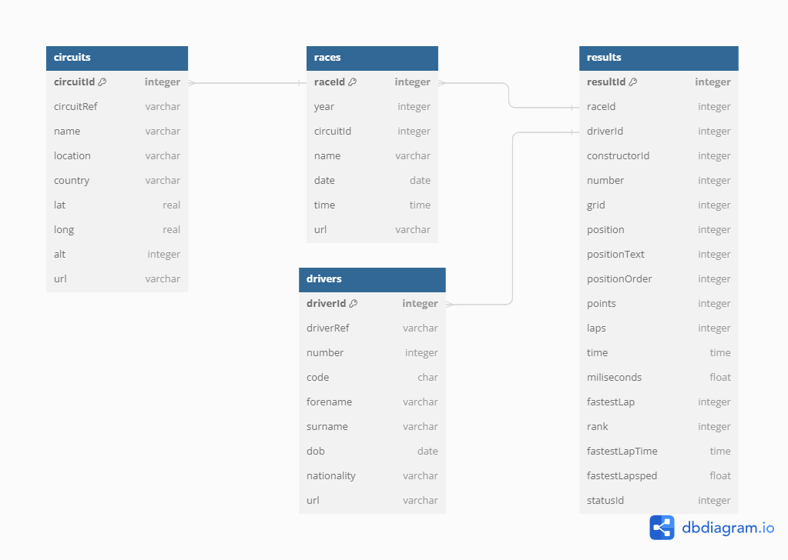

```{r, echo=FALSE, warning=FALSE}
#
pacman::p_load(tidyverse, formattable, janitor, dplyr, DT, pander)

```

## Por que aprender SQL na Estatística?

Vivemos no momento da história em que a geração de dados provavlemente está no seu auge. Praticamente toda ação de um indivíduo nos dias de hoje gera uma transação de dados. Alguns exemplos são acessos em redes sociais, compras em estabelecimentos físicos e virtuais, transferências bancárias, dentre infinitas possibilidades.

A maioria esmagadora destes dados consistem em dados empresariais. Empresas tem realizado investimentos vultuosos na coleta e armazenagem de dados. Entretanto, sem tratamento adequado, estes dados não são transformados em informação, e todo este investimento se perde. Uma das missões do SQL é usar os dados de forma relevante. SQL é a abreviação de *Structured Query Language,* uma linguagem que fornece os meios para manipular bases de dados de maneira intuitiva e assim facilitar a geração de *insights*.

Na estatística, a matéria prima do trabalho são os dados. Neste sentido, fica evidente a utilidade de dominar técnicas de manipulação de dados. Quando a referida técnica é uma das mais utilizadas, se não a mais utilizada no trabalho com tecnologia, caso do SQL, a tarefa de conhecer a ferramenta se torna ainda mais indispensável.

Neste texto, não serão abordadas questões técnicas. O estatístico é um consumidor de dados, ou seja, deve dominar o ferramental para acessar e transformar os dados com os quais vai trabalhar. O objetivo aqui é fornecer as bases para a construção de consultas que permitam ao estatístico acessar bases de dados em SQL diretamente no R e manipular os dados de modo a extrair valor deles. Além disso, como texto introdutório, também deverá permitir um aprofundamento no tema, caso haja interesse do aluno.

## Banco de Dados Relacionais

Um banco de dados pode ser definido, de modo geral, como uma entidade que coleta e organiza dados. Uma planilha de notas é um banco de dados, assim como um arquivo de texto simples que contém dados de compra de materiais, por exemplo. Alguns exemplos de bancos de dados foram abordados nas seções anteriores, nos formatos, .txt, .csv e .xlsx, por exemplo.

Porém, em termos técnicos, quando um profissional de tecnologia se refere a um banco de dados, provavelmente se trata de um **sistema de gerenciamento de banco de dados relacional** (*RDBMS - Relational Database Management System*). Um RDBMS é um tipo de banco de dados que contém uma série de tabelas que geralmente possuem relacionamentos entre si. Também existem bancos de dados que são não relacionais, como bancos de dados noSQL, mas focaremos em bancos de dados relacionais.

O conceito de banco de dados relacional trata da existência de tabelas e das relações existentes entre si. Cada entrada de uma tabela recebe uma chave única de identificação. Esta chave é utilizada para relacionar dados de duas ou mais tabelas.

Por exemplo, vejamos as tabelas a seguir.

```{r, echo=FALSE}

clientes <- data.frame(ID_CLIENTE = 1:5,
           NOME = c("Carlos", "Raquel", "Pedro", "Geraldo", "Taís"),
           SOBRENOME = c("Rocha", "Pereira", "Sampaio", "Martins", "Castro"),
           ENDERECO = c("Avenida JK, 125 Bauxita", "Rua da Lavoura 200",
                        "Rua São Pedro 54", "Avenida Perimetral 26",
                        "Avenida Afonso Pena 4587"),
           CIDADE = c("Ouro Preto", "Mariana", "Ouro Preto", "Itabirito", "Belo Horizonte"))


clientes %>% 
  pander
```

A primeira tabela contém dados de clientes, vamos denominá-la `CLIENTES`. A tabela a seguir contém alguns pedidos e será denominada `PEDIDOS`.

```{r, echo=FALSE}

set.seed(1234)
pedidos <- data.frame(ID_PRODUTO = sample(1:10, 7, replace = T),
                      ID_CLIENTE = sample(1:5, 7, replace = T),
                      QTD_PRODUTO = sample(50:300, 7, replace = T),
                      ENVIADO = sample(c("false", "true"), 7, replace = T))

pedidos %>% 
  pander

```

Note que a tabela `PEDIDOS` possui um campo com o mesmo nome da tabela `CLIENTES`, o campo `ID_CLIENTE`. Este campo estabelece a relação entre as tabelas e evita o registro de informação redundante, o que favorece o desempenho do banco de dados. Note que, no caso de uma tabela não relacional, apenas para incluir os dados de entrega do cliente, seria necessária a inclusão de pelo menos quatro colunas na tabela `PEDIDOS`. Note como ficaria a tabela não relacional.

```{r, echo=FALSE}

left_join(pedidos, clientes, by = "ID_CLIENTE")%>% 
  pander


```

A tabela se tornou saturada e com informações duplicadas. Por exemplo, os dados do cliente Geraldo foram inseridos 4 vezes. O mesmo ocorreria para os dados do produto, que estão cadastrados em uma outra tabela relacionada. Em linhas gerais, um banco de dados relacional trata deste tipo de tabelas e seus relacionamentos e torna o desempenho do trabalho com dados mais eficiente.

As colunas `ID_CLIENTE` e `ID_PRODUTO`, nas tabelas `CLIENTES` e `PEDIDOS`, respectivamente, são os identificadores únicos de cada linha de dados. Este tipo de dado é definido como ***primary key (PK)***, ou **chave primária**. Já na tabela `PEDIDOS`, observe que a coluna `ID_CLIENTE` aparece. Entretanto, ela não é única, pois é utilizada para relacionar a tabela de pedidos com a tabela de clientes. Neste caso, dizemos que a variável `ID_CLIENTE` é uma ***foreign key (FK)***, ou **chave estrangeira** ou **chave externa**.

Estes são dois dos principais tipos de variáveis em SQL, listados a seguir:

-   PRIMARY KEY - chave primária de identificação de um elemento;

-   FOREIGN KEY - Chave estrangeira, utilizada para relacionar duas tabelas;

-   BIT - Valores Booleanos (0 ou 1);

-   CHAR, VARCHAR - Cadeias de caracteres, com variações no tamanho da cadeia de caracteres;

-   TINYINT, SMALLINT, INT, BIGINT - Valores inteiros, com variação no tamanho do número;

-   NUMERIC e DECIMAL - Valores fracionários, com definição do número de casas decimais;

-   REAL, FLOAT - Números reais, com a diferença no tamanho do número;

-   DATE, DATETIME, TIME, TIMESTAMP - Armazena datas e horários.

É importante destacar que estes tipos de variáveis se aplicam a diversos formatos de RDBMS, e em particular a bancos de dados que utilizam SQL. Como nosso objetivo principal é consumir dados, não entraremos em mais detalhes sobre o formato de variáveis.

Os bancos de dados são executados por meio dos RDBMS, que se apresentam em três formas básicas:

-   **Client-server** - Os dados são armazenados em um servidor central (*server*), que conecta com a máquina do usuário (*client*). Os principais serviços dessa natureza incluem PostgreSQL, MariaDB, SQL Server e Oracle.

-   **Cloud -** Similares aos servidores client-server, porém com armazenamento em nuvem. Os principais serviços são oferecidos pela Amazon (Redshift) e Google (BigQuery).

-   **In-process -** Gerenciadores que são executados diretamente do computador, indicados para bancos de dados em que o administrador é o usuário principal. O mais utilizado é o SQLite, que utilizaremos em nossos estudos.

## Conectar a um Bancos de Dados no R

Para conectar um banco de dados ao R, utilizaremos o pacote `DBI` (**D**ata**B**ase **I**nterface). Ele fornece uma série de funções úteis para conexão e gerenciamento de bancos de dados. A principal função é a `dbConnect`, utilizada para realizara conexão entre o R e o banco de dados. Ela utilizará um segundo pacote para estabelecer a conexão, que irá variar conforme o formato do banco de dados.

No contexto do R, para apresentar as noções iniciais de SQL utilizaremos o pacote `RSQLite`, que serve para acessar bancos de dados administrados com o SQLite, formato que utilizaremos nesse material. Logo, utilizaremos a função `SQlite` para conectar o banco de dados.

Utilizaremos o banco de dados de temporadas da fórmula 1, disponível no [Kaggle](#0). Este banco de dados está em formato SQLite, logo, devemos realizar a importação do mesmo por meio da função `dbConnect`. O código a seguir cria a conexão, que chamaremos de db_f1. De maneira semelhante, alterando o pacote, podemos nos conectar a bancos de dados Postgres (`Rpostgres::Postgres`) MySQL (`RMariaDB::MariaDB`), dentre outros.

```{r, warning=FALSE}

#Instala e carrega os pacotes DBI e RSQLite 
pacman::p_load(DBI, RSQLite)  

#Cria uma conexão com a base de dados da Formula 1 
db_f1 <- dbConnect(RSQLite::SQLite(),
                  dbname = "datasets/a5_nocoes_sql/Formula1_4tables.sqlite") 

#Status do objeto
db_f1
```

Outros detalhes podem ser inseridos na conexão, caso necessários, como por exemplo `username` e `password`, caso se trate de um banco de dados com autenticação.

Uma vez que o banco de dados foi carregado, podemos visualizar suas tabelas com a função `dbListTables`.

```{r}

#Lista todas as tabelas do banco de dados 
dbListTables(db_f1)  
```

Note que possuimos agora quatro tabelas importadas para o ambiente do R, **circuits**, **drivers**, **races** e **results**. Utilizaremos estas tabelas para explorar a estrutura das consultas e os principais comandos SQL. Porém, antes de iniciar a prática propriamente dita, vamos apresentar alguns conceitos básicos de SQL.

## SQL e Consultas

A sigla SQL significa Structured Query Language, ou em português, Linguagem de Consulta Estruturada. Como o próprio nome indica, se trata de uma linguagem voltada para a realização de consultas em bancos de dados.

O SQL, ao contrário do R, não é uma linguagem de programação. As operações de aquisição de dados em SQL, nosso interesse principal, se dão por meio da realização de **consultas**, ou ***queries***, plural de ***query**.* Uma consulta é um conjunto de diretrizes que são repassadas ao banco de dados, por meio de comandos específicos. Como neste texto o enfoque principal é o consumo de dados, apresentaremos os principais comandos relacionados à obtenção de dados de tabelas e transformação dos dados obtidos. Os principais comandos utilizados em consultas SQL são:

-   SELECT

-   FROM

-   WHERE

-   GROUP BY

-   ORDER BY

-   AS

-   DISTINCT

-   COUNT

-   BETWEEN

-   HAVING

-   LIMIT

Estes comandos serão apresentados separadamente e posteriormente agregados em consultas mais complexas.

Existem duas formas principais de executar consultas SQL em R:

-   Função `dbGetQuery()` do pacote DBI;

-   Inclusão de um *chunk* SQL em um R notebook.

A primeira função é utilizada em scripts gerais, retorna um dataframe e é o método mais simples para executar uma consulta. Já a segunda, que somente pode ser utilizada dentro de um notebook R, é útil no aprendizado da sintaxe, pois as instruções são repassadas diretamente, sem alterações nas consultas ou funções intermediárias.

Utilizaremos principalmente a segunda forma, pois a finalidade principal é compreender o funcionamento das consultas.

Importante destacar que os chunks em SQL devem conter a seguinte sintaxe em seu cabeçalho:

`{sql, connection=con}`,

em que `con` é a conexão estabelecida entre o R e o banco de dados. No nosso caso, utilizaremos:

`{sql, connection=db_f1}`.

Se quisermos atribuir a consulta a um objeto R, utilizamos a sintaxe:

`{sql, connection=con, output.var = "dados"}`.

Ao utilizar essa sintaxe, o resultado da consulta realizada no chunk seria armazenada no objeto `dados`.

### SELECT e FROM - Seleção de Variáveis

O comando `SELECT` é a diretriz básica para uma consulta de dados em SQL. Ele indica de quais colunas serão importadas de uma tabela. Uma instrução do tipo `SELECT` sempre vem acompanhada do comando `FROM`. O comando `FROM` indica de qual tabela os dados indicados serão obtidos. Vamos utilizar os comandos `SELECT` e `FROM` para visualizar a estrutura das tabelas de nosso banco de dados da Fórmula 1.

Para acessar todas as colunas de uma tabela, utilizaremos a seguinte estrutura de consulta:

```{verbatim}
SELECT *
FROM exemplo_tabela
```

O símbolo **`*`** indica que todas as colunas devem ser selecionadas. A consulta acima pode ser "traduzida" para: **Selecione todas as colunas da tabela exemplo_tabela**. Vamos agora visualizar as tabelas de nosso banco de dados. Para executar uma consulta no R, utilizaremos a função `dbGetQuery` do pacote `DBI`, que é instalado em conjunto com o pacote `RSQLite`. Além dos comandos `SELECT` e `FROM`, vamos utilizar o comando `LIMIT` para limitar às 5 primeiras observações.

```{sql, connection=db_f1}

--Visualização da tabela circuits
SELECT * 
FROM circuits 

```

```{sql, connection=db_f1}

--Visualização da tabela drivers
SELECT * 
FROM drivers 
```

```{sql, connection=db_f1}

--Visualização da tabela races
SELECT * 
FROM races 
```

```{sql, connection=db_f1}

--Visualização da tabela results
SELECT * 
FROM results 
```

Pode-se observar que as 3 primeiras tabelas apresentam informações sobre os circuitos, pilotos e corridas, respectivamente, enquanto a última tabela contém os resultados das corridas. É fácil ver que as tabelas apresentam estrutura relacional. Por exemplo, a tabela `races` apresenta a variável `circuitid`, que identifica as informações do circuito na tabela `circuits`. O mesmo ocorre entre as tabelas `results` e todas as demais tabelas. Estas relações, conforme mencionado anteriormente, evitam a redundância de informações e contribuem para um banco de dados mais eficiente.

Poderíamos realizar as mesmas consultas por meio a função `dbGetQuery`, para utilização direta como objeto no R da seguinte maneira:

```{r, warning=FALSE}

#Visualização da tabela circuits
dbGetQuery(db_f1, "SELECT * FROM circuits") %>% 
  datatable()

#Visualização da tabela drivers
dbGetQuery(db_f1, "SELECT * FROM drivers") %>% 
  datatable() 

#Visualização da tabela races
dbGetQuery(db_f1, "SELECT * FROM races") %>% 
  datatable()

#Visualização da tabela results
dbGetQuery(db_f1, "SELECT * FROM results") %>% 
  datatable()
```

As relações entre as tabelas componentes de um banco de dados geralmente são representadas por diagramas. A seguir, um exemplo de como o banco de dados em estudo é estruturado.

{fig-align="center"}

Além de retornar a tabela como um todo, podemos utilizar o comando `SELECT` para construir uma consulta que retorne colunas específicas. Para tal, basta lista as colunas após a instrução. É importante mencionar que as consultas em SQL não são *case sensitive*, ou seja, não há diferenças ao declarar na consulta uma coluna em letras maiúsculas, minúsculas ou ambas.

Vamos agora utilizar o `SELECT` para retornar apenas algumas colunas da tabela `results`. Vamos selecionar as colunas `raceID`, `driverId`, `position`, `time`, `points` e `fastestLapTime`. Veja que mesclamos propositalmente algumas colunas em maiúsclua e outras em minúscula, o que não afetou o resultado da consulta.

```{sql, connection = db_f1}

--Selecionando as colunas desejadas
SELECT RACEID, driverId, position, TIME, Points, fastestLapTime 
FROM results
```

Observe que os valores devem ser separados por vírgula. A indentação não tem influência no resultado da consulta.

#### Operações com Colunas

Além de selecionar colunas, o comando `SELECT` também pode ser utilizado para efetuar cálculos em colunas e incluí-los como resultado. Por exemplo, vamos supor que queiramos aplicar uma punição de 25% na pontuação dos corredores.

```{sql, connection = db_f1}

--Penalizando a pontuação em 25%
SELECT raceID,  driverId,  position ,  time,  fastestLapTime,
 points AS base_points, 
 0.75*points AS penalized_points
FROM results
```

Em SQL, os principais operadores são a soma (+), subtração (-), multiplicação (\*), divisão (/) e resto da divisão entre dois números (%).

Note que uma nova instrução, `AS`, foi incluída após o nome da nova variável. O comando `AS`, quando inserido após uma variável no comando `SELECT`, redefine o nome da referida variável. No exemplo anterior, nomeamos a variável criada como `penalized_points` e renomeamos a variável original como `base_points`. Podemos também aplicar funções de valores simples aos dados. Por exemplo, se desejamos arredondar a nota penalizada para 1 casa decimal, basta utilizar a função `round():`

```{sql, connection = db_f1}

SELECT raceID, driverId, position, time,fastestLapTime,
  points AS base_points, 
  round(0.75*points, 1) AS penalized_points
FROM results
```

Algumas das principais funções são:

-   **ABS(n)**: Devolve o valor absoluto de (n).

-   **CEIL(n)**: Obtém o valor inteiro imediatamente superior ou igual a "n"

-   **FLOOR(n)**: Devolve o valor inteiro imediatamente inferior ou igual a "n".

-   **MOD (m, n)**: Devolve o resto resultante de dividir "m" entre "n".

-   **NVL (valor, expressão)**: Substitui um valor nulo por outro valor.

-   **POWER (m, exponente)**: Calcula a potência de um número.

-   **ROUND (numero \[, m\])**: Arredonda números com o número de dígitos de precisão indicados.

-   **SIGN (valor)**: Indica o sigal do "valor".

-   **SQRT(n)**: Devolve a raiz quadrada de "n".

-   **TRUNC (numero, \[m\])**: Trunca números para que tenham uma certa quantidade de dígitos de precisão.

As expressões em SQL também podem ser usadas com texto. Por exemplo, podemos utilizar o operador (\|\|) para concatenar duas ou mais cadeias de caracteres em uma nova variável. Por exemplo, na tabela drivers, vamos concatenar o nome completo dos pilotos e sua nacionalidade:

```{sql, connection = db_f1}

SELECT forename||' '||surname ||' - '||nationality AS 'Identificação'
FROM drivers
  
```

### WHERE - Seleção de registros

Ao se trabalhar com dados, uma tarefa bastante corriqueira é a seleção de dados com base em características de interesse. Por exemplo, ao enviar uma promoção para clientes que estão indecisos com uma determinada compra, seria prudente filtrar apenas aqueles que possuem itens no carrinho adicionados nas últimas 24 horas.

Para tal tarefa, utilizamos o comando `WHERE`. O comando `WHERE` permite que repassemos instruções para o banco de dados, de modo que apenas registros que atendam às instruções determinadas sejam retornados. Vamos apresentar alguns exemplos de filtros numéricos com `WHERE`:

```{sql, connection = db_f1}

--Selecionar apenas resultados de pilotos que venceram as corridas
SELECT *
FROM results
WHERE position = 1

```

```{sql, connection = db_f1}

--Selecionar dados das corridas anteriores à 30ª
SELECT *
FROM results
WHERE raceId < 30
```

```{sql, connection = db_f1}

--Selecionar provas excluindo o ano de 2009
SELECT *
FROM races
WHERE year != 2009
```

Para tornar as consultas mais detalhadas, podemos utilizar as instruções `BETWEEN`, `AND`, `IN`, `NOT IN` e `OR`. Cada uma delas realiza a seguinte função:

-   `BETWEEN`: Seleciona valores entre dois outros valores;

-   `AND`: Agrega condições do tipo E;

-   `IN`: Verifica se um valor pertence a um objeto;

-   `NOT IN`: Verifica se um valor não pertence a um objeto;

-   `OR`: Agrega condições do tipo OU

Vamos ver alguns exemplos de seleção e dados com estas instruções:

```{sql, connection = db_f1}
--Selecionar corridas entre 2009 e 2005
SELECT * 
FROM races
WHERE year BETWEEN 2005 AND 2009

```

```{sql, connection = db_f1}

--Selecionar corridas das rodadas 1, 3 e 8
SELECT * 
FROM races
WHERE round = 1 OR round = 3 OR round = 8
```

```{sql, connection = db_f1}

--Poderiamos fazer a mesma seleção acima usando o comando IN
SELECT * 
FROM races
WHERE round IN (1, 3, 8)
```

```{sql, connection = db_f1}

--Selecionar todas as corridas exceto as dos circuitos 9 e 17
SELECT * 
FROM races
WHERE circuitId NOT IN (9, 17)
```

```{sql, connection = db_f1}

--Selecionar todas as corridas exceto as dos circuitos 9 e 17, considerando apenas as 3 primeiras rodadas
SELECT * 
FROM races
WHERE circuitId NOT IN (9, 17) AND round IN (1, 2, 3)
```

A instrução `WHERE` também pode ser aplicada em dados de texto. Por exemplo, podemos querer apenas os registros que apresentem exatamente um texto, ou que comecem com a letra A, ou ainda aqueles que contem uma determinada palavra ou sequência de caracteres em sua composição. EM SQL, cadeias de caracteres são delimitadas por aspas simples.

Ao se trabalhar com texto em uma consulta para comparações, utiliza-se a instrução `LIKE`, geralmente acompanhada por caracteres especiais, que podem ser utilizados como coringas.

-   Underline ( `_` ): Indica a posição do caractere na string;

-   `%`: Indica que pode ocorrer qualquer quantidade de caractere após a string

Vamos observar algumas possibilidades nos exemplos a seguir:

```{sql, connection = db_f1}

--Listar todos os pilotos brasileiros
SELECT *
FROM drivers
WHERE nationality = 'Brazilian'
```

```{sql, connection = db_f1}

--Listar todos os pilotos brasileiros e italianos
SELECT *
FROM drivers
WHERE nationality IN ('Brazilian', 'Italian')
```

```{sql, connection = db_f1}

--Listar todas os pilotos cujo nome começam com letra A
SELECT *
FROM drivers
WHERE forename LIKE 'A%'
```

```{sql, connection = db_f1}

--Listar todas os pilotos cujo nome tem G como segunda letra
SELECT *
FROM drivers
WHERE forename LIKE '_G%'
```

```{sql, connection = db_f1}

--Listar pilotos cujo nome tem 6 letras
SELECT *
FROM drivers
WHERE LENGTH(forename)=6
```

Além destes coringas, existem diversas funções para manipulação de texto. As principais são as seguintes:

-   `CHARINDEX` - Localiza a posição de um determinado caractere.

-   `LEFT` - Seleciona uma determina quantidade da caracteres a partir da esquerda.

-   `RIGHT` - Seleciona uma determina quantidade da caracteres a partir da direita.

-   `LENGTH` - Conta a quantidade de caracteres.

-   `REPLACE` - Substitui um determinado caractere.

-   `REVERSE` - Inverte os caracteres.

-   `LOWER` - Converte os caracteres para minúsculo

-   `UPPER` - Converte os caracteres para maiúsculo

-   `SUBSTRING` - Seleciona parte de uma string com base numa posição inicial e final.

-   `SUBSTRING_INDEX` - Seleciona parte de uma string até atingir a quantidade informada do delimitador.

Outra opção é trabalhar com expressões regulares, ou REGEX. Entretanto, o uso de expressões regulares é um pouco mais complexo e não será aboradado nessa disciplina. Uma introdução bastante completa ao tema pode ser encontrada neste [link](https://blog.dp6.com.br/regex-o-guia-essencial-das-express%C3%B5es-regulares-2fc1df38a481).

### GROUP BY e ORDER BY - Agregação e Ordenação

A agreegação de dados tem como objetivo agrupar, totalizar ou resumir os dados. Esta agregação é realizada em termos de operações conhecidas, como contagem, soma, mínimo, máximo, média, dentre outras. Com a agregação é possível realizar a análise descritiva inicial de um conjunto de dados, por exemplo.

A agregação de dados em SQL é realizada por meio da instrução `GROUP BY`, após a seleção das colunas de interesse e da função de agregação. A instrução deve ser procedidadas variáveis de agregação. A estrutura geral é a seguinte:

```{verbatim}
SELECT var1, var2
FUNCAO_DE_AGREGACAO(*)
FROM exemplo_tabela
GROUP BY var
```

As principais funções de agregação são as seguintes:

-   `COUNT(X)`: Conta os valores não nulos da coluna

-   `COUNT(*)`: Conta todos os valores da coluna

-   `MIN`: Retorna o valor mínimo da coluna

-   `MAX`: Retorna o valor máximo da coluna

-   `AVG`: Calcula o valor médio da coluna

-   `SUM`: Calcula a soma dos valores da coluna

A seguir, alguns exemplos de concatenação utilizando o comando `GROUP BY`:

```{sql, connection = db_f1}

--Contagem de grandes prêmios constantes no banco de dados
SELECT COUNT(*) 
 from races
```

```{sql, connection = db_f1}

--Tabela de grandes prêmios
SELECT name, COUNT(*) AS frequencia
FROM races
GROUP BY name
```

```{sql, connection = db_f1}

--Pontuação total por piloto
SELECT driverId, SUM(points) AS 'pontuacao_total' 
FROM results
GROUP BY driverId
```

```{sql, connection = db_f1}

--Pontuação mínima, média e máxima por piloto
SELECT driverId, 
 MIN(points) AS 'pontuacao_minima',
 AVG(points) AS 'pontuacao_media',
 MAX(points) AS 'pontuacao_maxima'
FROM results
GROUP BY driverId
```

Em consultas comuns, para selecionarmos condições, utilizamos a instrução `WHERE`. Porém, este comando não funciona em agregações. Nestes casos, utilizamos a instrução `HAVING`. Vamos verificar como esta instrução funciona nos exemplos a seguir:

```{sql, connection = db_f1}

--Tabela de grandes prêmios com pelo menos 30 realizações
SELECT name, COUNT(*) AS frequencia
FROM races
GROUP BY name
HAVING frequencia >= 30
```

```{sql, connection = db_f1}

--Seleção apenas de pilotos que já pontuaram
SELECT driverId, SUM(points) AS 'pontuacao_total'
FROM results
GROUP BY driverId
HAVING pontuacao_total > 0
```

Em conjuntos de dados e em agregações, é comum desejarmos apresentar os resultados ordenados. Por exemplo, podemos estar interessados em quais os grandes prêmios com maior frequencia. Para isto, utilizamos o comando `ORDER BY`. O comando `ORDER BY` nos fornece a classificação crescente com base em uma coluna. Caso deseje-se o ordenamento decrescente, basta utilizar a instrução `DESC`.

```{sql, connection = db_f1}

--Tabela de grandes prêmios ordenada por frequência
SELECT name, COUNT(*) AS frequencia
FROM races
GROUP BY name
ORDER BY frequencia DESC, name
```

```{sql, connection = db_f1}

--Pilotos que já pontuaram em ordem decrescente de pontuação
SELECT driverId, SUM(points) AS 'pontuacao_total'
FROM results
GROUP BY driverId
HAVING pontuacao_total > 0
ORDER BY pontuacao_total DESC
```

## JOIN - Associando tabelas

Para finalizar, note que a tabela anterior apresenta o id do piloto. Entretanto, não é possível analisar os dados pessoais do piloto, por exemplo. Como o banco de dados é relacional, as informações do piloto estão presentes em outra tabela. Neste caso, precisamos utilizar uma função que agregue as informações da tabela de pilotos com a consulta realizada, por meio da chave primária `driverId`. Esta associação de tabelas é realizada pelas instruções do tipo `JOIN`.


Existem alguns tipos de JOIN, mas vamos dar atenção aos dois principais: `INNER JOIN` e `LEFT JOIN`.

O `INNER JOIN`, conforme o esquema anterior, realiza a união das tabelas considerando apenas casos que sejam coincidentes, ou seja, casos nos quais os valores relacionados estejam presentes em ambas as planilhas. Já a `LEFT JOIN` acrescentará resultados que não estejam presentes na segunda tabela.

Para efetuar a associação de tabelas, devemos seguir o seguinte esquema:

```{verbatim}
SELECT var1, var2, ...
FROM tabela_1 JOIN tabela_2
ON tabela_1.variavel_de_associacao = tabela_2.variavel_de_associacao
```

A seguir dois exemplos de associação de tabelas usando `INNER JOIN` e `LEFT JOIN`.

```{sql, connection = db_f1}

--Agregar dados de pilotos e corridas usando INNER JOIN
SELECT *
FROM results 
INNER JOIN drivers ON results.driverId = drivers.driverId
```

```{sql, connection = db_f1}

--Agregar dados de pilotos e corridas usando LEFT JOIN
SELECT *
FROM results 
LEFT JOIN drivers ON results.driverId = drivers.driverId
```

```{sql, connection = db_f1}

--Dados de pilotos que já pontuaram em ordem decrescente de pontuação
SELECT drivers.forename||' '||drivers.surname AS nome, 
       SUM(results.points) AS 'pontuacao_total'
FROM results LEFT JOIN drivers ON results.driverId = drivers.driverId
GROUP BY nome
HAVING pontuacao_total > 0
ORDER BY pontuacao_total DESC
```

Nos exemplos acima, `INNER JOIN` e `LEFT JOIN` apresentam os mesmos resultados, pois todos as corridas são compostas por pilotos presentes no banco de dados de pilotos. Entretanto, em situações reais, podem ocorrer situações diferentes. Por exemplo, um cliente pode ter se cadastrado em uma loja virtual, mas nunca ter realizado nenhum pedido. Uma `INNER JOIN` não o incluiria em uma associação com uma planilha de pedidos. Já uma `LEFT JOIN` o incluiria, independentemente de não ter pedidos.

## Subconsultas

Como o resultado de uma consulta é uma tabela, também é possível criar consultas a partir do resultado de outras consultas. Mais do que isso, muitas vezes, para elaborarmos relatórios mais avançados, podemos depender dos resultados de consultas anteriores, ou de salvar resultados de consultas como uma tabela virtual, para utilizarmos comandos `JOIN` neste resultado, dentre outras possibilidades.

Para estes casos, podemos utilizar subconsultas (também conhecidas como subquery ou subselect), que nada mais são que consultas aninhadas. Para entender melhor, vamos propor um exemplo. Ainda em nosso banco de dados da fórmula 1, suponha que se deseja construir um relatório com os melhores pilotos, que seriam aqueles que tem pontuação total acima da média.

Perceba que, antes de selecionar os pilotos usando uma cláusula do tipo `HAVING`, precisamos calcular a pontuação média. Neste caso, precisaremos de uma consulta anterior para calcularmos o valor e posteriormente utilizá-lo. Vamos compreender a sintaxe de uma subconsulta com este exemplo. Primeiramente, faremos uma consulta que retorne a pontuação média de cada piloto:

```{sql, connection = db_f1}

--Pontuação média por piloto
SELECT driverId, AVG(points) as averagePoints
FROM results
group by(driverId)
```

Agora, uma consulta que retorne a pontuação média geral:

```{sql, connection = db_f1}

--Calcula a média de pontos conquistados
SELECT AVG(points) as media 
FROM results
```

Ao conhecer o valor da média, poderíamos simplesmente utilizá-lo para selecionar os pilotos com pontuação acima da média:

```{sql, connection = db_f1}

SELECT driverId, AVG(points) as averagePoints
FROM results
GROUP BY(driverId)
HAVING averagePoints > 1.6014
```

Porém, essa consulta seria válida apenas até a realização da próxima corrida. Neste caso, podemos usar a subconsulta para retornar o valor. Basta incluí-la entre parênteses, para que seu resultado seja utilizado como input.

```{sql, connection = db_f1}


SELECT driverId, AVG(points) as averagePoints
FROM results
GROUP BY(driverId)
HAVING averagePoints > (SELECT AVG(points) as media --Calcula a média de pontos conquistados
FROM results)
ORDER BY averagePoints DESC

```

No exemplo anterior, a consulta retornou um resultado numérico. Mas podemos utilizar o retorno de tabelas como resultado, para realizarmos um `JOIN`, por exemplo. No exemplo anterior, temos os pilotos identificados por seu ID. Entretanto, suponha que queiramos utilizar o nome e sobrenome do piloto. Neste caso, criamos uma subconsulta e a nomeamos, logo após os parenteses. Assim, podemos utilizar seus resultados em uma associação de tabelas. Vamos construir as consultas separadamente para entendermos melhor o processo. Já temos a consulta de pontuação média pronta, logo, precisamos de uma consulta que gere os nomes associados ao ID do piloto:

```{sql, connection = db_f1}

SELECT driverId, forename||' '||surname ||' - '||nationality AS 'Identificação'
FROM drivers

```

Com essas consulta em mãos, podemos utlizá-las para construir nossa consulta complexa:

```{sql, connection = db_f1}

SELECT Identificação, averagePoints as 'Pontuação Média' --Consulta final
FROM(
  SELECT driverId, AVG(points) as averagePoints --Consulta de pilotos que pontuaram acima da média
  FROM results
  GROUP BY(driverId)
  HAVING averagePoints > (SELECT AVG(points) as media --Calcula a média de pontos conquistados
  FROM results)
ORDER BY averagePoints DESC) pontos --A consulta foi nomeada como "pontos"

LEFT JOIN(
  SELECT driverId, forename||' '||surname ||' - '||nationality AS 'Identificação' --Consulta de nomes e IDs
  FROM drivers) pilotos --Resultado renomeado como "pilotos"
  
ON pilotos.driverid = pontos.driverid --União das tabelas pilotos e pontos usando a chave driverId

```

Note que, uma consulta com subconsultas é construída de dentro para fora, uma vez que o resultado geral da consulta depende dos resultados anteriores.

## Utilização de consultas no R

Agora que sabemos o básico para a utilização de consultas em SQL, podemos utilizá-las para construir bases de dados para utilização em análise de dados. Para isso, utilizaremos a função `dbGetQuery` para atribuir o resultado de uma consulta a um objeto do R. Para ilustrar, vamos fazer um gráfico de barras para representar os dez maiores vencedores de corridas na fórmula 1, dentro do nosso banco de dados.

```{r}

#Primeiramente, criamos a tabela com os vencedores de grandes prêmios
dbGetQuery(db_f1,
           "SELECT driverId, count(*) as vitorias FROM
           results
           WHERE position = 1
           GROUP BY driverId
           ORDER BY vitorias DESC
           LIMIT 10")

#Porém, temos apenas a tabela com o ID do piloto, criar uma consulta com os nomes e id dos pilotos
dbGetQuery(db_f1,
           "SELECT driverId, forename ||'\n'|| surname as piloto
           FROM drivers
           LIMIT 10") #Limtamos a 10 apenas para fins de impressão

#Agora vamos unir as tabelas usando left join e subconsultas e atribuir ao objeto "dados"
dados <- dbGetQuery(db_f1,
                    "SELECT piloto, vitorias
                    FROM(SELECT driverId, count(*) as vitorias FROM
                           results
                           WHERE position = 1
                           GROUP BY driverId
                           ORDER BY vitorias DESC
                           LIMIT 10) vitorias
                      
                    LEFT JOIN(
                    SELECT driverId, forename ||'\n'|| surname as piloto
                      FROM drivers) pilotos
                      
                    on pilotos.driverid = vitorias.driverid") 

#Gráfico de vitórias
dados %>% ggplot(aes(x = reorder(piloto, desc(vitorias)), y = vitorias)) + 
  geom_bar(stat = 'identity') + 
  geom_text(aes(label = vitorias), nudge_y = 3) + 
  xlab("Pilotos") + 
  ylab("Vitórias")
                    
```

O objeto `dados` agora está disponível no ambiente do R para ser utilizado como um dataframe. É com essa metodologia que podemos acessar uma base de dados SQL, trabalhá-la dentro do ambiente do R e utilizar seus resultados para análises de dados, modelagens estatísticas, dentre outras possibilidades.

## Exercícios

Nestes exercícios, trabalharemos com o banco de dados AdventureWorks. O banco de dados AdventureWorks oferece suporte a cenários de processamento de transações online padrão para um fabricante de bicicleta fictício (Ciclos da Adventure Works). Os cenários incluem Manufatura, Vendas, Compras, Gerenciamento de Produtos, Gerenciamento de Contatos e Recursos Humanos.

1.  Carregue a base de dados `AdventureWorksLT.db`, disponível no Moodle e liste todas suas tabelas. Na sequência, crie consultas para exibir as 10 primeiras linhas de cada tabela, para compreender a estrutura dos dados.

    ```{r}
    #| warning: false
    #| include: false
    aw <- dbConnect(RSQLite::SQLite(),
                      dbname = "datasets/a5_nocoes_sql/AdventureWorksLT.db")

    dbListTables(aw)
    ```

2.  Crie consultas para retornar os seguintes resultados:

    a\) Lista de clientes cujo nome começa com a letra C

    b\) Relação de todos os produtos com preço de custo inferior a 1000 dólares.

    c\) Relatório com o nome do produto, preço padrão, preço de venda, lucro e margem de lucro

    d\) Contagem de produtos por cor.

    e\) Relatório com o número de clientes por estados em ordem crescente.

    f\) Unir as tabelas product e productCategory

    g\) Unir as tabelas customer e customerAddress

3.  A empresa pretende lançar uma promoção para reduzir o estoque de produtos com um número baixo de vendas. Para isso, o setor de marketing precisa de um relatório com os 50 produtos menos vendidos. Elabore um relatório com estes produtos, com o ID do produto e a quantidade de vendas.

    ```{sql, connection = aw}
    #| eval: false
    #| include: false
    SELECT  productid, count(ProductId) AS qtd
    FROM salesorderdetail 
    GROUP BY productid
    ORDER BY qtd 
    LIMIT 50

    ```

4.  Utilize o a consulta do exercício anterior como subconsulta e crie um relatório com o nome do produto, quantidade, cor, preço original e o preço promocional, que deve receber um desconto de 20% do preço original (list price).

    ```{sql connection=aw}
    #| eval: false
    #| include: false

    SELECT Name, qtd, color, listprice, 0.8*listprice as promoprice
    FROM 
    (SELECT  productid, count(ProductId) AS qtd
    FROM salesorderdetail 
    GROUP BY productid
    ORDER BY qtd 
    LIMIT 50) promo
    LEFT JOIN product ON promo.productid = product.productid

    ```

5.  Para planejar a produção do ano seguinte, a empresa necessita conhecer as vendas de cada um de seus produtos e a receita gerada por cada um. Crie uma consulta que retorne uma lista com nome, quantidade, preço unitário e valor total de vendas de cada produto. Ordene de forma decrescente utilizando o valor total de vendas.

    ```{sql, connection = aw}
    #| eval: false
    #| include: false

    SELECT Name, qtd, listprice, qtd * listprice AS total 
    FROM (SELECT productid, count(ProductId) AS qtd
      FROM salesorderdetail 
      GROUP BY productid
      ORDER BY qtd DESC) sales
    LEFT JOIN (SELECT productId, Name, ListPrice
      FROM Product) products
    ON products.productid = sales.productid
    ORDER BY total DESC

    ```

```{sql connection=db_f1}

SELECT *
from races
where circuitid = 2
LIMIT 5
```
