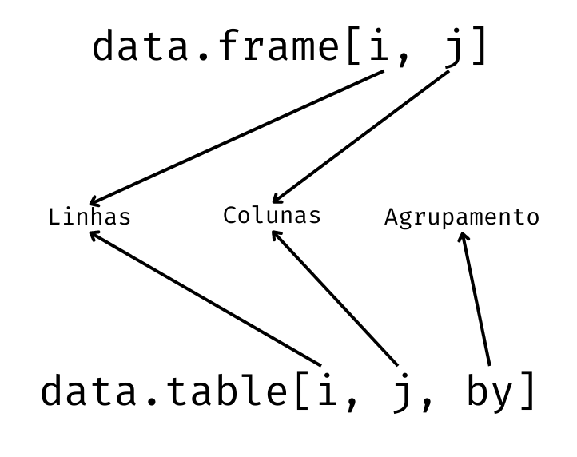

```{r, warning=FALSE, echo=FALSE}

pacman::p_load(tidyverse, formattable, janitor, dplyr, microbenchmark)
```

# Introdução

Muitas vezes, nas rotinas de análise de dados, é necessário trabalhar com grandes bases de dados. É fato conhecido que os pacotes padrão do R apresentam alguma dificuldade em relação à gestão de memória. Este fato se torna ainda mais saliente quando se efetuam operações com bases de dados de tamanho considerável.

Para minimizar esse aspecto técnico, algumas alternativas foram desenvolvidas para o R, em forma de pacotes para manipulação de dados. Uma das alternativas mais utilizadas é o pacote `data.table`.

{fig-align="center"}

Segundo a [documentação](https://rdatatable.gitlab.io/data.table/index.html), o pacote `data.table` aprimora os objetos do tipo `data.frame,` do pacote `base`. Oferece procedimentos mais rápidos de agregação, ordenamento, gestão de linhas e colunas, além de melhor gestão de memória.

A sintaxe, de fato, apresenta semelhanças com a utilização dos *data frames* padrão. Vejamos uma análise comparativa:

{fig-align="center" width="592"}

O pacote mantém a estrutura de colchetes para identificação de elementos de linhas e colunas na mesma posição de um *data frame* tradicional. Porém adiciona uma nova entrada para o agrupamento de dados. Mesmo as estruturas semelhantes ao *data frame* apresentam algumas expansões à sua funcionalidade. A rigor, os elementos de linha (**i**) funcionam de maneira semelhante à função `filter()` do pacote `dplyr`. Os elementos de colunas (**j**) por sua vez funcionam de forma que agrega as funções `select()` e `mutate()` do referido pacote, enquanto o terceiro parâmetro, `by` funciona de maneira similar à função `group_by`.

Além das funções de manipulação, o pacote `data.table` oferece uma leitura de grandes bases de dados com desempenho bastante superior às nativas. Nesta seção, trabalharemos com dados de avaliações de livros, disponível no [Kaggle](https://www.kaggle.com/datasets/saurabhbagchi/books-dataset). Apesar se não ser uma base de dados de grande dimensionalidade, contando com aproximadamente 1 milhão de linhas e 7 colunas, vamos verificar a diferença no tempo de carregamento entre os pacotes `base`, com sua função `read.csv()` e o pacote `data.table`, com sua função `fread()`. Para efetuar a comparação, utilizaremos a função `microbenchmark()`, do pacote homônimo.

```{r, warning=FALSE}

#Instalação e carregamento do pacote
pacman::p_load(data.table)

#Comparação dos tempos de leitura
microbenchmark::microbenchmark(
  
  books_base = read.csv2("datasets/a8_data_table/rating_books.csv", h = T, quote = ""),
  books_dt = fread("datasets/a8_data_table/rating_books.csv"),
  times = 10
  
)

#Leitura dos dados
books_base <- read.csv2("datasets/a8_data_table/rating_books.csv", h = T, quote = "")
books_dt  <- fread("datasets/a8_data_table/rating_books.csv")

#Removendo a base de dados lida pela função read.csv2
rm(books_base)

#Limpeza dos rótulos de colunas
books_dt <- books_dt %>% clean_names()

#Visualização dos dados
books_dt %>% glimpse
```

Note que mesmo para um arquivo de tamanho médio, a diferença de desempenho é bastante significativa. A função `fread()` efetuou a importação do arquivo algumas vezes mais rápido que a tradicional `read.csv()`.

Objetos do tipo `data.frame`, `tibble` e similares podem ser convertidos para *data table*, com o uso da função `data.table`. Vejamos um exemplo:

```{r}

#Dataframe cars, disponível no pacote base
cars

#Dataframe convertido para data table
data.table(cars)
```

Assim como fizemos com o pacote `dlpyr`, separaremos as funções por linhas, colunas e agrupamento.

## Linhas

Assim como nos *data frames*, as operações com linhas nos *data tables* ocorrem na primeira entrada do objeto, dentro das chaves (`[]`). Assim como no pacote `dplyr`, podemos selecionar subconjuntos e ordenar linhas.

### Subconjuntos de linhas

Na seleção de subconjuntos de linhas, podem ser utilizados os seguintes operadores:

-   `>` maior que;

-   `>=` maior ou igual que;

-   `<` menor que;

-   `<=` menor ou igual que;

-   `==` igual a;

-   `!=` diferente de;

-   `is.na()` é dado faltante;

-   `!is.na()` não é dado faltante;

-   `%in% x` pertence ao objeto `x;`

-   `%between% c(x, y)` está entre `x` e `y;`

-   `%like%` permite uso de expressões regulares.

-   `sample(n)` Retorna uma amostra aleatória de tamanho n das linhas

Além destes operadores, também é possível sua combinação utilizando os operadores `&` (e) e `|` (ou). Vejamos alguns exemplos

```{r, warning=FALSE}

#Retorna os 10 primeiros livros
books_dt[1:10]

#Retorna todos os livros com avaliação menor que 5
books_dt[book_rating < 5]

#Retorna todos os livros com avaliação entre 8 e 9
books_dt[book_rating == 8 | book_rating == 9]

#Retorna todos os livros com avaliação entre 0 e 5
books_dt[book_rating %between% c(0, 5)]

#Retorna livros das editoras Berkley Publishing Group e Oxford University Press
books_dt[publisher %in% c("Berkley Publishing Group", "Oxford University Press")]

#Retona todos os livros que contem a palavra Statistics no título
books_dt[book_title %like% "Statistics"]

#Amostra de tamanho 10 das linhas
books_dt[sample(10)]
```

### Ordenamento de Linhas

Para realizar o ordenamento de linhas, com base em valores de colunas, também utilizamos a primeira entrada do *data table*. Basta informar as variáveis que serão utilizadas para ordenamento dentro da função `order()`. No caso de ordenação decrescente, basta preceder a variável pelo sinal negativo (`-`). As linhas serão ordenadas pela primeira variável, enquanto as demais servirão para eventuais desempates. Vejamos alguns exemplos.

```{r, warning = F}

#Ordenar os livros por ordem alfabética
books_dt[order(book_title)]

#Ordenar livros por avaliação decrescente e autor em ordem crescente
books_dt[order(-book_rating, book_author)]

```

Outra forma de ordenar linhas é por meio da funçã `setorder(DT, a, b)`, em que `DT` é o *data table*, `a` e `b` são as colunas que serão utilizadas na ordenação. Ao utilizar esta função, o objeto será atualizado com a nova ordem, sem a necessidade de atribuir novamente o objeto.

```{r}

#Ordenar os livros por ordem alfabética
setorder(books_dt, book_title)
head(books_dt)

#Ordenar livros por avaliação decrescente e autor em ordem crescente
setorder(books_dt, -book_rating, book_author)
head(books_dt)
```

## 

## Colunas

Assim como nos *data frames*, as operações com colunas são realizadas na segunda entrada do *data table*. Dentre as operações possíveis de forma isolada, podemos selecionar colunas e realizar operações com colunas. Tais operações podem resultar em novos *data tables* ou serem agregadas ao objeto original.

### Selecionar colunas

Existem diversas formas de selecionar colunas específicas em *data tables*. Vejamos com exemplos como cada uma delas funciona

#### Selecionar colunas e retornar como um vetor.

```{r, warning=FALSE}

#Selecionar os autores de livros
books_dt[, book_author] %>% head
```

#### Selecionar uma coluna, mas retornar como um *data table.*

```{r}

#Selecionar os autores
books_dt[, .(book_author)]
```

Para retornar a seleção como *data table*, é necessário encapsular as colunas dentro de uma lista. Caso contrário, seriam retornados vetores. Note que, os nomes de colunas não estão dentro de uma lista tradicional, no formato `list()`, e sim dentro de uma expressão `.()`. Esta expressão é um pseudônimo para listas no pacote `data.table`. Sua operação ocorre da mesma forma. Sinta-se a vontade para utilizar a forma que preferir.

#### Selecionar duas ou mais colunas

```{r}

#Selecionar título e avaliação
books_dt[, .(book_title, book_rating)]
```

Assim como na seleção de uma coluna como *data table*, basta incluir os nomes das colunas dentro de uma lista. Também é possível selecionar colunas dentre duas outras e exceto aquelas dentre duas outras, de maneira similar ao feito com o pacote `dplyr`.

```{r}

#Selecionar variáveis entre book_rating e ebook_author
books_dt[, book_rating:book_author]

#Selecionar variáveis entre book_author e book_rating
books_dt[, book_author:book_rating]

#Selecionar variáveis exceto aquelas entre book_rating e ebook_author
books_dt[, -(book_rating:book_author)]
books_dt[, !(book_rating:book_author)]
```

#### Selecionar colunas por um vetor de nomes

Em algumas situações, como na construção de modelos ou de *dashboards*, é necessário selecionar as colunas dinamicamente. Uma das formas de realizar este tipo de operação é atribuir uma variável como um vetor de colunas, selecionado de alguma maneira, ao *data table.* Para realizar esta operação existem duas maneiras. A primeira é utilizar o prefixo `..` antes do objeto que armazena o nome das colunas selecionadas. A segunda forma é utilizar o argumento `with = FALSE`.

```{r}

#Definição das colunas que devem ser selecionadas
select_cols <- c("book_title", "book_author", "book_rating")

#Note que o resultado não é o esperado fornecendo apenas a variável
try(books_dt[, select_cols])

#Vamos repassar a variável com o prefixo ..
books_dt[, ..select_cols]

#Agora utilizando with = F
books_dt[, select_cols, with = F]
```

### Renomear colunas

Também podemos renomear as colunas de um *data table* de maneira simples com a utilização da função `setnames()` para fazer a tarefa. Basta informar o objeto *data table*, o nome ou vetor de nomes antigos e o novo nome ou vetor de novos nomes. É importante notar que, neste caso, diferente do pacote `dplyr`, a função `setnames()` atribui o novo nome à variável mesmo que o objeto não seja atribuído. Ou seja, a mudança é definitiva.

```{r}

#Alterando os rótulos da variáveis book_rating e book_author para rating e author
setnames(books_dt, c("book_rating", "book_author"), c("rating", "author"))
names(books_dt)

#Revertendo as alterações
setnames(books_dt, c("rating", "author"), c("book_rating", "book_author"))
names(books_dt)

```

Também é possível renomear colunas ao selecioná-las:

```{r}

#Selecionando livro, autor e nota, traduzindo os rótulos
books_dt[, .(livro = book_title, autor = book_author, nota = book_rating)]

```

### Cálculos com base em colunas

No pacote `data.table`, assim como no pacote `dplyr`, podemos efetuar operações com colunas, seja retornando resultados avulsos, seja agregando novas colunas.

#### Resultados gerais

Para retornar os resultados gerais, basta repassar a operação no índice **j**. Podemos também efetuar mais de um cálculo por vez, utilizando a lista `.()` e realizar as operações em conjunto com a definição de subconjuntos. Neste caso, basta utilizar as operações com linhas, conforme descrito anteriormente.

```{r}

#Calcular a avaliação média
books_dt[,mean(book_rating, na.rm = T)]

#Número de avaliações por classificação
books_dt[, length(book_rating == 10)]

#Cálculo da avaliação média e mediana 
books_dt[, .(avg_rating = mean(book_rating, na.rm = T), median_rating = median(book_rating, na.rm = T))]

#Tabela de frequência absoluta de avaliações
books_dt[, .( freq_abs = book_rating %>% table)]

#Avaliação média e mediana de livros, excluidas as notas 0
books_dt[book_rating > 0, .(avg_rating = mean(book_rating, na.rm = T), median_rating = median(book_rating, na.rm = T))]

```

Uma outra forma de contar elementos de um grupo é por meio da utilização do argumento `.N`. Ele é particularmente útil combinado com agrupamentos, conforme veremos na sequência. Caso informado fora de um agrupamento, ele retorna o número de casos, sem a necessidade de informar uma variável, como no exemplo anterior, em que usamos a função `length()`.

```{r}

#Número de avaliações de livros do autor Stephen King usando length()
books_dt[book_author == "Stephen King", length(book_author)]


#Número de avaliações de livros do autor Stephen King usando .N
books_dt[book_author == "Stephen King", .N]


```

#### Criação de novas variáveis

A criação de novas variáveis no pacote `data.table` é bastante simples. Basta utilizar no índice **j** o operador `:=`. Uma vez definida a operação que irá gerar uma nova coluna, assim como ao renomear variáveis com o uso da função `setnames()`, não é necessário atribuir o objeto à operação. A inclusão da nova coluna ocorrerá diretamente. Para deletar uma coluna calculada, basta atribuir o valor NULL a uma coluna de mesmo nome.

Também é possível o cálculo de uma série de novas variáveis simultaneamente. Neste caso, devemos utilizar o operador `:=` como função, com a seguinte grafia: **`` `:=` ``**. Os exemplos ilustrativos a seguir tornarão mais claros seu uso.

```{r}

#Criação da variável século de publicação
books_dt[, century_of_publication := ifelse(year_of_publication < 2000, 20, 21)]
glimpse(books_dt)

#Criação das variáveis Livro de Estatística e Avaliação Positiva
books_dt[, `:=`(statistics_book = str_detect(book_title, "Statistics"),
                positive_rating = book_rating > 6)]
glimpse(books_dt)

#Exclusão das variáveis criadas
books_dt[, `:=`(century_of_publication = NULL,
                statistics_book = NULL,
                positive_rating = NULL)]
glimpse(books_dt)
```

## Grupos

Um dos principais atrativos do pacote `data.table` é o trabalho com dados agrupados. Esta é uma das características que foram adicionadas aos *data frames* tradicionais no desenvolvimento do pacote.

### Agrupamento de dados usando `by`

Para efetuar agrupamentos, utilizaremos o argumento `by`, na terceira entrada do *data table*. As operações com dados agrupados seguem o mesmo padrão apresentado anteriormente. Todos os trabalhos são realizados nas posições **i** e **j** do *data table*. É importante ressaltar que, no caso de cálculos agrupados, os mesmos devem ser relizados dentro de uma lista. Vejamos alguns exemplos ilustrativos.

```{r}

#Avaliação média de todos os livros
books_dt[, .(avg_rating = mean(book_rating, na.rm = T)), 
         by = book_title]

#Número de avaliações e avaliação média de livros publicados por ano
books_dt[, .(avg_rating = mean(book_rating, na.rm = T), 
             .N), 
         by = year_of_publication]

#Avaliação média e número de avaliações dos livros relacionados ao Senhor dos Aneis
books_dt[str_detect(book_title, "The Lord of the Rings"), 
         .(avg_rating = mean(book_rating, na.rm = T), 
           n_ratings = .N),
           by = book_title]


```

Também é possível agrupar os dados por mais de uma variável. Para tal, basta repassar ao *data table* as variáveis de agregação dentro de uma lista `.()`. O resultado é a combinação de elementos de cada variável. Por exemplo, vamos criar novamente as variáveis século de publicação e se a a avaliação é positiva. Na sequência calcularemos a avaliação média e o número de avaliações considerando ambas as variáveis.

```{r}

#Criação das variáveis século de publicação e Avaliação Positiva
books_dt[, `:=`(century_of_publication = 
                  ifelse(year_of_publication < 2000, 20, 21),
                positive_rating = book_rating > 6)]

#Avaliação média por século e por avaliação positiva
books_dt[is.na(book_rating) == F, 
         .(avg_rating = mean(book_rating, na.rm = T), 
           rating_number = .N),
         by = .(century_of_publication, positive_rating)]

```

Além de colunas, podemos utilizar expressões no `by`. Podemos, por exemplo, utilizar subconjuntos para agrupamentos

```{r}

#Avaliação média e número de livros publicados por anos anteriores e posteriores a 1990 e livros com a palavra Statistics no título
books_dt[, 
         .(avg_rating = mean(book_rating, na.rm = T),
           .N),
         by = .(before_1990 = year_of_publication >= 1990, 
                statistics= str_detect(book_title, "Statistics"))]


```

### Agrupamento ordenado usando `keyby`

Além de agrupar os dados da maneira convencional, podemos realizar a operação considerando diretamente a classificação dos valores. Para tal, basta utilizar o argumento `keyby` no lugar do argumento `by`. Assim como em outros pacotes, a classificação ocorrerá conforme a ordem das variáveis. Para ordenar de forma crescente ou decrescente, utilizamos o sinal de `-`.

```{r}

#Número de avaliações e avaliação média de livros publicados por ano, ordenados por ano
books_dt[, 
         .(avg_rating = mean(book_rating, na.rm = T), 
           .N), 
         keyby = year_of_publication]

#Avaliação média por século e por avaliação positiva ordenadas
books_dt[is.na(book_rating) == F, 
         .(avg_rating = mean(book_rating, na.rm = T), 
           rating_number = .N),
         keyby = .(century_of_publication, positive_rating)]
```

## Chaining (Encadeamento)

Em algumas situações, não é possível efetuar o cálculo necessáro em uma única etapa. Suponha, por exemplo, calcular uma tabela de frequências absoluas e relativas por grupo a partir de uma base de dados comum. Note que a frequência absoluta de cada grupo será calculada com base nos dados e, posteriormente ao cálculo dessa frequência agrupada, os totais seriam utilizados na relativa.

Para situações desta natureza, a pacote `data.table` oferece a possibilidade de encadear tabelas. Ou seja, uma tabela calculada será trabalhada como um novo *data table, com índices* **i**, **j** e **by** próprios. O exemplo abaixo demonstra um encadeamento simples. Note que ao calcular a avaliação média por ano para os livros da década de 80, os anos são apresentados de forma desordenada, bem como a média. Se quisermos ordenar de forma decrescente pela média e posteriormente em ordem crescente pelo ano, devemos usar o encadeamento.

```{r}

#Tabela de avaliação média por ano classificada em ordem crescente para livros lançados na década de 80
books_dt[year_of_publication %in% 1980:1989, 
         .(avg_rating = mean(book_rating, na.rm = T)), 
         by = .(year_of_publication)]

books_dt[year_of_publication %in% 1980:1989, 
         .(avg_rating = mean(book_rating, na.rm = T)), 
         by = .(year_of_publication)][order(-avg_rating, year_of_publication)]

```

Note que a ordenação não era possível, pois a variável `avg_rating` não existia até ser criada pelo próprio *data table*. Outro exemplo interessante é o cálculo de frequências relativas por grupo, conforme mencionado acima. Suponha calcular as avaliações médias dos livros de George R. R. Martin e J. R. R. Tolkien, classificadas por avaliações positivas e negativas. Serão necessários 2 encadeamentos, pois a primeira tabela criará as frequências, a segunda criará os totais por avaliação positiva ou negativa e o terceiro efetuará o cálculo das frequências por subgrupo. Trabalhoso não? Mas muitas vezes tais operações são necessárias, por necessitarem de atualizaçôes dinâmicas.

```{r}

#Frequências absolutas e relativas por editora e época de lançamento
books_dt[book_rating >0 & book_author %in% c("George R.R. Martin", "J. R. R. Tolkien"), 
         .(avg_rating = mean(book_rating, na.rm = T), 
           abs_freq = .N),
         by = .(book_author, positive_rating)][
           order(book_author), 
           .(book_author, 
             positive_rating, 
             avg_rating, 
             abs_freq, 
             sum = sum(abs_freq)),
           by = .(positive_rating)][,
                                    .(book_author, 
                                      positive_rating, 
                                      avg_rating, 
                                      abs_freq, 
                                      rel_freq = abs_freq/sum), 
                                    by = .(positive_rating)]
```

## Combinar *data tables*

Para finalizar, podemos efetuar a união de dois *data tables* de forma bastante simples. Para tal, basta informar o *data table* principal,posteriormente o *data table* que será reunido na posição **i**, e as variáveis de união na posição **j**, por meio do parâmetro on, que deverá receber uma lista com as variáveis de cada *data table.* Vamos utilizar o arquivo *users.csv*, disponível na mesma página do Kaggle para agregar os dados dos usuários e verificar se a idade influencia na avaliação dos livros.

```{r, warning=FALSE}

#Leitura do arquivo
users <- fread("datasets/a8_data_table/users.csv") %>% 
  clean_names
glimpse(users)

#União dos data tables
join_books <- books_dt[users, on = .(user_id = user_id)]
glimpse(join_books)

#Vamos agora gerar a tabela de avaliação média por idade entre 15 e 60 anos, removendo dados faltantes e avaliações zeradas
#Note que os dados de idade estão em formato char, vamos converter para numérico
avg_age <- join_books[, 
                      age_num := as.numeric(age)][
                        is.na(age_num) == F & age_num %between% c(15, 60), 
                        .(avg_rating = mean(book_rating, na.rm = T)), keyby =. (age_num)]

avg_age

avg_age %>% 
  ggplot(aes(x = age_num, y = avg_rating)) + 
  geom_line() + 
  geom_smooth(method = 'loess', col = 'blue') + 
  xlab("Age") + 
  ylab("Average rating") +
  scale_x_continuous(breaks = seq(from = 15, to = 60, by = 3)) + 
  theme_light()


```

Aparentemente os leitores mais jovens tendem a apresentar avaliações melhores. Ocorre uma queda até o início dos 30 anos, seguida de uma aparente estabilidade.

Existem outras funções e possibilidades interessantes no pacote `data.table`. Mais informações podem ser obtidas nos *vignettes* do pacote, bem como em sua [*cheatsheet*](https://raw.githubusercontent.com/rstudio/cheatsheets/main/translations/portuguese/datatable_pt_br.pdf), que está disponível em português.

## Exercício

Utilizando as bases de dados `flights`, `wheather` e `planes`, realize as seguintes transformações, realizadas na aula anterior com o uso do pacote `dplyr`, agora com o pacote `data.table`:

1.  Crie variáveis que indiquem a situação do voo em relação ao tempo de chegada e partida, se saíram/chegaram atrasados, no horário ou adiantados.

2.  No novo banco de dados, selecione os voos do mês de janeiro de 2013 e agregue as informações de temperatura e das características dos aviões.

3.  Crie uma variável que deve verificar se a temperatura está acima ou abaixo de zero.

4.  Verifique o desempenho relativo de cada fabricante em relação à situação do voo sobre as chegadas.

5.  Verifique se a frequência de atrasos está relacionada à presença de precipitações no aeroporto de destino e à temperatura acima ou abaixo de zero.
