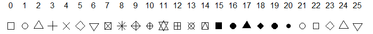

```{r, echo=FALSE, warning=FALSE, message=FALSE}
pacman::p_load(tidyverse, lubridate, ggpubr, ggthemes)

```

# Visualização de Dados

No decorrer deste curso, aprendemos algumas habilidades importantes para a análise de dados. Desde a importação de dados, passando pela limpeza e organização e a manipulação destes dados para torná-los úteis, no sentido de extrair as informações desejadas.

Entretanto, os dados em si são apenas valores que, se visualizados em sua forma natural, não apresentam tantas informações relevantes. Para que os dados possam ser convertidos em informação, é necessário que eles sejam apresentados de modo que o consumidor final seja capaz de extrair informações.

Existem algumas formas de comunicar resultados em análise de dados, mas sem dúvida a análise exploratória dos dados contribui sobremaneira pra uma compreensão do todo, além de indicar o caminho a se seguir caso se deseje uma modelagem mais complexa.

Dentre as ferramentas de visualização de dados, destacam-se os gráficos, tabelas e *dashboards,* que geralmente combinam gráficos, tabelas, bem como outros elementos, como *cards*, texto, dentre outros, em um painel de visualização complexo*.*

Na seção de visualização de dados, aprendemos formas de sumarizar informações, seja como indicadores ou como tabelas de dados. Nesta seção, trabalharemos principalmente com a visualização gráfica dos dados.

A seção de manipulação de dados será fundamental para o sucesso no aprendizado da geração de gráficos, dado que a estrutura de dados é crucial para a geração de um gráfico devidamente informativo.

## O pacote `ggplot2`

O `ggplot2` é um poderoso pacote para a geração gráficos no R. O pacote trabalha com um arcabouço conhecido como Gramática dos Gráficos. (detalhes em @wilkinson2012grammar). Esta gramática permite a geração de gráficos por meio da combinação de elementos independentes, o que torna o `ggplot2` um pacote com infinitas possibilidades, tanto na construção de gráficos clássicos, como no desenvolvimento de gráficos específicos para problemas inovadores.

A gramática dos gráficos é composta pelos seguintes elementos:

-   Dados: informação que será utilizada na construção dos gráficos

-   Mapeamento (**mapping**): Descrição de como os dados são mapeados para os atributos estéticos. O mapeamento é composto por cinco elementos:

    -   Camada (***layer***): Uma coleção de de elementos geométricos (***geoms***), como linhas, pontos, polígonos, etc; e estatísticos (***stats***), como contagens, estatísticas descritivas, dentre outras.

    -   Escala (***scale***): Mapeia os dados do espaço estatístico para o espaço estético (***aesthetics*** ou ***aes***). Também é responsável por gerar elementos como eixos e legendas por exemplo.

    -   Coordenadas (***coord***): Sistema de coordenadas, que descreve como os dados estão mapeados no plano gráfico, bem como linhas de grade e valores de eixos. Inclui coordenadas cartesianas, polares e projeções de mapas.

    -   Facetas (***facet***): Controla a visualização de subconjuntos de dados em janelas distintas.

    -   Tema (***theme***): Responsável pelos elementos finos de formatação, como fonte, plano de fundo e demais elementos gráficos.

A composição destes elementos permitem a geração de gráficos diversos. Vamos estudar como combiná-los no contexto do pacote `ggplot2`. Vamos utilizar o conjunto de dados [**car information, disponível no Kaggle**](https://www.kaggle.com/datasets/tawfikelmetwally/automobile-dataset) para apresentar os principais elementos e tipos de gráficos do pacote. Os dados trazem informações relacionadas a 399 carros e 9 atributos.

```{r}
car <- read.csv("datasets/a7_ggplot/Automobile.csv")
glimpse(car)
```

## Principais componentes

Todo gráfico **ggplot** é composto por três componentes chave:

-   dados (***data***). Conforme será percebido, a estrutura e organização dos dados é primordial para a geração de um gráfico no pacote `ggplot2`.

-   Um conjunto de mapeamentos estéticos (***aes***) entre as variáveis e as propriedades visuais;

-   Pelo menos uma camada de informação visual, que descreve como renderizar cada observação disponível nos dados. Camadas geralmente são criadas com a função `geom`.

Vejamos um exemplo simples. O gráfico a seguir compara o tamanho do motor em litros (`displacement`) e o potência do motor (`horsepower`).

```{r, warning=FALSE}

#Carregar o pacote e gerar um gráfico básico
library(ggplot2)

ggplot(car, aes(x = displacement, y = horsepower)) + 
  geom_point()
```

O gráfico acima é composto pelos seguintes elementos básicos:

-   Dados: `car`.

-   Mapeamento estético (`aes`): tamanho do motor mapeado em **x** e potência mapeada em **y**.

-   Camada: pontos.

A estrutura apresentada se mantém: Dados e mapeamentos estéticos são fornecidos na função `ggplot()`, enquanto as camadas são adicionadas com um sinal de `+`. No gráfico acima, os dados foram mapeados em x e y. Como este é um padrão comum, as duas primeiras variáveis do mapeamento estético são automaticamente mapeadas para x e y.

## Atributos Estéticos

Para incluir variáveis adicionais aos gráficos, podemos utilizar outros elementos, tais como cores, formatos e tamanhos. Estes elementos são adicionados nos mapeamentos `aes()`:

-   `ggplot(mpg, aes(x = displacement, y = horsepower, colour = cylinders))`

-   `ggplot(mpg, aes(x = displacement, y = horsepower, shape = cylinders))`

-   `ggplot(mpg, aes(x = displacement, y = horsepower, colour = acceleration))`

Existem outras opções estéticas, que são voltadas para outros tipos de gráficos. Vamos explorá-las em conjunto com os demais tipos de gráficos. No caso das estéticas acima, vejamos como cada elemento altera o gráfico original:

```{r, warning=FALSE}

#Colour dentro da função ggplot
ggplot(car, aes(x = displacement, y = horsepower, colour = origin)) + 
  geom_point()


#Colour dentro da função geom
ggplot(car, aes(x = displacement, y = horsepower)) + 
  geom_point(aes(colour = "blue"))

#Colour dentro da função geom
ggplot(car, aes(x = displacement, y = horsepower)) + 
  geom_point(colour = "red")
```

Ao inserir o parâmetro `colour` dentro da `aes` da função ggplot, as cores são associadas à classe dos carros em estudo. Já ao inserir nas `aes` da função `geom_point`, os parâmetros estéticos são adicionados à camada fixa gerada por ela, mas como mapeamento estético. Note que, assim como quando incluimos o parâmetro na função `ggplot`, é adicionada uma legenda. Já ao inserir a cor fora do `aes`, todos os pontos são coloridos de vermelho, mas sem a geração de legenda, indicando que o parâmetro foi repassado de forma geral. Este detalhe é importante na customização dos gráficos.

Cada tipo de estética funciona melhor com determinados tipos de variável. Formas e cores funcionam melhor com variáveis categóricas, enquanto tamanho de ponto e escalas funcionam melhor com variáveis contínuas. Vejamos alguns exemplos:

```{r, warning=FALSE}

#Cores
ggplot(car, aes(x = displacement, y = horsepower, colour = origin)) + 
  geom_point()

#Formato de ponto
ggplot(car, aes(x = displacement, y = horsepower, shape = origin, colour=  origin)) + 
  geom_point()

#Tamanho de ponto
ggplot(car, aes(x = displacement, y = horsepower, size = acceleration)) + 
  geom_point()

```

O uso de parâmetros estéticos deve ser realizado com parcimônia. Incluir muitos elementos ao mesmo tempo pode tornar a visualização dos dados difícil. Caso existam muitas relações, o ideal é gerar uma série de gráficos simples que explicitem as relações existentes entre as variáveis.

## Facetas (*faceting*)

Conforme mencionado anteriormente, muitas vezes, temos diversos atributos para análise. Quando este número passa de três, geralmente o gráfico tende a ficar confuso, caso realizemos a inserção de todos estes elementos. Uma abordagem interessante, sobretudo quando um dos atributos chave é categórico, é a utilização de gráficos em paralelo, no `ggplot` denominados como facetas (*facet*).

Os gráficos em faceta permitem a comparação de gráficos de mesma construção para níveis diferentes de uma variável. Os gráficos são construídos por meio dos mesmos dados e parâmetros estéticos, porém separados em janelas distintas, com mesma escala, para permitir a comparação. Para realizar tal operação, adicionamos uma camada `facet_wrap()` ou `facet_grid()`. Ao utilizar esta camada, a variável que gerará as facetas deve ser precedida de um símbolo de til `~`. Vejamos dois exemplos, com `facet_wrap()` e `facet_grid()`, que utilizam os mesmos dados, mas trazem visualizações distintas.

```{r, warning=FALSE}


ggplot(car, aes(x = displacement, y = horsepower, colour = as.factor(cylinders))) + 
  geom_point() + 
  facet_wrap(~origin)

ggplot(car, aes(x = displacement, y = horsepower)) + 
  geom_point() + 
  facet_grid(cylinders ~ origin)
```

Enquanto a camada `facet_wrap()` gera os gráficos em ordem crescente em relação à variável de classificação, a camada `facet_grid()` gera um grid crescente de duas variáveis, conforme o "modelo" apresentado. Logo, o ideal é a utilização do `facet_wrap()` para análise de dados classificados por uma categoria, mantendo a segunda categoria dentro dos gráficos individuais. , enquanto o `facet_grid()` é ideal para explorar as relações entre duas variáveis simultaneamente, com a manutenção das escalas naturais dos dados. Entretanto, conforme se oberva na figura acima, o uso do grid deve ocorrer principalmente quando se há um grande volume de dados. A utilização de cada tipo de camada dependerá da natureza do problema em estudo.

Em ambas as camadas é possível controlar alguns parâmetros, como a escala, número de linhas e colunas, dentre outros. Para mais detalhes, digite `?facet_grid` e `?facet_wrap` no console do RStudio.

## Principais tipos de gráficos (`geoms`)

Em visualização de dados, é importante utilizar o tipo de gráfico adequado para cada tipo de dados e informações que se pretende extrair. Por exemplo:

-   **Gráficos de pontos** apresentados acima, são ideais para análise da relação entre duas variáveis contínuas. Eles podem ser combinados com **curvas de suavização** para destacar sua relação.

-   Para verificar a distribuição de uma variável, são indicados ***box-plots*** e **histogramas**.

-   Se formos tratar de frequências, **gráficos de barras** e suas variações são mais indicados.

-   Já para dados com alguma forma de ordenação (temporal, crescente), **gráficos de linhas** trazem informações mais relevantes.

O pacote `ggplot2` oferece a possibilidade de geração de todos estes tipos de gráficos por meio de camadas denominadas ***geoms.*** Os ***geoms*** utilizam os dados e elementos estéticos definidos na função `ggplot()` na construção dos gráficos. Os principais ***geoms*** são:

-   `geom_point()`: Adiciona um gráfico de pontos.

-   `geom_smooth()`: Ajusta uma curva aos dados informados, bem como seu desvio padrão e plota a referida curva.

-   `geom_histogram()` e `geom_freqplot()`: Adiciona um ou mais histogramas ou polígonos de frequência.

-   `geom_boxplot()`: Adiciona um ou mais boxplots.

-   `geom_line()` e `geom_path()`: traçam gráficos de linhas e caminhos, respectivamente. Estas linhas interligam os pontos. Enquanto `geom_lines()` interliga os pontos da esquerda para direita, `geom_path()` interliga os pontos respeitando a ordem das observações, independente da direção.

Vamos explorar cada geom e suas principais opções.

### Gráfico de pontos - `geom_point()`

O gráfico de pontos foi o primeiro a ser explorado neste texto. Trata-se de um formato gráfico que privilegia a visualização entre duas variáveis numéricas. A estrutura básica dos dados para geração de um gráfico de pontos é um *data frame* com pelo menos duas variáveis. Variáveis estéticas poderão ser adicionadas por meio da inclusão de mais atributos no *data frame*. Conforme vimos, a camada é adicionada pela função `geom_point()`. A partir deste momento, passaremos a utilizar o *pipe* para repassar os dados para a função *ggplot().*

```{r}
#| warning: false
#| message: false
car %>% 
  ggplot(aes(x = displacement, y = horsepower)) + 
  geom_point()
```

Os principais parâmetros estéticos que podem ser passados para o gráfico de pontos, conforme visto anteriormente, são os seguintes:

-   `colour` - Cor dos pontos.

-   `shape` - Formato do ponto. Estão disponíveis os seguintes formatos:

    

-   `size` - Tamanho do ponto

Como esta geometria foi abordada no início do texto, dispensaremos mais exemplos.

### Linhas suavidadas - `geom_smooth()`

Ao se tratar da relação entre duas ou mais variáveis, geralmente se utilizam modelos que destaquem a referida relação. Por exemplo, podemos utilizar modelos de regressão linear para explicar a relação entre duas variáveis que apresentem tendência linear entre si, ou modelos de regressão não lineares caso essa tendência não se confirme. O pacote `ggplot2` torna a geração de gráficos desta natureza uma tarefa simples com a geometria `geom_smooth()`. Ela facilita a visualização de padrões entre as variáveis e oferece uma série de modelos que podem ser utilizados para esta finalidade. O modelo deve ser informado por meio do parâmetro `method.`Vamos utilizar o exemplo inicial para observar cada tipo de modelo. Se o modelo não for informado, a função utiliza `x`e `y` informados no `aes.`

-   Regressão local: `method = "loess"`. Método padrão. O nível de suavização é controlado pelo parâmetro `span`. Quanto menor o `span`, menor a suavização.

    ```{r}
    car %>% 
      ggplot(aes(x = displacement, y = horsepower)) + 
      geom_point() + 
      geom_smooth(span = 1)

    car %>% 
      ggplot(aes(x = displacement, y = horsepower)) + 
      geom_point() + 
      geom_smooth(span = .2)
    ```

-   Modelo Linear: `method = "lm"`. Ajusta um modelo linear aos dados.

    ```{r}
    #| warning: false
    #| message: false
    car %>% 
      ggplot(aes(x = displacement, y = horsepower)) + 
      geom_point() + 
      geom_smooth(method = 'lm')
    ```

-   Modelo Linear Robusto: `method = "rlm"`. Ajusta um modelo linear aos dados, porém com metodologia robusta, reduzindo a influência de *outliers*. Para utilizá-lo, deve-se carregar o pacote `MASS`.

    ```{r}
    #| warning: false
    #| message: false
    library(MASS)

    car %>% 
      ggplot(aes(x = displacement, y = horsepower)) + 
      geom_point() + 
      geom_smooth(method = 'rlm')
    ```

Também é possível omitir o desvio dos dados, basta incluir o parâmetro `se = F`.

```{r}
#| warning: false
#| message: false


car %>% 
  ggplot(aes(x = displacement, y = horsepower)) + 
  geom_point() + 
  geom_smooth(se = F)
```

### *Boxplot* e variações - `geom_boxplot()`

O *boxplot* é um gráfico bastante útil para compreender a distribuição de uma variável contínua. Porém, quando existe além da variávei contínua, pelo menos uma variável categórica, ele se torna ainda mais útil, ao permitir a comparação entre o comportamento dos dados para cada variável. Sua utilização é bastante simples:

```{r}
#| warning: false

car %>% 
  ggplot(aes(origin, horsepower)) + 
  geom_boxplot()
```

É fácil perceber por este gráfico que carros americanos tendem a ser mais potentes, que sua potência apresenta mais variabilidade, que são mais assimétricas, dentre outras características. O boxplot pode ser customizado por meio dos seguintes parâmetros:

-   `fill`: Cor de preenchimento da caixa. Podemos gerar boxplot multigrupos utilizando este parâmetro;

-   `colour`: cor das linhas.

-   `alpha`: transparência das cores;

```{r}
#| warning: false

#Boxplot simples com alteração na cor das linhas
car %>% 
  ggplot(aes(origin, horsepower, colour = origin)) + 
  geom_boxplot()

#Boxplot simples com alteração na cor do preenchimento
car %>% 
  ggplot(aes(origin, horsepower, fill = origin)) + 
  geom_boxplot()

#Boxplor multigrupos
car %>% 
  ggplot(aes(origin, horsepower, fill = factor(cylinders))) + 
  geom_boxplot()

#Transparência das cores
car %>% 
  ggplot(aes(origin, horsepower, fill = origin)) + 
  geom_boxplot(alpha = 0.5)


```

Podemos também adicionar os pontos ao boxplot usando a geometria `jitter_points()` ou plotar o *violin plot*, uma variação do boxplot em que o formato da distribuição empírica é apresentado.

```{r}

#Boxplot simples com pontos
car %>% 
  ggplot(aes(origin, horsepower, fill = origin)) + 
  geom_boxplot() + 
  geom_jitter()

#Violin plot
car %>% 
  ggplot(aes(origin, horsepower, fill = origin)) + 
  geom_violin()
```

### Histogramas e Polígonos de Frequência - `geom_histogram()` e `geom_freqpoly()`

Histogramas e polígonos de frequência são utilizados para avaliar a distribuição de uma variável numérica. Ambos funcionam de maneira semelhante, dividem os dados em intervalos e calculam sua frequência. Eles diferem apenas na apresentação. Enquanto histogramas trabalham com barras, o polígono de frequência utiliza linhas.

É possível controlar a larguda dos intervalos por meio do parâmetro `binwidth`. Por padrão, os dados são divididos em 30 intervalos, que certamente não é o valor indicado para todo e qualquer conjunto de dados. É importante testar vários padrões até encontrar um que apresente de forma ideal seus dados.

Os parâmetros estéticos são os mesmos utilizados no boxplot: `fill`, `colour` e `alpha`. Vejamos alguns exemplos:

```{r}

#Histograma simples
car %>% 
  ggplot(aes(horsepower)) + 
  geom_histogram()

#Histograma simplescom binwidth = 2
car %>% 
  ggplot(aes(horsepower)) + 
  geom_histogram(binwidth = 2)

#Polígono de frequência simples
car %>% 
  ggplot(aes(horsepower)) + 
  geom_freqpoly()

#Histograma colorido
car %>% 
  ggplot(aes(horsepower)) + 
  geom_histogram(fill = 'red')

#Polígono de frequencia por grupos
car %>% 
  ggplot(aes(horsepower, colour = origin)) + 
  geom_freqpoly(binwidth = 20)

#Histograma por grupos em facetas
car %>% 
  ggplot(aes(horsepower, fill = origin)) + 
  geom_histogram() + 
  facet_wrap(~origin, nrow = 1)
```

Note que ao utilizar o polígono de frequências agrupado ou o histograma multifacetado, a comparação entre as distribuições foi facilitada. Este tipo de comparação deve sempre ser realizada, quando o objetivo for comparar grupos.\

### Gráfico de Barras - `geom_bar()`

Ao se trabalhar com dados, sempre nos deparamos com dados relacionados à frequência. Tendemos a agrupar dados e, no agrupamento de dados, muitas vezes uma boa estatística descritiva é a frequência com a qual os dados ocorrem. Existem alguns tipos de gráficos que trabalham este tipo de dados. Porém, o mais utilizado por larga margem é o gráfico de barras.

O gráfico de barras é uma versão do histograma para dados discretos. Sua geração no `ggplot` ocorre por meio da geometria `geom_bar()`. Vamos fazer um gráfico de barras com a origem dos veículos.

```{r}

#Gráfico de barras
car %>% 
  ggplot(aes(origin)) + 
  geom_bar()
```

Note que o gráfico foi gerado com as observações totais, ou seja, a própria função efetuou os cálculos de frequência. O gráfico de barras pode ser gerado para dados pré-sumarizados. Por exemplo, podemos gerar um gráfico de barras de uma tabela. Para tal, precisamos informar à geometria o tipo de sumarização utilizado. No caso de valores agregados, utilizamos o parâmetro `stat = 'identity'` dentro da geometria `geom_bar()`.

```{r}

#Vamos gerar uma tabela fictícia
graph <- data.frame(
  type = c("bar", "histogram", "lines", "points"),
  freq = c(35, 20, 20, 25)
)

#Agora gerar o gráfico de barras com a tabela criada
graph %>% 
  ggplot(aes(type, freq)) +
  geom_bar(stat = "identity")
```

Muitas vezes é interessante apresentar os dados de forma ordenada, ou seja, apresentá-los de forma que seja visível o ordenamento de frequências. Não há um parâmetro dentro do pacote `ggplot` para realizar o ordenamento. Para tal, devemos utilizar a função `reorder` do pacote `stats` Vejamos como fazer o gráfico anterior de forma ordenada.

```{r}

#Gráfico ordenado em frequência decrescente
graph %>% 
  ggplot(aes(reorder(type, -freq), freq)) +
  geom_bar(stat = "identity")

#Gráfico ordenado em frequência crescente
graph %>% 
  ggplot(aes(reorder(type, freq), freq)) +
  geom_bar(stat = "identity")

```

Algumas variações dos gráficos de barras são bastante importantes na visualização de dados. Por exemplo temos os gráficos de barras **agrupadas** e **empilhadas**. Gráficos de **barras agrupadas** tem como principal objetivo a comparação de frequências dentro os grupos, enquanto os gráficos de barras empilhadas, além de permitir a comparação de frequências dentro grupos, atendem ao objetivo de comparar as frequências entre os grupos. Ainda existe um terceiro formato, que são os gráficos de percentuais empilhados, para comparar as proporções de casos em cada grupo.

O agrupamento, empilhamento e empilhamento percentual são realizados por meio do parâmetro `position:`

-   `position = "dodge"` para geração de barras agrupadas.

-   `position = "stack"` para barras empilhadas.

-   `position = "fill"` para barras empilhadas em percentual.

Em todos os casos, o parâmetro de agrupamento é informado na estética `fill`. Para tal, precisamos construir uma tabela que reflita aos dados que desejamos. Vamos construir a tabela dos dados e construir alguns gráficos:

```{r, warning=FALSE, message=FALSE}

#Tabela de dados
data <- car %>% 
  group_by(model_year, origin) %>% 
  summarise(count = n()) %>% 
  mutate(freq = count/sum(count))

data
  

#Gráfico de barras de ano de fabricação agrupados por origem
data %>% 
  ggplot(aes(model_year, count, fill = origin)) + 
  geom_bar(stat = 'identity', position = "dodge")

#Gráfico de barras de ano de fabricação empilhados por origem
data %>% 
  ggplot(aes(model_year, count, fill = origin)) + 
  geom_bar(stat = 'identity', position = "stack")

#Gráfico de percentuais empilhados agrupados por origem
data %>% 
  ggplot(aes(model_year, count, fill = origin)) + 
  geom_bar(stat = 'identity', position = "fill")


```

Note que os dois primeiros gráficos utilizam as mesmas informações. Porém, no primeiro a possibilidade de comparação entre anos modelo é mais complexa. Já no segundo gráfico, além das proporções, é possível comparar os totais. Já no terceiro gráfico, os valores totais são suprimidos, restando apenas a composição proporcional da amostra.

Também é possível apresentar os gráficos na horizontal. Basta utilizar a camada `coord_flip` para construir o gráfico horizontalmente.

```{r}

#Girando o gráfico para a posição horizontal
data %>% 
  ggplot(aes(model_year, count, fill = origin)) + 
  geom_bar(stat = 'identity', position = "fill") + 
  coord_flip()

```

O gráfico de barras e suas variações são capazes de resolver o problema de visualização para grande parte dos problemas de frequência. Vamos ver na sequência a plotagem de gráficos de linha e caminho.

### Gráficos de linhas e caminhos - `geom_line()` e `geom_path()`

Gráficos de linhas e caminhos usualmente são utilizados por dados que apresentam alguma forma de ordenamento. Alguns exemplos são séries temporais em geral, tais como temperaturas diárias, valorização de ativos, número de clientes por dia, dentre outros. Podemos por exemplo efetuar medidas com algum ordenamento geográfico. Por exemplo, ao se medir a contaminação de água por coliformes fecais em um rio, em diversos pontos, no sentido descendente, pode se utilizar o gráfico de caminhos para analisar como a contaminação oscila a cada ponto.

Como o conjunto de dados em estudo não apresenta nenhuma variável ordenada, utilizaremos o conjunto de dados `economics`, presente no próprio pacote `ggplot2`, que contém dados econômicos dos Estados Unidos.

Assim como nas demais geometrias, podemos controlar alguns parâmetros, como alterar a cor das linhas (parâmetro `colour`), espessura das linhas (parâmetro `size`), transparência da linha (parâmetro `alpha`), dentre outros. também podemos plotar séries simultâneamente usando o parâmetero `fill`. Vamos gerar alguns gráficos relacionados ao desemprego por data nos EUA.

```{r}
#| warning: false
#| 
#Gráfico de taxa de desemprego por população
economics %>% 
  ggplot(aes(date, unemploy/pop)) + 
  geom_line()

#Alterando cor e espessura da linha
economics %>% 
  ggplot(aes(date, unemploy/pop)) + 
  geom_line(colour = "red", linewidth = 1)

```

Podemos também utilizar a geometria `geom_path()` para plotar o diagrama de caminhos. Vamos plotar o caminho percorrido pela taxa de desemprego e pelo número mediano de semanas desempregado, e posteriormente avaliar a evolução por ano.

```{r}

#Gráfico de desempregados por número de semanas desempregado
economics %>% 
  ggplot(aes(unemploy / pop, uempmed)) + 
  geom_path() +
  geom_point()

#Gráfico de caminhos com gradação de ano
economics %>% 
  ggplot(aes(unemploy / pop, uempmed)) + 
  geom_path(colour = 'grey50') +
  geom_point(aes(colour = year(date)))

#Compare agora com o gráfico sem ordenação
economics %>% 
  ggplot(aes(unemploy / pop, uempmed)) + 
  geom_point()
```

\
Com este gráfico é nítido que existe correlação entre as variáveis. Entretanto, ao se analisar o diagrama de caminhos, percebe-se que a taxa é decrescente nos últimos anos. Com estes gráficos, cobrimos os principais tipos de gráficos que trabalharemos em visualização. Vamos agora trabalhar alguns aspectos adicionais de manipulação dos gráficos.

## Outros elementos importantes

Para finalizar a apresentação dos principais aspectos do `ggplot`, vamos trabalhar alguns elementos de customização importantes para melhorar a qualidade dos gráficos: Eixos, anotações e temas.

### Modificando os eixos

Podemos modificar alguns aspectos dos eixos:

-   Rótulos - Funções `xlab` e `ylab`;

-   Escalas - Funções da família `scale`;

-   Limites - Funções `xlim` e `ylim`;

Vamos modificar os eixos de alguns dos gráficos apresentados acima. Vamos utilizar o pacote ggpubr para organizar os gráficos com e sem modificações lado a lado

```{r}
#| warning: false
#| message: false
library(ggpubr)

#Boxplot com eixos originais e alterados
g1 <- car %>% 
  ggplot(aes(origin, horsepower, colour = origin)) + 
  geom_boxplot()

g2 <- car %>% 
  ggplot(aes(origin, horsepower, colour = origin)) + 
  geom_boxplot() + 
  xlab("Pais de Origem") + 
  ylab("Potência do motor (HP)")

ggarrange(g1, g2, ncol = 2)

#Boxplot simples com alteração na cor das linhas
g1 <- car %>% 
  ggplot(aes(origin, horsepower, colour = origin)) + 
  geom_boxplot()

g2 <- car %>% 
  ggplot(aes(origin, horsepower, colour = origin)) + 
  geom_boxplot() + 
  scale_x_discrete(labels = c("Europa", "Japão", "EUA")) + 
  xlab("País de Origem") + 
  ylab("Potência do Motor (HP)")

ggarrange(g1, g2, ncol = 2)

#Tamanho do motor vs potência sem e com alterações
g1 <- car %>% 
  ggplot(aes(x = displacement, y = horsepower)) + 
  geom_point() + 
  geom_smooth(span = 1)

g2 <- car %>% 
  ggplot(aes(x = displacement, y = horsepower)) + 
  geom_point() + 
  geom_smooth(span = 1) + 
  xlim(0, 550) + 
  ylim(0, 300) + 
  xlab("Capacidade do Motor") + 
  ylab("Potência do Motor (HP)")

ggarrange(g1, g2, ncol = 2)
```

### Anotações

Quando estamos trabalhamos com gráficos, é corriqueira a necessidade de alterar elementos textuais, como legendas, eixos, como vimos na seção anterior, títulos, títulos das legendas, dentre outros. Muitos destes parâmetros conseguimos alterar diretamente na função `labs()`. Podemos inclusive repassar fórmulas, se necessário

```{r, warning=FALSE}

#Gráfico de potência por capacidade do motor e cilindros
car %>% 
  ggplot(aes(x = displacement, y = horsepower, colour = factor(cylinders))) +      
  geom_point() + 
  labs(x = "Capacidade do motor",
       y = "Potência do motor (HP)",
       colour = "Número de cilindros",
       title = "Potência por capacidade do motor e cilindros",
       subtitle = quote(f(x) == x^100))

```

Podemos também realizar a inclusão de texto nos gráficos por meio da geometria `geom_text()`. O tamanho da fonte é controlado pelo parâmetro size. Também podemos alterar outros parâmetros, como cor, transparência, tipo de fonte, ângulo, dentre outros

```{r}

#Plotando os rótulos dos carros 
car[1:10,] %>% 
  ggplot(aes(x = displacement, y = horsepower)) + 
  geom_point() + 
  geom_text(aes(label = name, y = horsepower + 10), size = 3, angle = 30, colour = 'red')
```

Vamos plotar as porcentagens nos gráficos de barras anteriores. Para incluí-la, vamos criar uma variável com os valores já em percentual. Para ajustá-los ao posicionamento das barras, devemos utilizar o parâmetro `position` dentro da função `geom_text`. Para que o posicionamento fique correto, devemos usar uma das seguintes funções , a depender do tipo de gráfico:

-   Barras agrupadas: `position = position_dodge`

-   Barras empilhadas: `position = position_stack(vjust = 0.5)`

-   Barras empilhadas por percentual: `position = position_fill(vjust  = 0.5)`

O parâmetro `vjust` controla o alinhamento do texto dentro das barras em relação à posição. `vjust = 0` alinha na base, `vjust = 0.5` alinha no centro, `vjust = 1` alinha no topo.

```{r}
#Adição dos percentuais
data <- data %>% 
  mutate(percentual = paste0(round(100*count/sum(count),0),"%"))


#Gráfico de barras de ano de fabricação agrupados por origem
data %>% 
  ggplot(aes(model_year, count, fill = origin)) + 
  geom_bar(stat = 'identity', position = "dodge") + 
  geom_text(aes(x = model_year, y = count, 
                label = percentual), 
            position = position_dodge(1),
            size = 3,
            angle = 90)

#Gráfico de barras de ano de fabricação empilhados por origem
data %>% 
  ggplot(aes(model_year, count, fill = origin)) + 
  geom_bar(stat = 'identity', position = "stack") + 
  geom_text(aes(x = model_year, y = count, 
                label = percentual), 
            position = position_stack(vjust = .5))

#Gráfico de percentuais empilhados agrupados por origem
data %>% 
  ggplot(aes(model_year, count, fill = origin)) + 
  geom_bar(stat = 'identity', position = "fill") + 
  geom_text(aes(x = model_year, y = count, 
                label = percentual), 
            position = position_fill(vjust = .5))
```

Além das opções apresentadas, existem diversas possibilidades de controle de texto. As necessidades em geral aparecem durante a análise.

### Temas

O pacote `ggplot` oferece alguns temas pré-definidos, além da possibilidade da inclusão de novos temas por meio de pacotes adicionais, como por exemplo o pacote `ggthemes`. Vejamos alguns temas

```{r}
#| warning: false

library(ggthemes)

base <- car %>% 
  ggplot(aes(origin, horsepower, fill = origin)) + 
  geom_boxplot()


base + theme_base() + labs(title = "Tema base")
base + theme_void() + labs(title = "Tema Void")
base + theme_clean() + labs(title = "Tema clean")
base + theme_excel() + labs(title = "Tema Excel")
base + theme_economist() + labs(title = "Tema The Economist")
base + theme_solarized() + labs(title = "Tema Solarizado")


```

Outros exemplos de temas podem ser visualizados no link <https://yutannihilation.github.io/allYourFigureAreBelongToUs/ggthemes/>

Qualquer tentativa de apresentar o pacote `ggplot` em sua totalidade será frustrada. O pacote apresenta opções praticamente ilimitadas de construção e customização de gráficos. Entretanto, esta introdução servirá como base para a expansão para outras funcionalidades, bem como outros pacotes, que continuaremos a explorar nas próximas seções.

## Exercícios

Utilize o banco de dados `dados_mostra.csv`, disponível no Moodle, para gerar os seguintes gráficos usando `ggplot`.

1.  Evolução do número de visitas por hora;

2.  Pessoas que ouviram e não ouviram falar do curso de Estatística.

3.  Opiniões sobre o curso de Estatística após a apresentação.

4.  Informações que mais chamaram a atenção dos visitantes

5.  Cidade de origem.

6.  Disponibilidade em receber e-mails por conhecimento prévio sobre o curso

7.  Disponibilidade em receber e-mails por informações que mais chamaram atenção.

Algumas orientações:

-   Corrija os títulos dos eixos e inclua os rótulos sempre que possível.

-   Para gráficos semelhantes, varie elementos (cores, rotações, etc).

-   Interprete os resultados obtidos.

-   Respostas livres devem ser agrupadas como "Outras".

-   Lembre-se de realizar as transformações necessárias nos dados e utilizar os gráficos adequados para cada visualização.
